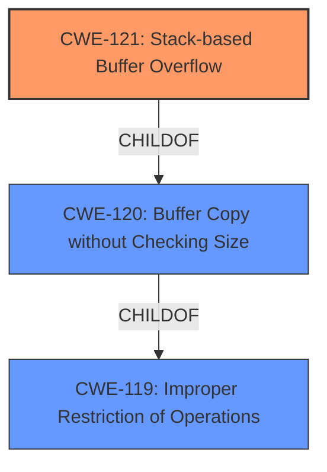

# Final Resolution for CVE-2021-43556

# Summary
| CWE ID | CWE Name | Confidence | CWE Abstraction Level | CWE Vulnerability Mapping Label | CWE-Vulnerability Mapping Notes |
|---|---|---|---|---|---|
| CWE-121 | Stack-based Buffer Overflow | 1.0 | Variant | Primary | Allowed |

## Evidence and Confidence

*   **Confidence Score:** 1.0
*   **Evidence Strength:** HIGH

## Relationship Analysis
The primary relationship considered was the hierarchical relationship. CWE-121 is a Variant of CWE-120 (Buffer Copy without Checking Size) and CWE-119 (Improper Restriction of Operations within the Bounds of a Memory Buffer). Since the vulnerability is explicitly described as a "stack-based buffer overflow", choosing the Variant CWE-121 provides the optimal level of specificity.

## Vulnerability Chain
The vulnerability chain consists of a lack of proper input validation, leading directly to a stack-based buffer overflow.
  - **Root Cause:** Lack of proper validation of the length of user-supplied data.
  - **Weakness:** CWE-121 (Stack-based Buffer Overflow) due to uncontrolled copy of data into a stack buffer.
  - **Impact:** Execution of arbitrary code.

## Summary of Analysis
The initial analysis and criticism both agree on the selection of CWE-121 (Stack-based Buffer Overflow) as the primary **WEAKNESS**. The vulnerability description explicitly states "stack-based buffer overflow," and the CVE reference confirms this. This direct evidence supports the high confidence level.

The graph relationships reinforce this decision, as CWE-121 is a specific variant of a more general buffer overflow (**CWE-120**) and memory safety issues (**CWE-119**). Selecting CWE-121 provides the optimal level of specificity based on the available evidence.

The evidence is taken directly from the vulnerability description: "FATEK WinProladder Versions 3.30_24518 and prior are vulnerable to a stack-based buffer overflow while processing project files, which may allow an attacker to execute arbitrary code." and the CVE Reference Links Content Summary "The vulnerability is a stack-based buffer overflow. It occurs due to a lack of proper validation of the length of user-supplied data before copying it to a stack-based buffer."

The retriever results suggest other CWEs, such as CWE-190 (Integer Overflow), CWE-126 (Buffer Over-read), and CWE-130 (Improper Handling of Length Parameter Inconsistency). However, these are less appropriate because they are either not directly related to the core issue (over-read instead of over-write) or represent potential contributing factors that are not explicitly mentioned in the vulnerability description.

Therefore, based on the available evidence and the principle of selecting the most specific CWE, CWE-121 is the most appropriate classification.