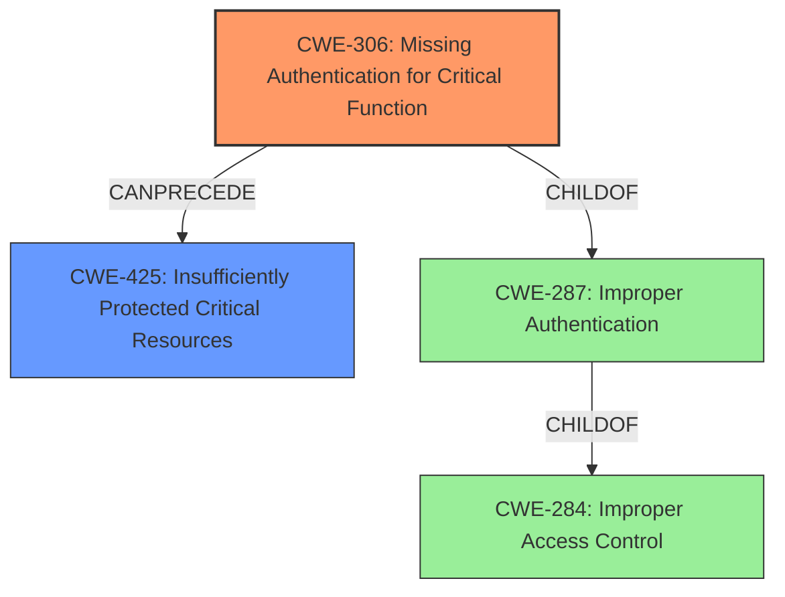

# Final Resolution for CVE-2021-43563

# Summary
| CWE ID | CWE Name | Confidence | CWE Abstraction Level | CWE Vulnerability Mapping Label | CWE-Vulnerability Mapping Notes |
|---|---|---|---|---|---|
| CWE-306 | Missing Authentication for Critical Function | 0.90 | Base | Primary | The product does not perform any authentication for functionality that requires a provable user identity or consumes a significant amount of resources. |
| CWE-425 | Insufficiently Protected Critical Resources | 0.75 | Base | Secondary | The web application does not adequately enforce appropriate authorization on all restricted URLs, scripts, or files. |

## Evidence and Confidence

*   **Confidence Score:** 0.85
*   **Evidence Strength:** HIGH

## Relationship Analysis
The initial analysis selected CWE-284, a Pillar, which is discouraged. The criticism correctly points out that CWE-306 is a more specific and appropriate Base-level CWE. CWE-425 is a valid secondary concern. CWE-639 was deemed inappropriate.

## Vulnerability Chain
The vulnerability chain begins with the **ROOTCAUSE** of CWE-306 (Missing Authentication for Critical Function). Because there is no authentication required, an attacker can access restricted resources. The **WEAKNESS** that follows is CWE-425 (Insufficiently Protected Critical Resources) where the application does not adequately enforce authorization. The **IMPACT** is the downloading of media files from the DAM system.

## Summary of Analysis
The initial analysis correctly identified the general issue of broken access control but incorrectly chose CWE-284 as the primary **WEAKNESS**. The criticism provided strong justification for selecting a more specific CWE. The vulnerability description states: "The Access Control in the bundled media browser is broken, which allows an unauthenticated attacker to perform requests to the pixx.io API for the configured API user. This allows an attacker to download various media files from the DAM system."

Based on this, the most accurate classification is:
*   Primary: CWE-306 (Missing Authentication for Critical Function) - because the attacker is unauthenticated.
*   Secondary: CWE-425 (Insufficiently Protected Critical Resources) - because the application does not adequately enforce authorization.

CWE-306 is at the optimal level of specificity because it directly addresses the **ROOTCAUSE** of the vulnerability, which is the lack of authentication.