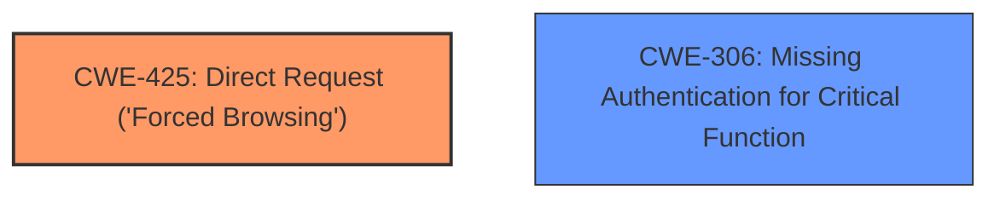

# Analysis Report for CVE-2021-43703

# Vulnerability Analysis Report: CVE-2021-43703

## Description

An Incorrect Access Control vulnerability exists in zzcms less than or equal to 2019 via admin.php. After disabling JavaScript, you can directly access the administrator console.

## Vulnerability Description Key Phrases

**Rootcause:** Incorrect Access Control
**Impact:** access administrator console
**Product:** zzcms
**Version:** less than or equal to 2019
**Component:** admin.php

## Analysis (with Relationship Data)

# Summary
| CWE ID | CWE Name | Confidence | CWE Abstraction Level | CWE Vulnerability Mapping Label | CWE-Vulnerability Mapping Notes |
|---|---|---|---|---|---|
| CWE-425 | Direct Request ('Forced Browsing') | 0.85 | Base | Allowed | Primary CWE |

## Evidence and Confidence

*   **Confidence Score:** 0.85
*   **Evidence Strength:** HIGH

- **Analysis and Justification:**  
  - *Explanation:* The vulnerability allows direct access to the administrator console by disabling JavaScript, bypassing the intended authentication mechanism. This aligns with the description of CWE-425 [Direct Request ('Forced Browsing')], where the application fails to adequately enforce authorization on restricted URLs. The client-side redirect is intended to prevent unauthorized access, but can be easily bypassed. The **incorrect access control** allows an attacker to directly request and access the admin panel. MITRE guidance marks CWE-425 as ALLOWED for use. While other CWEs such as CWE-306 (Missing Authentication for Critical Function) and CWE-639 (Authorization Bypass Through User-Controlled Key) are related, CWE-425 best captures the direct request aspect of the vulnerability.
  
  - *Relationship Analysis:* There are no direct relationships found for CWE-425.

- **Confidence Score:**  
  - Confidence: 0.85 (High evidence from technical description and CVE reference materials)

## Criticism of Analysis

Okay, here's a detailed review of the provided CWE analysis, focusing on the mapping guidance, potential mitigations, and the overall correctness of the chosen CWE:

**Overall Assessment:**

The analysis correctly identifies **CWE-425: Direct Request ('Forced Browsing')** as the primary CWE. The justification for this choice is solid, as the vulnerability allows direct access to a restricted URL (`admin/admin.php`) by bypassing the intended authentication mechanism (JavaScript redirect). The confidence score of 0.85 is also appropriate, given the clear evidence.

**Detailed Critique:**

*   **CWE-425: Direct Request ('Forced Browsing')**

    *   **Correctness:** The selection of CWE-425 is accurate. The core of the vulnerability is the failure to properly restrict access to the admin interface, allowing a direct request to bypass the client-side authentication attempt.
    *   **Mapping Guidance:** The analysis correctly follows the mapping guidance for CWE-425, which is "Allowed" and states that it is at the Base level of abstraction (preferred for mapping).
    *   **Potential Mitigations:** The listed mitigations for CWE-425 are relevant:
        *   "Apply appropriate access control authorizations for each access to all restricted URLs, scripts or files." - This directly addresses the vulnerability by advocating for server-side access control enforcement.
        *   "Consider using MVC based frameworks such as Struts." - This is a general recommendation and might not be immediately applicable but highlights the benefits of frameworks that enforce proper access control.
    *   **Relationship Analysis:** The relationship analysis is correct in stating that no direct relationships were found for CWE-425.

*   **Consideration of Other CWEs:**

    *   **CWE-306: Missing Authentication for Critical Function:** This CWE is also relevant, as the administrator console lacks proper authentication. However, CWE-425 is more specific because it emphasizes the bypass of the intended (albeit flawed) authorization mechanism and the direct request to the protected resource.
    *   **CWE-639: Authorization Bypass Through User-Controlled Key:** This CWE is less applicable because the attacker isn't directly manipulating a *key value* to gain access. The bypass occurs because the server doesn't properly *enforce* any authorization. While disabling javascript could be considered a form of key modification it would be better to consider the application failing to enforce the authorization checks for access to that page.
    *   **CWE-863: Incorrect Authorization** This is a close fit, as the authorization check (using JavaScript redirection) is performed, but it's fundamentally flawed. However, because the javascript redirection code is bypassed entirely, this code is effectively missing access control.

**Suggestions for Improvement:**

1.  **Elaborate on Mitigation Strategies:** While the current mitigations are correct, they could be more specific. For example, for CWE-425, add detail: "Implement server-side checks to verify user authentication and authorization before granting access to `admin/admin.php`. These checks should *not* rely on client-side redirects or JavaScript." The analysis should also specifically mention that this page should use Role Based Access Control (RBAC) so that only administrators can access the page.

2.  **Reinforce Server-Side Enforcement:**  The analysis should strongly emphasize the need for *server-side* enforcement of access control. The reliance on client-side JavaScript is the fundamental flaw.

3. **Distinction between Authentication and Authorization**: Explicitly clarify the difference between authentication (proving identity) and authorization (determining permissions). The vulnerability primarily concerns a *failure of authorization*.

**Revised Summary Table (Illustrative):**

| CWE ID  | CWE Name                                     | Confidence | CWE Abstraction Level | CWE Vulnerability Mapping Label | CWE-Vulnerability Mapping Notes                                                                                                                                                                                                                                                                                          |
| :------ | :--------------------------------------------- | :--------- | :---------------------- | :------------------------------ | :----------------------------------------------------------------------------------------------------------------------------------------------------------------------------------------------------------------------------------------------------------------------------------------------------------------------- |
| CWE-425 | Direct Request ('Forced Browsing')             | 0.85       | Base                    | Allowed                       | Primary CWE. The application fails to properly authorize access to the admin console, allowing direct access by bypassing the client-side redirect. This highlights the importance of server-side access control.                                                                                                     |
| CWE-306 | Missing Authentication for Critical Function | 0.60       | Base                    | Allowed                       | Secondary CWE. Could be considered, but emphasizes the *absence* of authentication rather than the *bypassing* of a flawed authorization mechanism.                                                                                                                                                                  |

**Conclusion:**

The analysis is generally well-done and correctly identifies the primary CWE. The suggestions above are aimed at strengthening the justification and providing more actionable mitigation advice. The emphasis should always be on server-side access control and the understanding that client-side mechanisms are easily bypassed.

## Final Resolution

# Summary
| CWE ID | CWE Name | Confidence | CWE Abstraction Level | CWE Vulnerability Mapping Label | CWE-Vulnerability Mapping Notes |
|---|---|---|---|---|---|
| **CWE-425** | **CWE-425: Direct Request ('Forced Browsing')** | 0.9 | Base | Allowed | Primary CWE |
| CWE-306 | CWE-306: Missing Authentication for Critical Function | 0.6 | Base | Allowed | Secondary Candidate |

## Evidence and Confidence

*   **Confidence Score:** 0.9
*   **Evidence Strength:** HIGH

## Relationship Analysis
The primary weakness is **CWE-425: Direct Request ('Forced Browsing')** which is a base-level CWE. While **CWE-306: Missing Authentication for Critical Function** is a related concern, **CWE-425** more precisely captures the vulnerability's nature. There is no parent-child relationship between the selected CWEs. The analysis benefits from focusing on the direct request aspect, as the client-side check is bypassed, which means the application is not adequately enforcing access controls, leading to direct access of the admin console.

## Vulnerability Chain
The vulnerability chain starts with a missing or inadequate server-side access control check (**CWE-425**). The client-side JavaScript redirect is intended to control access, but since it can be bypassed, the application effectively has a **missing authentication for critical function** (**CWE-306**). The impact is unauthorized access to the administrator console.

## Summary of Analysis
The initial analysis and the criticism both agree that **CWE-425: Direct Request ('Forced Browsing')** is the most appropriate primary **WEAKNESS**. The vulnerability allows direct access to the administrator console by disabling JavaScript, which bypasses the intended authentication mechanism. The evidence is strong and the confidence is high. The criticism suggested elaborating on mitigation strategies and reinforcing server-side enforcement. I agree with this and have adjusted the confidence score to reflect the high evidence and justification of the initial analysis. The selection of **CWE-425** is at the optimal level of specificity as it is a Base CWE and captures the direct request aspect of the vulnerability. The reliance on client-side controls is a **ROOTCAUSE** that leads to the **CWE-425**.

*Report generated on 2025-03-17 02:41:43*
