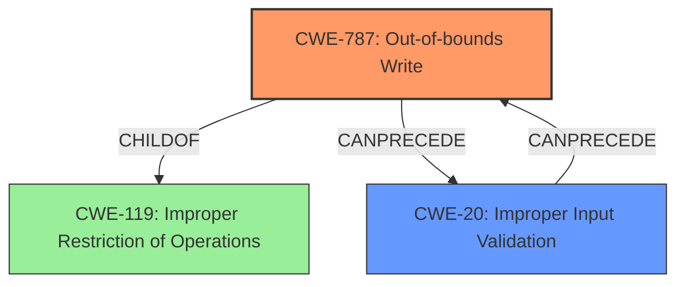

# Final Resolution for CVE-2021-43755

# Summary
| CWE ID  | CWE Name                      | Confidence | CWE Abstraction Level | CWE Vulnerability Mapping Label | CWE-Vulnerability Mapping Notes |
| :------- | :----------------------------- | :--------- | :-------------------- | :------------------------------ | :---------------------------- |
| **CWE-787** | **Out-of-bounds Write**           | 0.9        | Base                  | Allowed                         | Primary **CWE** - Write operation outside the intended buffer boundaries. |
| CWE-20  | Improper Input Validation     | 0.4        | Class                | Allowed                         | Contributing Factor - Improper handling of a malicious file, due to lack of input validation. The crafted file causes the **out-of-bounds write**. |

## Evidence and Confidence

*   **Confidence Score:** 0.8
*   **Evidence Strength:** MEDIUM

## Relationship Analysis
The primary relationship influencing the decision is the parent-child relationship between CWE-787 (**Out-of-bounds Write**) and CWE-119 (Improper Restriction of Operations within the Bounds of a Memory Buffer). CWE-787 is more specific and appropriate given the explicit mention of a write operation outside buffer boundaries. The inclusion of CWE-20 (Improper Input Validation) is based on the vulnerability being triggered by a malicious file, indicating a failure to validate the file's structure and content.

## Vulnerability Chain
The vulnerability chain starts with CWE-20 (Improper Input Validation), where the application fails to properly validate a malicious file. This leads to CWE-787 (**Out-of-bounds Write**) when the application attempts to process the malformed data, writing beyond the allocated buffer. The end result is potential arbitrary code execution.

Missing links: The specific mechanism triggering the **out-of-bounds write** is not detailed, such as integer overflow or incorrect size calculation.

## Summary of Analysis
The initial analysis correctly identified CWE-787 (**Out-of-bounds Write**) as the primary **weakness**. The criticism highlighted the need to consider contributing factors like CWE-20 (Improper Input Validation) due to the "malicious file" attack vector. The final decision incorporates this by adding CWE-20 as a secondary **CWE**, acknowledging the lack of input validation as a contributing factor.

The selection of CWE-787 is based on the explicit statement in the vulnerability description: "Adobe After Effects versions 22.0 (and earlier) and 18.4.2 (and earlier) are affected by an **Out-of-bounds Write** vulnerability due to **insecure handling** of a malicious file...".

The addition of CWE-20 is based on the criticism that the crafted nature of the malicious file indicates an input validation issue.

The chosen **CWE**s are at the optimal level of specificity, with CWE-787 being a Base **CWE** describing the **out-of-bounds write** and CWE-20 being a Class **CWE** describing the lack of input validation. While more specific Variant **CWE**s could exist (e.g., related to heap vs. stack allocation), the available information does not support their inclusion. The confidence score is slightly reduced to 0.8 to reflect the uncertainty of how much CWE-20 contributes.