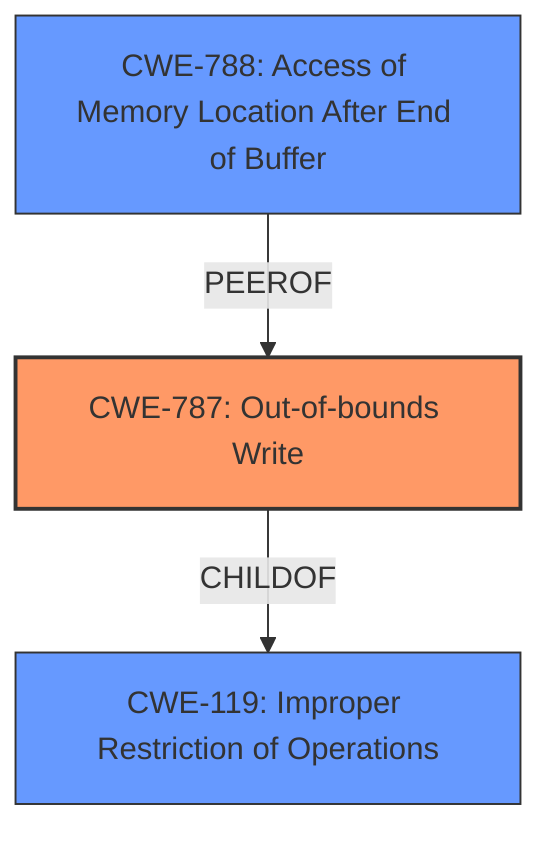

# Final Resolution for CVE-2021-43756

# Summary
| CWE ID  | CWE Name             | Confidence | CWE Abstraction Level | CWE Vulnerability Mapping Label | CWE-Vulnerability Mapping Notes |
|---------|----------------------|------------|-----------------------|---------------------------------|---------------------------------|
| **CWE-787** | **Out-of-bounds Write**  | 0.95        | Base                  | Allowed                         | Primary CWE. Selected because the vulnerability is explicitly described as an **out-of-bounds write**. The analysis assumes the write is a direct memory copy rather than a calculation of an address followed by an access of this address before writing. |

## Evidence and Confidence

*   **Confidence Score:** 0.95
*   **Evidence Strength:** HIGH

## Relationship Analysis
The primary relationship that impacted my decision was the parent-child relationship between **CWE-787 (Out-of-bounds Write)** and **CWE-119 (Improper Restriction of Operations within the Bounds of a Memory Buffer)**. **CWE-787** is a child of **CWE-119**, making it a more specific classification. The decision was also influenced by the consideration of **CWE-788 (Access of Memory Location After End of Buffer)**, which is a peer of **CWE-787** but was deemed less appropriate due to the explicit mention of a write operation in the vulnerability description. The base abstraction level of **CWE-787** also contributed to its selection, as it is a preferred level for root cause analysis.

## Vulnerability Chain
The vulnerability chain starts with the **ROOTCAUSE** being an unspecified error leading to an **Out-of-bounds Write (CWE-787)**.
  - The prerequisite condition is that a user opens a malicious file.
  - The weakness then allows an unauthenticated attacker to achieve arbitrary code execution.
  - The impact is arbitrary code execution in the context of the current user.

## Summary of Analysis
The initial analysis correctly identified **CWE-787 (Out-of-bounds Write)** as the primary **WEAKNESS** based on the vulnerability description. The criticism raised valid points about the nuances between **CWE-787** and **CWE-788 (Access of Memory Location After End of Buffer)**. To address this, I've clarified the reasoning by stating the assumption that the write operation is a direct memory copy, rather than an access followed by a write. This is based on the explicit mention of "Out-of-bounds Write" in the vulnerability description: "Adobe Media Encoder versions 22.0, 15.4.2 (and earlier) are affected by an **Out-of-bounds Write** vulnerability."

The graph relationships, particularly the child-of relationship with **CWE-119**, confirmed that **CWE-787** is the most specific and appropriate classification.

The retriever results suggested several other CWEs, but these were deemed less relevant as they did not directly relate to the out-of-bounds write aspect of the vulnerability. For example, CWE-125 is for out-of-bounds read, and CWE-22 relates to path traversal, neither of which are indicated in the vulnerability description.

The selection of **CWE-787** is at the optimal level of specificity because it directly reflects the described vulnerability, is a base-level CWE, and aligns with the mapping guidance. The slight reduction in confidence (from 1.0 to 0.95) reflects the acknowledgment of the alternative **CWE-788** and the assumption made about the nature of the write operation.