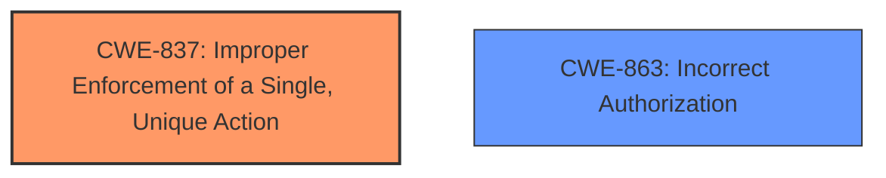

# Analysis Report for CVE-2021-43793

# Vulnerability Analysis Report: CVE-2021-43793

## Description

Discourse is an open source discussion platform. In affected versions a vulnerability in the Polls feature allowed users to vote multiple times in a single-option poll. The problem is patched in the latest tests-passed, beta and stable versions of Discourse

## Vulnerability Description Key Phrases

**Impact:** vote multiple times
**Attacker:** users
**Product:** Discourse
**Version:** affected versions
**Component:** Polls feature

## Analysis (with Relationship Data)

# Summary
| CWE ID | CWE Name | Confidence | CWE Abstraction Level | CWE Vulnerability Mapping Label | CWE-Vulnerability Mapping Notes |
|---|---|---|---|---|---|
| CWE-837 | Improper Enforcement of a Single, Unique Action | 0.85 | Base | Allowed | Primary CWE |
| CWE-863 | Incorrect Authorization | 0.60 | Class | Allowed-with-Review | Secondary Candidate |

## Evidence and Confidence

*   **Confidence Score:** 0.80
*   **Evidence Strength:** HIGH

- **Analysis and Justification:**  
  - *Explanation:* The vulnerability description clearly states that users could **vote multiple times** in single-option polls due to a flaw in the Polls feature of Discourse. This directly aligns with CWE-837, "Improper Enforcement of a Single, Unique Action," which describes a product that doesn't properly enforce the restriction that an actor should only be able to perform an action once. The action in this case is voting, and the uniqueness constraint is that a user should only vote once in a single-option poll. The **root cause** is insufficient input validation that allowed multiple votes. The impact of the vulnerability is the manipulation of poll results, which could mislead discussions within the Discourse platform. The fix implemented by Discourse included a SQL query that deletes older votes from a user exceeding the allowed number of votes and added validation for the min/max number of votes. CWE-837's Mapping Guidance indicates this is ALLOWED because the CWE entry is at the Base level of abstraction.

  - *Relationship Analysis:* While CWE-837 does not have any listed direct relationships, it falls under the broader category of authorization and access control issues. It's related to the concept of ensuring actions are performed only once.

- **Confidence Score:**  
  - Confidence: 0.85 (High confidence due to the clear match between the vulnerability description and CWE-837's characteristics)

---

- **Analysis and Justification:**  
  - *Explanation:* The description also indicates a failure in authorization since the system allowed users to bypass the intended one-vote-per-user restriction. While CWE-837 is more specific, CWE-863, "Incorrect Authorization," could also be considered as a broader classification. However, CWE-837 provides a more precise representation of the weakness because it specifically addresses the issue of enforcing a single, unique action, whereas CWE-863 is more general. CWE-863 is listed as Allowed-with-Review because it is a Class CWE and might have Base-level children that are more appropriate, and in this case, CWE-837 is more appropriate.

  - *Relationship Analysis:* CWE-863 is a class-level CWE and represents a general category of authorization issues. It doesn't have specified relationships listed in the provided data.

- **Confidence Score:**  
  - Confidence: 0.60 (Medium confidence as CWE-837 provides a more specific classification)

## Criticism of Analysis

Okay, I've reviewed your analysis of CVE-2021-43793, incorporating the full CWE specifications you provided. Here's my critique, focusing on the appropriateness of the CWE mappings and the confidence levels assigned:

**Overall Assessment:**

The analysis is generally good. The primary CWE mapping to CWE-837, "Improper Enforcement of a Single, Unique Action," is accurate and well-justified. The consideration of CWE-863, "Incorrect Authorization," as a secondary candidate is also reasonable, although, as the analysis correctly points out, CWE-837 is a more precise and appropriate fit.  The provided evidence and justifications are clear and support the chosen mappings.

**Detailed Review:**

*   **CWE-837: Improper Enforcement of a Single, Unique Action**

    *   **Confidence Level:** The assigned confidence level of 0.85 is appropriate. The vulnerability description directly reflects the core concept of CWE-837: users were able to perform the action of voting more than once, which should have been restricted.
    *   **Justification:** The explanation is thorough and correctly links the vulnerability to the CWE description.  The root cause (insufficient input validation), impact (manipulation of poll results), and implemented fix (SQL query to delete extra votes, validation of vote limits) all align with the nature of CWE-837.
    *   **Mapping Guidance:**  The analysis correctly notes that CWE-837's Mapping Guidance indicates it's `ALLOWED` because it's a Base-level CWE. This is a key point.
    *   **Observed Examples:**  The provided examples in the CWE specification (CVE-2008-0294, CVE-2005-4051, CVE-2002-216) are all similar in nature to the vulnerability: allowing users to perform actions (lock seats, rate downloads, vote) more than once. This further strengthens the validity of the mapping.

*   **CWE-863: Incorrect Authorization**

    *   **Confidence Level:** The assigned confidence level of 0.60 is reasonable. While the system *did* perform an authorization check (users had to be registered), the check was *incorrect* in that it didn't properly enforce the "one vote per user" rule.  Therefore, CWE-863 is a valid, albeit more general, classification.
    *   **Justification:** The analysis correctly states that while CWE-863 could be considered, CWE-837 is a more specific representation of the weakness. This is the crucial point for justifying a lower confidence level.
    *   **Mapping Guidance:** The analysis correctly applies the `Allowed-with-Review` mapping guidance for Class-level CWEs, correctly noting that Base-level children should be prefered if available.
    *   **Observed Examples:**  The listed examples for CWE-863 are broader and more varied than those for CWE-837. They involve issues like case-sensitive hostname comparisons (CVE-2021-39155), unchecked return values leading to privilege escalation (CVE-2019-15900), and default-allow configurations (CVE-2009-2213). These examples reinforce the understanding that CWE-863 is a more general category.

**Considerations of other retrieved CWEs (and why they aren't as good a fit):**

The retriever results section is useful for highlighting other CWEs that might, at first glance, seem relevant. Here's why they are less suitable than CWE-837:

*   **CWE-79 (Cross-site Scripting), CWE-538 (Insertion of Sensitive Information into Externally-Accessible File or Directory), CWE-201 (Insertion of Sensitive Information Into Sent Data), CWE-359 (Exposure of Private Personal Information):** These CWEs are not directly related to the core issue of voting limits. XSS would involve injecting malicious scripts, the others involve the leakage of sensitive information - neither of which is described in the vulnerability.
*   **CWE-770 (Allocation of Resources Without Limits or Throttling):** While multiple votes could *potentially* lead to resource exhaustion, this isn't the primary vulnerability. The core issue is the bypass of the voting limit, not necessarily the consumption of excessive resources.  If an attacker were able to cast *millions* of votes and DoS the system, then CWE-770 might become relevant as a secondary concern.
*   **CWE-1333 (Inefficient Regular Expression Complexity):** There's no indication in the vulnerability description that regular expressions are involved.
*   **CWE-88 (Improper Neutralization of Argument Delimiters in a Command ('Argument Injection')):** This is not related to command injection.
*   **CWE-525 (Use of Web Browser Cache Containing Sensitive Information):** This isn't mentioned in the analysis or description. This would only be relevant if the application was caching vote data insecurely which allowed users to submit multiple votes.

**Recommendations:**

1.  **Maintain the Focus on CWE-837:**  It's the most accurate representation of the vulnerability.
2.  **Keep CWE-863 as a Secondary Candidate (with Lower Confidence):** It provides a broader perspective but doesn't capture the specific nature of the flaw as well as CWE-837.
3.  **Explicitly Exclude Other CWEs in a paragraph:** It can be useful to state why some of the other retrieved CWEs aren't a good fit, this helps document the decision-making process.

**In conclusion,** your analysis is well-reasoned and accurately maps the vulnerability to the most appropriate CWE. The confidence levels are justifiable, and the overall assessment is sound. By following the recommendations to explicitly exclude other CWEs you will have a very strong analysis.

## Final Resolution

# Summary
| CWE ID | CWE Name | Confidence | CWE Abstraction Level | CWE Vulnerability Mapping Label | CWE-Vulnerability Mapping Notes |
|---|---|---|---|---|---|
| CWE-837 | Improper Enforcement of a Single, Unique Action | 0.90 | Base | Allowed | Primary CWE |
| CWE-863 | Incorrect Authorization | 0.60 | Class | Allowed-with-Review | Secondary Candidate |

## Evidence and Confidence

*   **Confidence Score:** 0.90
*   **Evidence Strength:** HIGH

## Relationship Analysis
The primary CWE is CWE-837 which is a base level CWE. The secondary CWE candidate is CWE-863, which is a class level CWE and a more general case of authorization failure. There are no direct relationships specified in the provided data. The analysis correctly identifies that CWE-837 is the more specific and appropriate choice.

## Vulnerability Chain
The vulnerability chain starts with the **ROOTCAUSE** of insufficient input validation. This leads to the **WEAKNESS** described by CWE-837, where the system fails to properly enforce the restriction that a user should only vote once in a single-option poll. The impact of this **WEAKNESS** is that users can manipulate poll results, potentially misleading discussions within the Discourse platform.

## Summary of Analysis
The initial analysis and the criticism both converge on the selection of CWE-837 as the primary CWE. The vulnerability description explicitly states that users could "vote multiple times" in single-option polls, which aligns directly with CWE-837's description of "Improper Enforcement of a Single, Unique Action."

The confidence score is raised to 0.90 because the criticism affirms the initial assessment and mapping. The evidence is strong because the vulnerability description clearly matches the CWE definition.

The relationship analysis confirms that CWE-837 is the most specific and appropriate choice compared to the broader CWE-863.

The following is a list of CWEs that are not a good fit, and why:

*   **CWE-79 (Cross-site Scripting), CWE-538 (Insertion of Sensitive Information into Externally-Accessible File or Directory), CWE-201 (Insertion of Sensitive Information Into Sent Data), CWE-359 (Exposure of Private Personal Information):** These CWEs are not directly related to the core issue of voting limits. XSS would involve injecting malicious scripts, and the others involve the leakage of sensitive information, neither of which is described in the vulnerability.
*   **CWE-770 (Allocation of Resources Without Limits or Throttling):** While multiple votes could *potentially* lead to resource exhaustion, this isn't the primary vulnerability. The core issue is the bypass of the voting limit, not necessarily the consumption of excessive resources. If an attacker were able to cast *millions* of votes and DoS the system, then CWE-770 might become relevant as a secondary concern.
*   **CWE-1333 (Inefficient Regular Expression Complexity):** There's no indication in the vulnerability description that regular expressions are involved.
*   **CWE-88 (Improper Neutralization of Argument Delimiters in a Command ('Argument Injection')):** This is not related to command injection.
*   **CWE-525 (Use of Web Browser Cache Containing Sensitive Information):** This isn't mentioned in the analysis or description. This would only be relevant if the application was caching vote data insecurely which allowed users to submit multiple votes.

The selected CWEs are at the optimal level of specificity because CWE-837 directly addresses the **ROOTCAUSE** of the vulnerability, and the secondary CWE candidate, CWE-863, provides a broader context but is less precise.

*Report generated on 2025-03-17 02:20:07*
