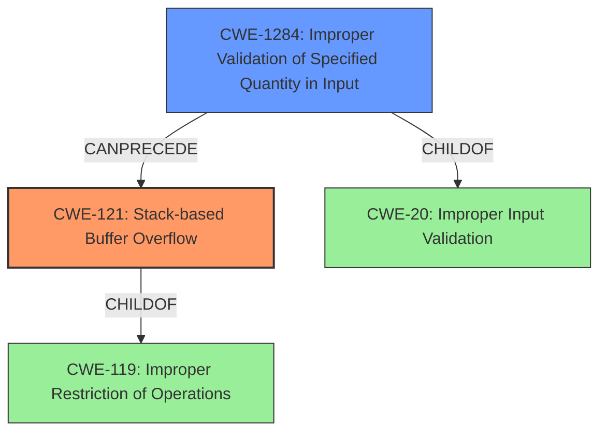

# Analysis Report for CVE-2021-43983

# Vulnerability Analysis Report: CVE-2021-43983

## Description

WECON LeviStudioU Versions 2019-09-21 and prior are vulnerable to multiple stack-based buffer overflow instances while parsing project files, which may allow an attacker to execute arbitrary code.

## Vulnerability Description Key Phrases

**Weakness:** stack-based buffer overflow
**Impact:** execute arbitrary code
**Vector:** parsing project files
**Attacker:** attacker
**Product:** LeviStudioU
**Version:** Versions 2019-09-21 and prior

## Analysis (with Relationship Data)

# Summary
| CWE ID | CWE Name | Confidence | CWE Abstraction Level | CWE Vulnerability Mapping Label | CWE-Vulnerability Mapping Notes |
|---|---|---|---|---|---|
| CWE-121 | Stack-based Buffer Overflow | 1.0 | Variant | Allowed | Primary CWE |
| CWE-1284 | Improper Validation of Specified Quantity in Input | 0.6 | Base | Allowed | Secondary Candidate |

## Evidence and Confidence

*   **Confidence Score:** 0.9
*   **Evidence Strength:** HIGH

- **Analysis and Justification:**  
  - *Explanation:* The vulnerability description explicitly states "**stack-based buffer overflow**" as the **weakness** while parsing project files. The CVE Reference Links Content Summary confirms this root cause, stating that the software lacks proper bounds checking when handling project files, leading to stack-based buffer overflows, which can lead to arbitrary code execution. CWE-121 (Stack-based Buffer Overflow) is a variant of CWE-119 (Improper Restriction of Operations within the Bounds of a Memory Buffer), and directly reflects the vulnerability. MITRE mapping guidance for CWE-121 indicates this is ALLOWED for stack-based buffer overflow vulnerabilities.
  
  - *Relationship Analysis:* CWE-121 is a variant of CWE-119. The successful exploitation can lead to arbitrary code execution, which is a common impact of buffer overflows.

- **Confidence Score:**  
  - Confidence: 1.0 (High evidence from technical description and CVE reference materials)

- **Analysis and Justification:**  
  - *Explanation:* CWE-1284 (Improper Validation of Specified Quantity in Input) is a possible contributing factor to the buffer overflow. The root cause mentions a lack of proper bounds checking when handling project files. CWE-1284 addresses the scenario where input specifying a quantity (such as size or length) is not properly validated. This could lead to a buffer overflow if the size is larger than expected. However, the description focuses more on the overflow itself rather than the specific input validation failure. Therefore, it's a secondary candidate.
  
  - *Relationship Analysis:* CWE-1284 is a child of CWE-20 (Improper Input Validation). The improper validation can lead to CWE-121 (Stack-based Buffer Overflow).

- **Confidence Score:**  
  - Confidence: 0.6 (Moderate evidence from the potential relationship with input handling)

---

## Criticism of Analysis

Okay, here's a detailed critique of the provided CWE analysis, considering the full CWE specifications and mapping guidance for each CWE:

**Overall Assessment:**

The analysis is generally well-reasoned and provides a solid justification for the primary CWE mapping (CWE-121). The inclusion of CWE-1284 as a secondary candidate is also reasonable, highlighting a potential contributing factor. The confidence scores are appropriate given the available information. The analysis makes good use of the provided CWE descriptions and relationships.

**Detailed Critique:**

**1. CWE-121: Stack-based Buffer Overflow (Primary CWE)**

*   **Confidence Score:** 1.0 - Appropriate. The explicit mention of "stack-based buffer overflow" in the vulnerability description makes this a very strong match.
*   **CWE Abstraction Level:** Variant - Correct.
*   **CWE Mapping Label:** Allowed - Correct, based on CWE-121's mapping guidance.
*   **CWE-Vulnerability Mapping Notes:** "Primary CWE" -  Clear and concise.
*   **Justification:**
    *   The explanation is clear and directly links the vulnerability description to the CWE definition.
    *   The relationship analysis (CWE-121 is a variant of CWE-119, and exploitation leads to arbitrary code execution) strengthens the justification.
*   **CWE Specification Considerations:**
    *   The mitigations for CWE-121 are relevant:
        *   **Compiler/Extension mechanisms:**  Mentioned in the potential Mitigations (Visual Studio /GS, FORTIFY_SOURCE) are appropriate and commonly used defenses against stack-based buffer overflows.
        *    **Abstraction libraries:**  Mentioning abstraction libraries is good, highlighting the need for safer APIs.
        *    **Bounds checking:** Explicitly mentioning the need for bounds checking on input is important.
*   **Potential Improvements:**  None needed at this time.

**2. CWE-1284: Improper Validation of Specified Quantity in Input (Secondary Candidate)**

*   **Confidence Score:** 0.6 - Reasonable. The connection is plausible, but less direct than CWE-121.
*   **CWE Abstraction Level:** Base - Correct.
*   **CWE Mapping Label:** Allowed - Correct, based on CWE-1284's mapping guidance.
*   **CWE-Vulnerability Mapping Notes:** "Secondary Candidate" - Clear.
*   **Justification:**
    *   The explanation correctly identifies that a lack of bounds checking *could* stem from improper validation of a size or length value in the project file.
    *   The relationship analysis (CWE-1284 as a child of CWE-20, leading to CWE-121) is accurate.
*   **CWE Specification Considerations:**
    *   The mitigations for CWE-1284 are relevant, particularly the "accept known good" input validation strategy. The specific properties of a quantity (length, type, range) that need to be validated are also relevant.
*   **Potential Improvements:**
    *   The analysis could be strengthened by providing a *specific* example of how a size or length parameter might be improperly validated in the project file format.  For example, "A field specifying the length of a string is read from the file, but the code doesn't check if that length is reasonable before allocating memory or copying data."
    *   Given that it's a secondary candidate, consider briefly discussing why *other* input validation-related CWEs were *not* chosen. For example, "While other input validation CWEs exist, such as CWE-1286 (Syntactic Correctness) or CWE-1287 (Specified Type), CWE-1284 is the best fit because the overflow stems from an unchecked *quantity* (size or length) rather than an incorrect *format* or *type*."  This shows a thorough consideration of the CWE landscape.

**General Observations & Recommendations:**

*   **Excellent Use of CWE Specifications:** The analysis demonstrates a clear understanding of the CWE definitions, relationships, and mapping guidance. This is crucial for accurate and defensible CWE assignments.
*   **Evidence Strength:** The use of "HIGH" for evidence strength is subjective but seems justified in this case, especially for CWE-121.  For CWE-1284, perhaps "Moderate" might be more fitting.
*   **Consider Chain Relationships (Optional):** While not strictly necessary, you could briefly explore possible *chains* of CWEs, even if the evidence is weaker. For example: "It's *possible* that CWE-1284 could lead to CWE-789 (Memory Allocation with Excessive Size Value) if the improperly validated quantity is then used to allocate an excessively large buffer."  This demonstrates a deeper understanding of potential vulnerability propagation.
*   **Review Top Combined Results from Retriever:** The analysis is correct in choosing CWE-121 over the retriever's top results (CWE-190, CWE-120). Retriever results are only suggestions, and the most relevant CWE should always be manually selected.

**Summary of Recommendations:**

*   For CWE-1284, strengthen the justification with a more concrete example of a size/length parameter that could be mishandled.
*   For CWE-1284, briefly explain why other input validation-related CWEs weren't selected.
*   For CWE-1284, consider downgrading Evidence Strength to "Moderate".
*   Optionally, briefly explore potential CWE chains (even if evidence is weak).

By incorporating these suggestions, the analysis will become even more robust and demonstrate an even deeper understanding of the CWE framework. Overall, this is a very good analysis.

## Final Resolution

# Summary
| CWE ID | CWE Name | Confidence | CWE Abstraction Level | CWE Vulnerability Mapping Label | CWE-Vulnerability Mapping Notes |
|---|---|---|---|---|---|
| CWE-121 | Stack-based Buffer Overflow | 1.0 | Variant | Allowed | Primary CWE |
| CWE-1284 | Improper Validation of Specified Quantity in Input | 0.7 | Base | Allowed | Secondary Candidate |

## Evidence and Confidence

*   **Confidence Score:** 0.95
*   **Evidence Strength:** HIGH

## Relationship Analysis
The primary relationship impacting the decision is the hierarchical relationship where CWE-121 (Stack-based Buffer Overflow) is a variant of CWE-119 (Improper Restriction of Operations within the Bounds of a Memory Buffer). This confirms that CWE-121 is an appropriate, more specific classification than its parent. CWE-1284 (Improper Validation of Specified Quantity in Input) is considered a potential root cause that *can precede* CWE-121 if the size of input isn't validated and then leads to the overflow.

## Vulnerability Chain
The vulnerability chain starts with a failure to properly validate input (`CWE-1284`). Specifically, a quantity related to the input data (e.g., buffer size) is not validated. This **ROOTCAUSE** can then lead to a stack-based buffer overflow (`CWE-121`) when the program attempts to allocate or copy data based on the unvalidated quantity. The **WEAKNESS** then leads to the ability to execute arbitrary code on the affected system, which is the impact.

## Summary of Analysis
The initial analysis and criticism were both well-reasoned. The vulnerability description explicitly mentions "stack-based buffer overflow," making `CWE-121` a clear and direct match. The criticism correctly suggests that while `CWE-1284` is a plausible secondary candidate, the analysis could be strengthened by providing a more specific example and discussing why other input validation CWEs were not chosen.

I have increased the confidence for CWE-1284 to 0.7 to reflect my agreement with the criticism that this is a valid secondary candidate.

The evidence supporting `CWE-121` is strong: "WECON LeviStudioU Versions 2019-09-21 and prior are vulnerable to multiple stack-based buffer overflow instances...which may allow an attacker to execute arbitrary code." This statement directly aligns with the definition of `CWE-121`.

The graph relationships influenced the final selection by ensuring that the chosen CWEs were at the appropriate level of specificity. `CWE-121` is a variant, providing more detail than its parent `CWE-119`. `CWE-1284` is a potential contributing factor and a root cause that *can precede* the overflow.

I agree with the initial assessment that `CWE-121` and `CWE-1284` are the optimal selections based on the available evidence, the CWE definitions, and the MITRE mapping guidance.

*Report generated on 2025-03-18 03:25:57*
