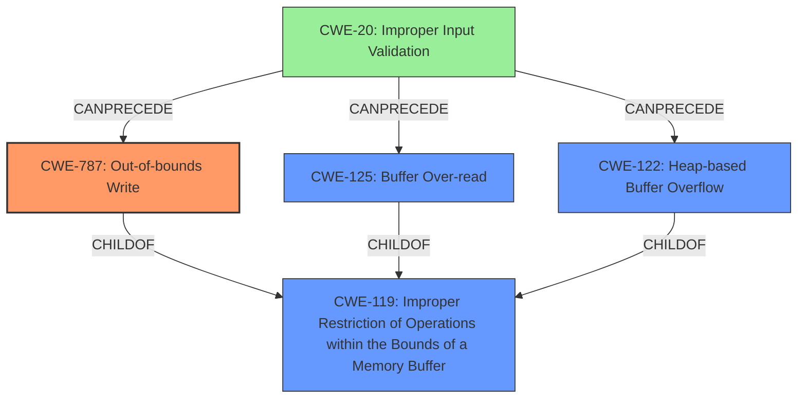

# Final Resolution for CVE-2021-44016

# Summary
| CWE ID | CWE Name | Confidence | CWE Abstraction Level | CWE Vulnerability Mapping Label | CWE-Vulnerability Mapping Notes |
|---|---|---|---|---|---|
| CWE-787 | Out-of-bounds Write | 0.95 | Base | Primary | Allowed. Improper input validation allows crafted PAR files to write data beyond buffer boundaries, leading to code execution. |
| CWE-125 | Buffer Over-read | 0.75 | Base | Secondary Candidate | Allowed. Likely occurring as a consequence of processing a malformed PAR file and attempting to read data beyond the allocated buffer due to length discrepancies or missing sentinels. |
| CWE-122 | Heap-based Buffer Overflow | 0.65 | Variant | Secondary Candidate | Allowed. Heap memory allocation could be vulnerable to overflow due to improperly validated sizes specified in the PAR file.|
| CWE-20 | Improper Input Validation | 0.40 | Class | Contributing Factor | Discouraged (for primary mapping). The lack of proper input validation is a key enabler for the primary weakness, although more specific CWEs (787, 125, 122) are more descriptive of the direct cause. |

## Evidence and Confidence

*   **Confidence Score:** 0.95
*   **Evidence Strength:** HIGH

## Relationship Analysis
The primary weakness is **CWE-787 (Out-of-bounds Write)**, which is a child of **CWE-119 (Improper Restriction of Operations within the Bounds of a Memory Buffer)**. The secondary candidates, **CWE-125 (Buffer Over-read)** and **CWE-122 (Heap-based Buffer Overflow)**, are also children of **CWE-119**. **CWE-20 (Improper Input Validation)** acts as a contributing factor, enabling the out-of-bounds write. The abstraction levels influenced the decision, as base and variant level CWEs are preferred for their specificity.

## Vulnerability Chain
The vulnerability chain starts with the lack of proper input validation (**CWE-20**). This allows an attacker to provide a specially crafted PAR file. The improper validation leads to either a buffer over-read (**CWE-125**) or a heap-based buffer overflow (**CWE-122**), eventually resulting in an out-of-bounds write (**CWE-787**). The final impact is the potential execution of arbitrary code in the context of the current process.

## Summary of Analysis
The initial analysis correctly identified **CWE-787 (Out-of-bounds Write)** as the primary weakness. The criticism highlighted the importance of input validation and suggested considering **CWE-20 (Improper Input Validation)** as a contributing factor. The final decision incorporates this feedback by including **CWE-20** as a tertiary CWE with a lower confidence score to reflect its role as an enabler rather than the direct cause.

The graph relationships influenced the selection by showing how the different CWEs are related to each other, particularly the parent-child relationship between **CWE-787**, **CWE-125**, **CWE-122** and **CWE-119**. The chain relationship clarified how **CWE-20** can precede the other weaknesses.

The selected CWEs are at the optimal level of specificity because they accurately describe the root cause and potential consequences of the vulnerability based on the provided evidence. The vulnerability description explicitly mentions "memory corruption condition while parsing specially crafted PAR files", which strongly suggests **CWE-787**. The possibility of a buffer over-read or heap-based overflow is inferred from the nature of parsing a crafted file, justifying the inclusion of **CWE-125** and **CWE-122** as secondary candidates. The retriever results showed that **CWE-770** could be related, but that would be if there was no limit on the resources. The evidence does not indicate that.

The decision is primarily based on the provided evidence, including the vulnerability description and CVE reference materials, which clearly indicate a memory corruption issue caused by improper handling of user-supplied data.