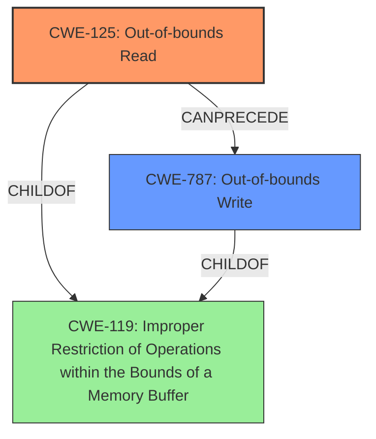

# Final Resolution for CVE-2021-44018

# Summary
| CWE ID | CWE Name | Confidence | CWE Abstraction Level | CWE Vulnerability Mapping Label | CWE-Vulnerability Mapping Notes |
|---|---|---|---|---|---|
| CWE-125 | Out-of-bounds Read | 0.95 | Base | Allowed | Primary CWE |
| CWE-787 | Out-of-bounds Write | 0.75 | Base | Allowed | Secondary Candidate |

## Evidence and Confidence

*   **Confidence Score:** 0.93
*   **Evidence Strength:** HIGH

## Relationship Analysis
The primary relationship influencing the decision is the parent-child relationship between **CWE-119** (Improper Restriction of Operations within the Bounds of a Memory Buffer) and both **CWE-125** (Out-of-bounds Read) and **CWE-787** (Out-of-bounds Write). **CWE-125** and **CWE-787** are both children of **CWE-119**, indicating that they are specific types of buffer access errors. Additionally, **CWE-787** can follow **CWE-125** in a vulnerability chain if the out-of-bounds read leads to a subsequent out-of-bounds write. The abstraction levels were also considered; both **CWE-125** and **CWE-787** are Base level, which is preferred for root cause analysis.

## Vulnerability Chain
The vulnerability chain begins with a specially crafted PAR file, leading to improper input validation. This lack of validation allows the `plmxmlAdapterSE70.dll` library to parse the file, resulting in an **out-of-bounds read** (**CWE-125**). If the data read from the out-of-bounds memory location is used in a subsequent write operation, it can lead to an **out-of-bounds write** (**CWE-787**), potentially causing memory corruption and arbitrary code execution.

Improper Input Validation --> Out-of-bounds Read (**CWE-125**) --> Out-of-bounds Write (**CWE-787**) --> Memory Corruption --> Arbitrary Code Execution

## Summary of Analysis
The initial analysis correctly identified **CWE-125** as the primary weakness, supported by the vulnerability description explicitly stating a "read past the end of an allocated buffer." The criticism suggested enhancing the justification for **CWE-787**. The vulnerability description mentions **memory corruption** and the potential for arbitrary code execution. Given that the end goal of the exploit is often code execution, the likelihood of **CWE-787** occurring is high if the out-of-bounds read retrieves a pointer to a function, and the application then calls that (invalid) pointer, this could be viewed as a 'write-what-where' condition.

The graph relationships influenced the decision by highlighting the connection between buffer access errors (**CWE-119**) and the specific types of errors (**CWE-125**, **CWE-787**). The abstraction levels also confirmed that the selected CWEs are at the appropriate level of specificity.

The selected CWEs are at the optimal level of specificity because they directly relate to the actions described in the vulnerability: an out-of-bounds read that can lead to an out-of-bounds write and subsequent code execution.