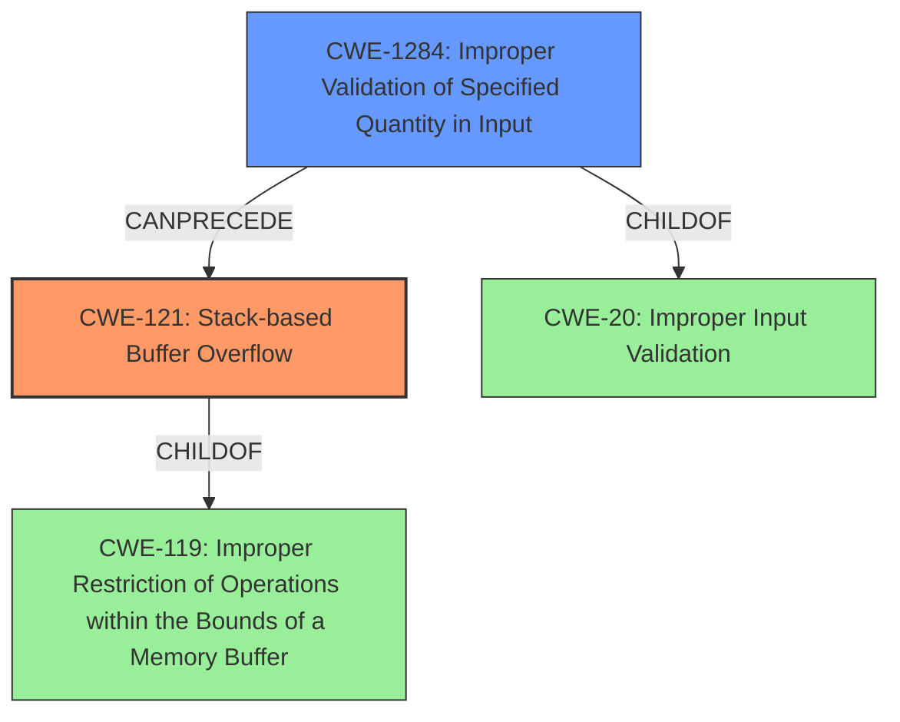

# Final Resolution for CVE-2021-44158

# Summary
| CWE ID | CWE Name | Confidence | CWE Abstraction Level | CWE Vulnerability Mapping Label | CWE-Vulnerability Mapping Notes |
|---|---|---|---|---|---|
| CWE-121 | Stack-based Buffer Overflow | 0.95 | Variant | Allowed | Primary CWE |
| CWE-1284 | Improper Validation of Specified Quantity in Input | 0.80 | Base | Allowed | Secondary Candidate |

## Evidence and Confidence

*   **Confidence Score:** 0.93
*   **Evidence Strength:** HIGH

## Relationship Analysis
The primary relationship impacting the decision is the CANPRECEDE relationship between CWE-1284 and CWE-121. The **improper validation of the input** (CWE-1284) directly leads to the **stack-based buffer overflow** (CWE-121). CWE-121 is a child of CWE-119 (Improper Restriction of Operations within the Bounds of a Memory Buffer), which highlights the fundamental issue of boundary control. The peer relationship of CWE-1284 to CWE-20 (Improper Input Validation) shows that the root cause is a specific case of input validation failure. While CWE-130 (Improper Handling of Length Parameter Inconsistency) was considered, the absence of an explicit length field in the input favors CWE-1284.

## Vulnerability Chain
The vulnerability chain starts with **improper validation of the httpd parameter length (CWE-1284)**. This leads to a condition where an attacker can provide an overly long parameter. The lack of bounds checking when copying this parameter to a stack-based buffer results in a **stack-based buffer overflow (CWE-121)**. This overflow allows the attacker to overwrite data on the stack, potentially including the return address, leading to arbitrary code execution and control of the system.

## Summary of Analysis
The initial analysis and criticism were both accurate and well-justified. The core of the vulnerability lies in the **stack-based buffer overflow (CWE-121)**, directly caused by the **lack of proper input validation (CWE-1284)**. The evidence from the vulnerability description, specifically "improper validation for httpd parameter length" and "stack-based buffer overflow," strongly supports this classification.

The graph relationships further reinforce this conclusion. The CANPRECEDE relationship between CWE-1284 and CWE-121 highlights the causal connection. The CHILDOF relationship of CWE-121 to CWE-119 underscores the violation of memory boundary restrictions. While CWE-130 was considered as a more specific alternative to CWE-1284, it was determined that the lack of an explicit length field makes CWE-1284 a better fit.

The selected CWEs are at the optimal level of specificity. CWE-121 accurately describes the type of buffer overflow, while CWE-1284 pinpoints the root cause of the vulnerability. This combination provides a clear and comprehensive understanding of the vulnerability. The classification decision is based on strong evidence from the vulnerability description, supported by the relationship analysis and mapping guidance.