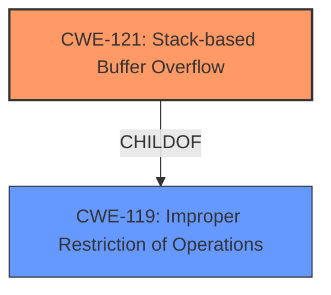

# Final Resolution for CVE-2021-44170

# Summary
| CWE ID | CWE Name | Confidence | CWE Abstraction Level | CWE Vulnerability Mapping Label | CWE-Vulnerability Mapping Notes |
|---|---|---|---|---|---|
| CWE-121 | Stack-based Buffer Overflow | 1.0 | Variant | Primary | Allowed |

## Evidence and Confidence

*   **Confidence Score:** 1.0
*   **Evidence Strength:** HIGH

## Relationship Analysis
The primary relationship considered was the parent-child relationship between CWE-119 (Improper Restriction of Operations within the Bounds of a Memory Buffer) and CWE-121 (Stack-based Buffer Overflow). Since the vulnerability description explicitly states a stack-based buffer overflow, CWE-121, being a variant of CWE-119, is the more specific and appropriate choice. No other relationships significantly influenced the decision.

## Vulnerability Chain
The vulnerability chain consists of a single, direct weakness: a **stack-based buffer overflow** [CWE-121] due to specially crafted command line arguments. The root cause is the lack of proper bounds checking when copying the command-line arguments to a stack-allocated buffer. The consequence is the ability for an authenticated attacker to execute unauthorized code or commands.

## Summary of Analysis
The initial analysis and criticism both converge on the same conclusion: CWE-121 (Stack-based Buffer Overflow) is the most accurate classification for this vulnerability. The evidence is strong, as the vulnerability description explicitly mentions a "stack-based buffer overflow" vulnerability in the command line interpreter of FortiOS.

The graph relationship analysis confirms that CWE-121 is a variant, offering a more specific categorization compared to its parent, CWE-119.

The selection of CWE-121 is at the optimal level of specificity because it directly reflects the technical nature of the vulnerability: a buffer overflow occurring on the stack.