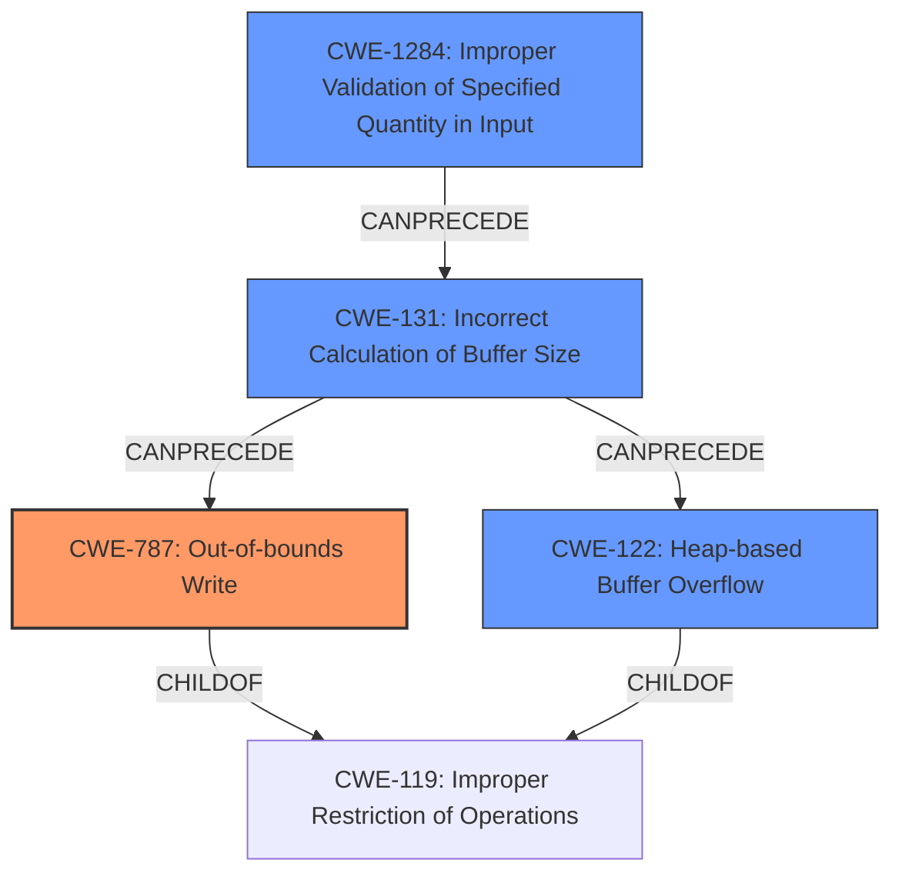

# Final Resolution for CVE-2021-44422

# Summary
| CWE ID | CWE Name | Confidence | CWE Abstraction Level | CWE Vulnerability Mapping Label | CWE-Vulnerability Mapping Notes |
|---|---|---|---|---|---|
| CWE-787 | Out-of-bounds Write | 0.95 | Base | Allowed | Primary CWE: Matches the description of writing past the end of a buffer. |
| CWE-122 | Heap-based Buffer Overflow | 0.80 | Variant | Allowed | Secondary CWE: The vulnerability description mentions a heap-based buffer overflow as a possible outcome. |
| CWE-1284 | Improper Validation of Specified Quantity in Input | 0.75 | Base | Allowed | Secondary CWE: The **rootcause** is improper input validation, which can include not validating quantity/size. This is the first step in the chain that leads to **CWE-787** and **CWE-122**. |
| CWE-131 | Incorrect Calculation of Buffer Size | 0.60 | Base | Allowed | Secondary CWE: The size of the buffer might be calculated incorrectly even if the input parameters are validated. |

## Evidence and Confidence

*   **Confidence Score:** 0.92
*   **Evidence Strength:** HIGH

## Relationship Analysis
The analysis of CWE relationships confirms the initial assessment and the reviewer's suggestions.
  - **Parent-child relationships:** **CWE-787** (Out-of-bounds Write) and **CWE-122** (Heap-based Buffer Overflow) are both children of **CWE-119** (Improper Restriction of Operations within the Bounds of a Memory Buffer), indicating a shared higher-level weakness related to memory boundary issues. This supports the co-occurrence of these CWEs.
  - **Chain relationships:** **CWE-1284** (Improper Validation of Specified Quantity in Input) can precede **CWE-787** (Out-of-bounds Write) and **CWE-122** (Heap-based Buffer Overflow), forming a vulnerability chain. The addition of **CWE-131** (Incorrect Calculation of Buffer Size) to this chain is also valid, as it can be an intermediate step where, even with some validation, the calculation itself introduces errors.
  - **Peer relationships:** No relevant peer relationships significantly impacted the decision.
  - **Abstraction levels:** The chosen CWEs are at Base and Variant levels, which provide a good balance of specificity and generality for mapping the vulnerability.

## Vulnerability Chain
The vulnerability chain begins with:
  1. **CWE-1284** (Improper Validation of Specified Quantity in Input): The application receives a BMP file and does not properly validate the size or dimensions specified within the file's header.
  2. **CWE-131** (Incorrect Calculation of Buffer Size): Even if some validation occurs, the buffer size calculation based on the (potentially unvalidated or partially validated) input parameters may be flawed.
  3. This leads to allocating an undersized buffer in the heap.
  4. Subsequently, when the application attempts to write data into this buffer, it overflows (**CWE-122** Heap-based Buffer Overflow), resulting in an **out-of-bounds write** (**CWE-787**).

The impact is potential code execution in the context of the current process, as mentioned in the vulnerability description.

## Summary of Analysis
The initial analysis correctly identified **CWE-787** as the primary weakness, supported by the explicit mention of "write operation past the end of an allocated buffer" in the vulnerability description. The inclusion of **CWE-122** is also justified, given the mention of a "heap-based buffer overflow." The reviewer's suggestion to add **CWE-131** as a secondary CWE is a valid enhancement.

The decision is strongly based on the provided evidence and aligns with the CWE specifications and mapping guidance. The graph relationships, particularly the chain relationship, further solidify the chosen CWEs and their order of occurrence.

The selected CWEs are at the optimal level of specificity because they directly address the **rootcause** (improper input validation and incorrect buffer size calculation) and the resulting consequences (heap-based buffer overflow and out-of-bounds write).