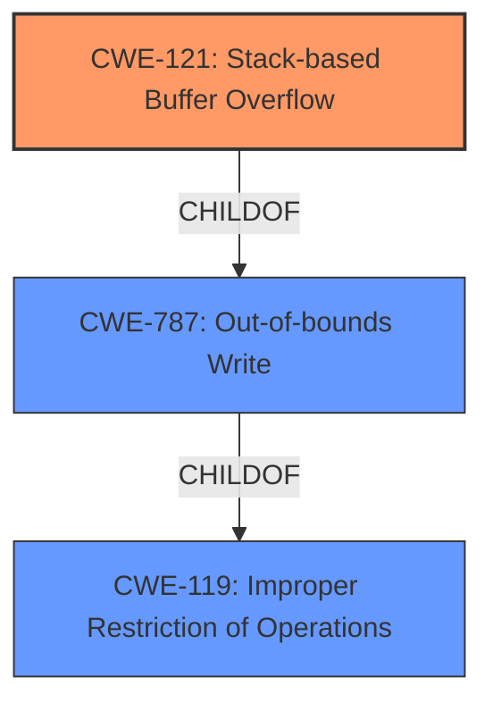

# Analysis Report for CVE-2021-44435

# Vulnerability Analysis Report: CVE-2021-44435

## Description

A vulnerability has been identified in JT Utilities (All versions < V13.1.1.0), JTTK (All versions < V11.1.1.0). JTTK library in affected products is vulnerable to stack based buffer overflow while parsing specially crafted JT files. An attacker could leverage this vulnerability to execute code in the context of the current process. (ZDI-CAN-14903)

## Vulnerability Description Key Phrases

**Weakness:** stack based buffer overflow
**Impact:** execute code in the current process
**Vector:** parsing specially crafted JT files
**Attacker:** attacker
**Product:** ['JT Utilities', 'JTTK']
**Version:** ['All versions < V13.1.1.0', 'All versions < V11.1.1.0']
**Component:** JTTK library

## Analysis (with Relationship Data)

# Summary
| CWE ID | CWE Name | Confidence | CWE Abstraction Level | CWE Vulnerability Mapping Label | CWE-Vulnerability Mapping Notes |
|---|---|---|---|---|---|
| CWE-121 | Stack-based Buffer Overflow | 0.95 | Variant | Primary | The vulnerability is explicitly described as a stack-based buffer overflow. |
| CWE-787 | Out-of-bounds Write | 0.75 | Base | Secondary Candidate | This is a more general description of a buffer overflow, but the description specifies a stack-based overflow making CWE-121 a better fit. |

## Evidence and Confidence

*   **Confidence Score:** 0.9
*   **Evidence Strength:** HIGH

- **Analysis and Justification:**  
  - *Explanation:* The vulnerability description clearly states a **stack based buffer overflow** while parsing specially crafted JT files. The vulnerability can lead to arbitrary code execution. CWE-121 (Stack-based Buffer Overflow) is a Variant-level CWE that specifically describes this type of vulnerability. The "CWE for similar CVE Descriptions" lists CWE-787 (Out-of-bounds Write) as the primary match and top CWE, but the description specifies "stack based" so CWE-121 is a better fit. CWE-787 is still a valid secondary candidate because it describes the general condition of writing outside the bounds of the allocated buffer.
  
  - *Relationship Analysis:* CWE-121 is a child of CWE-119 (Improper Restriction of Operations within the Bounds of a Memory Buffer) and CWE-787 (Out-of-bounds Write). CWE-787 is a parent of CWE-121. The "CWE for similar CVE Descriptions" suggests CWE-787 (Out-of-bounds Write) as the primary match; however, the explicit mention of "stack-based" in the vulnerability description makes CWE-121 more specific and appropriate.

- **Confidence Score:**  
  - Confidence: 0.95 (High confidence due to the explicit mention of a "stack based buffer overflow" in the vulnerability description.)

---

## Criticism of Analysis

Okay, I've reviewed the provided analysis against the full CWE specifications. Here's my critique:

**Overall Assessment:**

The analysis is strong and correctly identifies the primary CWE as CWE-121 (Stack-based Buffer Overflow). The justification is well-reasoned and considers the relationships between CWE-121 and its parent, CWE-787 (Out-of-bounds Write), as well as the guidance regarding the use of more specific CWEs when available. The confidence level of 0.95 is appropriate.

**Detailed Review:**

*   **CWE-121 (Stack-based Buffer Overflow) - Primary:**
    *   **Strengths:**
        *   The mapping is accurate. The vulnerability description explicitly mentions "stack-based buffer overflow."
        *   The justification clearly explains why CWE-121 is a better fit than the more general CWE-787. It highlights the importance of using the most specific CWE available.
        *   The identified mitigations for CWE-121 are relevant and generally applicable. These include compiler-based buffer overflow detection mechanisms, abstraction libraries, and input bounds checking.
    *   **Areas for improvement:**
        *  Could briefly mention the attack surface as it relates to parsing specially crafted files which creates an avenue to exploit the vulnerability.
*   **CWE-787 (Out-of-bounds Write) - Secondary Candidate:**
    *   **Strengths:**
        *   Acknowledging CWE-787 as a secondary candidate is appropriate. It represents the broader class of the vulnerability.
        *   The justification for *not* selecting it as primary is sound.
    *   **Areas for Improvement:**
        * No areas for improvement

*   **General Comments and Potential Improvements:**
    *   **Clarity and Conciseness:** The analysis is well-written and easy to understand.
    *   **Relationship Analysis:** The analysis of relationships between CWEs is good.
    *   **Evidence Strength:** The evidence strength is correctly assessed as HIGH due to the explicit description of the vulnerability.
    *   **Retriever Results:** The Retriever Results correctly list CWE-121 and CWE-787 in the top results.

**Specific Suggestions Based on CWE Specifications:**

*   **CWE-119 Discussion:**  The analysis correctly acknowledges that CWE-119 is a parent of CWE-121 and CWE-787. However, it could be even stronger by explicitly mentioning *why* CWE-119 is **not** the best choice.  Specifically, refer to the "Mapping Guidance" for CWE-119: "**Usage:** Discouraged. **Rationale:** CWE-119 is commonly misused in low-information vulnerability reports when lower-level CWEs could be used instead, or when more details about the vulnerability are available."  Stating this explicitly would further solidify the decision-making process.
*   **Mitigations:** The analysis accurately points to the mitigations. The specific mitigations listed in the CWE details (e.g., language selection, vetted libraries, compiler options) could be included as a bulleted list in the analysis.

**Revised Table (Optional):**

| CWE ID  | CWE Name                         | Confidence | CWE Abstraction Level | CWE Vulnerability Mapping Label | CWE-Vulnerability Mapping Notes                                                                                                                                                                                                                                                                                                                                                           |
| :------ | :--------------------------------- | :--------- | :-------------------- | :---------------------------- | :---------------------------------------------------------------------------------------------------------------------------------------------------------------------------------------------------------------------------------------------------------------------------------------------------------------------------------------------------------------------------------------- |
| CWE-121 | Stack-based Buffer Overflow      | 0.95       | Variant               | Primary                       | The vulnerability is explicitly described as a stack-based buffer overflow.                                                                                                                                                                                                                                                                                                                    |
| CWE-787 | Out-of-bounds Write                | 0.75       | Base                  | Secondary Candidate           | This is a more general description of a buffer overflow, but the description specifies a stack-based overflow making CWE-121 a better fit.                                                                                                                                                                                                                                            |
| CWE-119 | Improper Restriction of Operations within the Bounds of a Memory Buffer | N/A        | Class                  | Considered and Rejected           | The vulnerability is explicitly described as a stack-based buffer overflow.  CWE-119 is discouraged when more specific CWEs like CWE-121 or CWE-787 are available.                                                                                                                                                                              |

**In Summary:**

This is a well-performed analysis. The core mapping to CWE-121 is correct and well-justified. The suggested improvements are minor and aimed at further clarifying the reasoning and leveraging the information within the full CWE specifications.

## Final Resolution

# Summary
| CWE ID | CWE Name | Confidence | CWE Abstraction Level | CWE Vulnerability Mapping Label | CWE-Vulnerability Mapping Notes |
|---|---|---|---|---|---|
| CWE-121 | Stack-based Buffer Overflow | 0.95 | Variant | Primary | The vulnerability is explicitly described as a stack-based buffer overflow. |
| CWE-787 | Out-of-bounds Write | 0.75 | Base | Secondary Candidate | This is a more general description of a buffer overflow, but the description specifies a stack-based overflow making CWE-121 a better fit. |

## Evidence and Confidence

*   **Confidence Score:** 0.95
*   **Evidence Strength:** HIGH

## Relationship Analysis
The initial analysis correctly identified CWE-121 (Stack-based Buffer Overflow) as the primary **WEAKNESS**. CWE-121 is a child of CWE-119 (Improper Restriction of Operations within the Bounds of a Memory Buffer) and CWE-787 (Out-of-bounds Write). The decision to choose CWE-121 over CWE-787 is based on the explicit mention of "stack-based" in the vulnerability description, making CWE-121 more specific. CWE-119 was considered but correctly rejected as it is a more general class and its mapping guidance discourages its use when more specific CWEs are available. This hierarchical relationship influenced the selection by ensuring the most precise classification.

## Vulnerability Chain
The **ROOTCAUSE** is the lack of proper bounds checking when parsing specially crafted JT files. This leads to a **WEAKNESS**, specifically a stack-based buffer overflow (CWE-121). An attacker can leverage this vulnerability to execute arbitrary code in the context of the current process. The chain is: Insufficient Input Validation -> Stack-based Buffer Overflow -> Arbitrary Code Execution.

## Summary of Analysis
The initial analysis and the criticism are both well-reasoned and accurate. The final determination is based on the explicit mention of "stack-based buffer overflow" in the vulnerability description: "JTTK library in affected products is vulnerable to **stack based buffer overflow** while parsing specially crafted JT files." This direct evidence supports the selection of CWE-121. The graph relationships confirm that CWE-121 is a more specific child of CWE-787 and CWE-119, justifying its selection as the primary CWE. The selection of CWE-121 is at the optimal level of specificity because it directly reflects the vulnerability type described in the report.

*Report generated on 2025-03-18 03:30:38*
