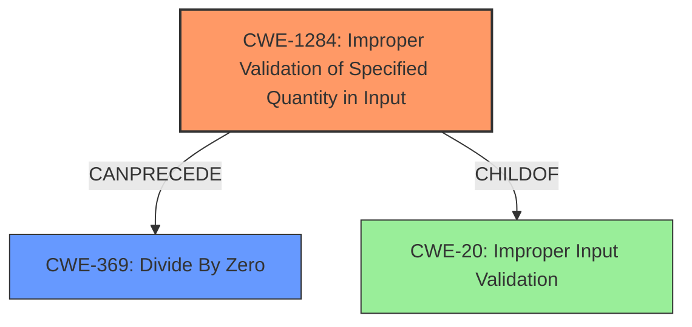

# Final Resolution for CVE-2021-44483

# Summary
| CWE ID | CWE Name | Confidence | CWE Abstraction Level | CWE Vulnerability Mapping Label | CWE-Vulnerability Mapping Notes |
|---|---|---|---|---|---|
| CWE-1284 | Improper Validation of Specified Quantity in Input | 0.85 | Base | Primary | The primary **weakness** is a **lack of input validation** on the divisor, leading to a divide-by-zero error. |
| CWE-369 | Divide By Zero | 0.65 | Base | Secondary | The direct result of the **lack of input validation** is a divide-by-zero error, causing a crash. |

## Evidence and Confidence

*   **Confidence Score:** 0.75
*   **Evidence Strength:** MEDIUM

## Relationship Analysis
The primary relationship is the chain where **CWE-1284 (Improper Validation of Specified Quantity in Input)** leads to **CWE-369 (Divide By Zero)**. **CWE-1284** is a child of **CWE-20 (Improper Input Validation)**, but we are selecting **CWE-1284** due to its greater specificity. **CWE-369** directly results from **CWE-1284** when a divisor of zero is not properly validated.

## Vulnerability Chain
The vulnerability chain starts with the **root cause**, which is the **lack of input validation (CWE-1284)** for the divisor. This **weakness** allows a zero value to be used in a division operation, resulting in a **divide-by-zero error (CWE-369)**. The consequence is a crash of the application.

## Summary of Analysis
The initial analysis correctly identified the **lack of input validation** and the resulting **divide-by-zero error**. However, it used the class-level CWE-20. The criticism correctly pointed out that **CWE-20** is discouraged and suggested a more specific CWE. I agree with the criticism and have updated the primary CWE to **CWE-1284 (Improper Validation of Specified Quantity in Input)**, as it more accurately reflects the specific **weakness** in the code. The vulnerability description explicitly states a **lack of input validation** as the **root cause**, specifically the divisor in the `eb_div` function not being checked for zero. This aligns with **CWE-1284** since the divisor is a specified quantity whose value isn't checked. The evidence is sufficient to support this classification.
The selection of **CWE-1284** is at the optimal level of specificity because it describes the precise type of input validation error (quantity validation) leading to the vulnerability. Using **CWE-20** would be too general, while more specific variants might not fully capture the essence of the **weakness**.