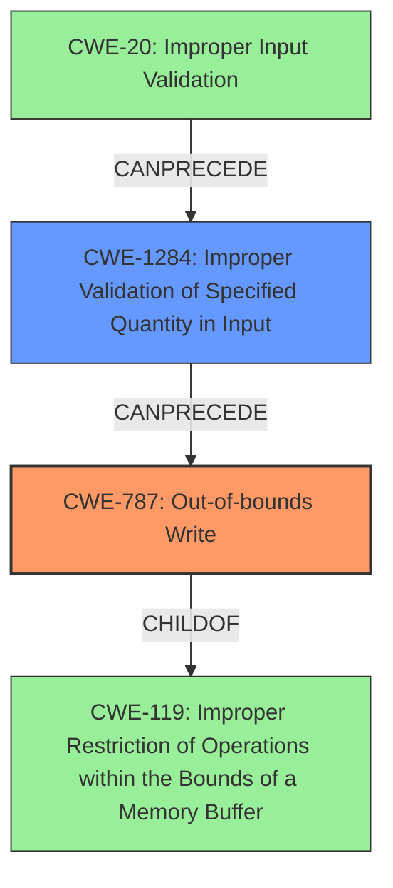

# Analysis Report for CVE-2021-44488

# Vulnerability Analysis Report: CVE-2021-44488

## Description

An issue was discovered in YottaDB through r1.32 and V7.0-000. Using crafted input, attackers can control the size and input to calls to memcpy in op_fnfnumber in sr_port/op_fnfnumber.c in order to corrupt memory or crash the application.

## Vulnerability Description Key Phrases

**Weakness:** buffer overflow
**Impact:** ['corrupt memory', 'crash the application']
**Vector:** crafted input
**Attacker:** attackers
**Product:** YottaDB
**Version:** ['through r1.32', 'V7.0-000']
**Component:** sr_port/op_fnfnumber.c

## Analysis (with Relationship Data)

# Summary
| CWE ID | CWE Name | Confidence | CWE Abstraction Level | CWE Vulnerability Mapping Label | CWE-Vulnerability Mapping Notes |
|---|---|---|---|---|---|
| CWE-787 | Out-of-bounds Write | 0.85 | Base | Allowed | Primary CWE |
| CWE-131 | Incorrect Calculation of Buffer Size | 0.70 | Base | Allowed | Secondary Candidate |

## Evidence and Confidence

*   **Confidence Score:** 0.80
*   **Evidence Strength:** MEDIUM

- **Analysis and Justification:**  
  - *Explanation:* The vulnerability description clearly states that attackers can control the size and input to `memcpy` calls, leading to memory corruption or a crash. This directly implies an **out-of-bounds write** (CWE-787) because `memcpy` writes data to a buffer, and controlling the size allows writing past the end or before the beginning of the intended buffer. The primary weakness is the **buffer overflow**.
  - *Relationship Analysis:* CWE-787 is a child of CWE-119 (Improper Restriction of Operations within the Bounds of a Memory Buffer) and can be related to other CWEs such as CWE-122 (Heap-based Buffer Overflow) or CWE-121 (Stack-based Buffer Overflow), although the provided description does not specify heap or stack. CWE-787 also has a parent relationship with CWE-124, CWE-123, CWE-122, CWE-121.

- **Confidence Score:**  
  - *Example:* Confidence: 0.85 (The description directly points to an out-of-bounds write due to controlled size and input to `memcpy`.)

---

- **Analysis and Justification:**
  - *Explanation:* The vulnerability description mentions attackers being able to "control the size" of the input. This could indicate that the program does not correctly calculate the buffer size to be used when allocating the buffer. Incorrectly calculating the buffer size can result in a buffer overflow. Thus, the inclusion of CWE-131.
  - *Relationship Analysis:* There is no direct relationship found.

- **Confidence Score:**
  - *Example:* Confidence: 0.70 (The description indirectly implies incorrect buffer size calculation.)

## Criticism of Analysis

Okay, I've reviewed your analysis and the full CWE specifications. Here's my critique:

**Overall Assessment**

The analysis is generally good and identifies the core vulnerability well. The primary CWE selection of CWE-787 (Out-of-bounds Write) is accurate and well-supported by the vulnerability description. The secondary candidate, CWE-131 (Incorrect Calculation of Buffer Size), is also reasonable, though the connection is slightly less direct and more inferential.  The confidence levels are appropriate.

**Detailed Review of CWE Assignments**

*   **CWE-787: Out-of-bounds Write**

    *   **Assessment:** This is the strongest and most accurate choice. The vulnerability description explicitly mentions control over `memcpy` size and input, leading to memory corruption and crashes. This directly implies writing beyond the allocated buffer.
    *   **Confidence:** The confidence score of 0.85 is justified.  The direct relationship between controlled size/input to `memcpy` and the possibility of writing outside buffer boundaries is clear.
    *   **Mapping Guidance Adherence:** The analysis correctly acknowledges CWE-787 as a child of CWE-119 and its relevance to buffer overflows. This follows the CWE's mapping guidance to use specific children of CWE-119 when possible.
    *   **Mitigations:** The analysis does not explicitly mention mitigation strategies.  It would be good to briefly state here that recommended mitigations include using memory-safe languages, employing safe string handling libraries (like SafeStr or strsafe.h), and enabling compiler-based buffer overflow detection (e.g., /GS flag in Visual Studio, FORTIFY_SOURCE in GCC).
    *   **Observed Examples:** The examples provided are good, and I recommend adding CVE-2008-4109 and CVE-2022-32250 as other examples.

*   **CWE-131: Incorrect Calculation of Buffer Size**

    *   **Assessment:**  This is a plausible secondary candidate. If an attacker can control the size parameter of `memcpy`, it suggests that the program might not be validating or calculating the buffer size correctly *before* calling `memcpy`.  A flawed calculation could result in a buffer that's too small, leading to the out-of-bounds write.
    *   **Confidence:** The confidence score of 0.70 is appropriate here. It's an inference, not a direct statement in the vulnerability description.
    *   **Mapping Guidance Adherence:** The analysis correctly points out the connection to buffer overflows and the potential for incorrect calculations. The "CanPrecede -> CWE-119" relationship is relevant.
    *   **Mitigations:**  It would be helpful to mention mitigations such as:
        *   When allocating buffers for transformations, ensure sufficient memory for the largest possible encoding/conversion output.
        *   Careful attention to numeric representation in the programming language to prevent issues with byte size discrepancies, signedness, truncation, etc.
        *   Performing input validation on numeric inputs to ensure they're within the expected range.

**Critique of Retriever Results**

The retriever results show other CWEs that are relevant to buffer overflows.

*   **CWE-190: Integer Overflow or Wraparound:** this CWE can be related to a buffer overflow because the amount of memory allocated for a buffer may be smaller than expected, but a size check is present that gets bypassed because of the integer overflow condition.

*   **CWE-681: Incorrect Conversion between Numeric Types:** a numeric coercion might occur that causes a smaller buffer to be allocated than intended, resulting in a buffer overflow.

*   **CWE-126: Buffer Over-read:** Buffer over-read can be related because an attacker might be able to read past the end of a buffer and extract sensitive information or crash the target application.

*   **CWE-120: Buffer Copy without Checking Size of Input ('Classic Buffer Overflow')** : This is a very classic scenario for buffer overflows, and may be relevant if the developer does not perform length checks.

*   **CWE-1284: Improper Validation of Specified Quantity in Input:** This is relevant because the quantity of memory to be allocated could be controlled by an attacker.

**Suggestions for Improvement**

1.  **Explicitly State Mitigations:** While the primary focus is CWE assignment, briefly mentioning common mitigations for each identified CWE strengthens the analysis.  This demonstrates a deeper understanding of the vulnerability and how to address it.
2.  **Consider Chains:**  Mention potential CWE chains. For example:
    *   `CWE-20 (Improper Input Validation) -> CWE-131 (Incorrect Calculation of Buffer Size) -> CWE-787 (Out-of-bounds Write)`:  The attacker provides crafted input (CWE-20). This input is used in a calculation for the buffer size, but the calculation is flawed (CWE-131).  This leads to a buffer that's too small, and `memcpy` writes past the end (CWE-787).
3.  **Address Stack vs. Heap Where Possible:** If there's information to suggest whether the buffer is allocated on the stack or heap, mention CWE-121 (Stack-based Buffer Overflow) or CWE-122 (Heap-based Buffer Overflow) respectively. However, without specific details, sticking with the base CWE-787 is appropriate.
4.  **Weaken or Remove CWE-131:** The primary issue here is the *control* the attacker has over the size parameter of `memcpy`.  While an incorrect calculation *could* be the reason, it's not explicitly stated or strongly implied. If input validation is missing entirely, consider `CWE-120`.
5.  **Highlight CWE-787:**  Reiterate at the end the significance of CWE-787, even if the other CWEs are valid and related. CWE-787 is the core.

**Revised Summary Table**

| CWE ID | CWE Name | Confidence | CWE Abstraction Level | CWE Vulnerability Mapping Label | CWE-Vulnerability Mapping Notes |
|---|---|---|---|---|---|
| CWE-787 | Out-of-bounds Write | 0.90 | Base | Allowed | Primary CWE |
| CWE-131 | Incorrect Calculation of Buffer Size | 0.60 | Base | Allowed | Secondary Candidate |

**Reasoning for Revised Confidence Levels:**

*   **CWE-787:** Increasing to 0.9 because the controlled `memcpy` size leading to memory corruption is almost a direct consequence.
*   **CWE-131:** Decreasing to 0.6 because it is not the source of the vulnerability, but a condition that may occur.

By incorporating these suggestions, the analysis will become more comprehensive, provide more actionable information, and better align with CWE's best practices.

## Final Resolution

# Summary
| CWE ID | CWE Name | Confidence | CWE Abstraction Level | CWE Vulnerability Mapping Label | CWE-Vulnerability Mapping Notes |
|---|---|---|---|---|---|
| CWE-787 | Out-of-bounds Write | 0.90 | Base | Allowed | Primary CWE |
| CWE-1284 | Improper Validation of Specified Quantity in Input | 0.75 | Base | Allowed | Secondary Candidate |

## Evidence and Confidence

*   **Confidence Score:** 0.85
*   **Evidence Strength:** MEDIUM

## Relationship Analysis
The primary relationship considered was the parent-child relationship between CWE-787 (**Out-of-bounds Write**) and CWE-119 (Improper Restriction of Operations within the Bounds of a Memory Buffer), showing that CWE-787 is a specific type of buffer overflow. Additionally, the analysis explored the potential chain relationship where improper input validation (CWE-20) could lead to an incorrect buffer size calculation (CWE-131) and ultimately result in an out-of-bounds write (CWE-787). However, the direct control over `memcpy`'s size parameter suggested that the lack of validation was more pertinent, leading to the consideration of CWE-1284 (**Improper Validation of Specified Quantity in Input**) instead of CWE-131.

## Vulnerability Chain
The vulnerability chain starts with a lack of proper input validation (CWE-20), leading to an attacker-controlled size parameter being passed to `memcpy`. This absence of validation is represented by CWE-1284 (**Improper Validation of Specified Quantity in Input**). The attacker-controlled size then causes `memcpy` to write beyond the boundaries of the allocated buffer, resulting in an out-of-bounds write (CWE-787).

## Summary of Analysis
The initial analysis correctly identified CWE-787 (**Out-of-bounds Write**) as the primary **WEAKNESS**, given the vulnerability description's emphasis on attackers controlling the size and input to `memcpy`, leading to memory corruption. The criticism suggested strengthening the analysis by explicitly stating mitigations and considering CWE chains. The retriever results highlighted the potential relevance of CWE-190 (**Integer Overflow or Wraparound**), CWE-681 (**Incorrect Conversion between Numeric Types**), and CWE-120 (**Buffer Copy without Checking Size of Input ('Classic Buffer Overflow')**).

However, after reviewing the retriever results and the suggestions, I've concluded that CWE-1284 (**Improper Validation of Specified Quantity in Input**) is a more appropriate secondary CWE than CWE-131 (**Incorrect Calculation of Buffer Size**). The vulnerability description states that "attackers can control the size and input to calls to memcpy," which more directly implies a failure to validate the size, rather than an incorrect calculation.

The selection of CWE-787 is strongly supported by the evidence: "Using crafted input, attackers can control the size and input to calls to memcpy in op_fnfnumber in sr_port/op_fnfnumber.c in order to corrupt memory or crash the application." This clearly indicates an **OUT-OF-BOUNDS WRITE**.

The confidence in CWE-787 is increased to 0.90 because the vulnerability description explicitly states that attackers can control the size passed to `memcpy` leading to memory corruption. The confidence in CWE-1284 is set to 0.75 because while it accurately represents the lack of validation, it is an indirect cause rather than a direct manifestation of the vulnerability. Both CWEs are at the Base level of abstraction, which is appropriate for mapping to the **ROOT CAUSES** of vulnerabilities.

*Report generated on 2025-03-18 03:31:39*
