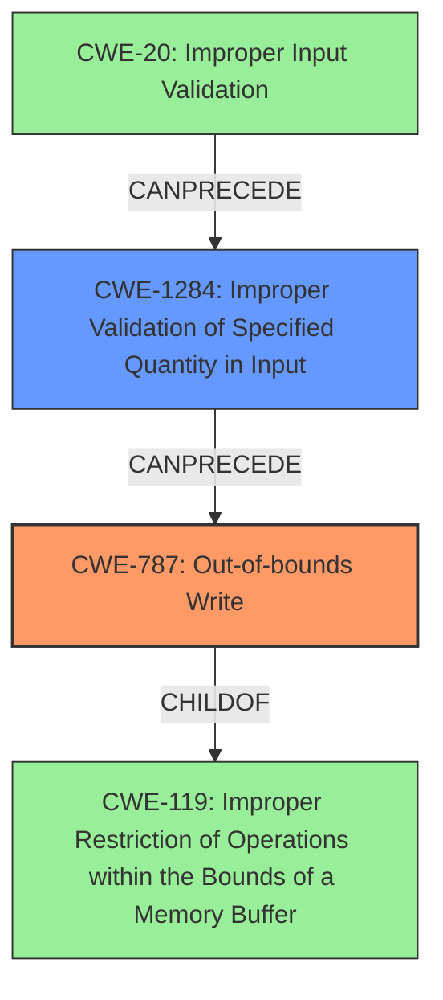

# Final Resolution for CVE-2021-44488

# Summary
| CWE ID | CWE Name | Confidence | CWE Abstraction Level | CWE Vulnerability Mapping Label | CWE-Vulnerability Mapping Notes |
|---|---|---|---|---|---|
| CWE-787 | Out-of-bounds Write | 0.90 | Base | Allowed | Primary CWE |
| CWE-1284 | Improper Validation of Specified Quantity in Input | 0.75 | Base | Allowed | Secondary Candidate |

## Evidence and Confidence

*   **Confidence Score:** 0.85
*   **Evidence Strength:** MEDIUM

## Relationship Analysis
The primary relationship considered was the parent-child relationship between CWE-787 (**Out-of-bounds Write**) and CWE-119 (Improper Restriction of Operations within the Bounds of a Memory Buffer), showing that CWE-787 is a specific type of buffer overflow. Additionally, the analysis explored the potential chain relationship where improper input validation (CWE-20) could lead to an incorrect buffer size calculation (CWE-131) and ultimately result in an out-of-bounds write (CWE-787). However, the direct control over `memcpy`'s size parameter suggested that the lack of validation was more pertinent, leading to the consideration of CWE-1284 (**Improper Validation of Specified Quantity in Input**) instead of CWE-131.

## Vulnerability Chain
The vulnerability chain starts with a lack of proper input validation (CWE-20), leading to an attacker-controlled size parameter being passed to `memcpy`. This absence of validation is represented by CWE-1284 (**Improper Validation of Specified Quantity in Input**). The attacker-controlled size then causes `memcpy` to write beyond the boundaries of the allocated buffer, resulting in an out-of-bounds write (CWE-787).

## Summary of Analysis
The initial analysis correctly identified CWE-787 (**Out-of-bounds Write**) as the primary **WEAKNESS**, given the vulnerability description's emphasis on attackers controlling the size and input to `memcpy`, leading to memory corruption. The criticism suggested strengthening the analysis by explicitly stating mitigations and considering CWE chains. The retriever results highlighted the potential relevance of CWE-190 (**Integer Overflow or Wraparound**), CWE-681 (**Incorrect Conversion between Numeric Types**), and CWE-120 (**Buffer Copy without Checking Size of Input ('Classic Buffer Overflow')**).

However, after reviewing the retriever results and the suggestions, I've concluded that CWE-1284 (**Improper Validation of Specified Quantity in Input**) is a more appropriate secondary CWE than CWE-131 (**Incorrect Calculation of Buffer Size**). The vulnerability description states that "attackers can control the size and input to calls to memcpy," which more directly implies a failure to validate the size, rather than an incorrect calculation.

The selection of CWE-787 is strongly supported by the evidence: "Using crafted input, attackers can control the size and input to calls to memcpy in op_fnfnumber in sr_port/op_fnfnumber.c in order to corrupt memory or crash the application." This clearly indicates an **OUT-OF-BOUNDS WRITE**.

The confidence in CWE-787 is increased to 0.90 because the vulnerability description explicitly states that attackers can control the size passed to `memcpy` leading to memory corruption. The confidence in CWE-1284 is set to 0.75 because while it accurately represents the lack of validation, it is an indirect cause rather than a direct manifestation of the vulnerability. Both CWEs are at the Base level of abstraction, which is appropriate for mapping to the **ROOT CAUSES** of vulnerabilities.