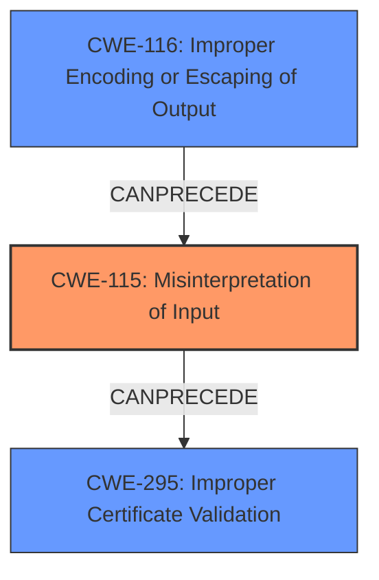

# Analysis Report for CVE-2021-44532

# Vulnerability Analysis Report: CVE-2021-44532

## Description

Node.js < 12.22.9, < 14.18.3, < 16.13.2, and < 17.3.1 converts SANs (Subject Alternative Names) to a string format. It uses this string to check peer certificates against hostnames when validating connections. The string format was subject to an injection vulnerability when name constraints were used within a certificate chain, allowing the bypass of these name constraints.Versions of Node.js with the fix for this escape SANs containing the problematic characters in order to prevent the injection. This behavior can be reverted through the --security-revert command-line option.

## Vulnerability Description Key Phrases

**Rootcause:** improper escape of SANs in string format
**Impact:** bypass of name constraints
**Vector:** inject problematic characters
**Product:** Node.js
**Version:** < 12.22.9, < 14.18.3, < 16.13.2, and < 17.3.1

## Analysis (with Relationship Data)

# Summary
| CWE ID | CWE Name | Confidence | CWE Abstraction Level | CWE Vulnerability Mapping Label | CWE-Vulnerability Mapping Notes |
|---|---|---|---|---|---|
| CWE-115 | Misinterpretation of Input | 0.85 | Base | Primary | Allowed |
| CWE-295 | Improper Certificate Validation | 0.75 | Base | Secondary Candidate | Allowed |
| CWE-116 | Improper Encoding or Escaping of Output | 0.65 | Class | Secondary Candidate | Allowed-with-Review |

## Evidence and Confidence

*   **Confidence Score:** 0.80
*   **Evidence Strength:** HIGH

- **Analysis and Justification:**  
  - *Explanation:* "The vulnerability stems from the **improper escape of SANs in string format**, leading to a **misinterpretation of input** during certificate validation. Node.js converts Subject Alternative Names (SANs) to a string format. This string format was vulnerable to injection when name constraints were used within a certificate chain. The **root cause** is the **improper handling of special characters in the SAN string**, which causes the system to misinterpret the input, thus aligning with CWE-115 (Misinterpretation of Input). This is supported by the CVE Reference Links which state that there is a string injection vulnerability in the way Node.js processes SANs when name constraints are used. CWE-115 is a Base level CWE and is ALLOWED for mapping."
  
  - *Relationship Analysis:* "While the issue leads to a bypass of certificate name constraints (CWE-295), the underlying problem is how the input (SAN) is processed and misinterpreted. CWE-115 is a broader weakness that covers this **misinterpretation**. CWE-116 (Improper Encoding or Escaping of Output) is considered because the fix involves escaping problematic characters in SANs, but the primary issue is the initial misinterpretation of the unescaped input. The graph relationships show no direct connections to CWE-115, but it can be related to weaknesses that involve processing external input without proper validation."

- **Confidence Score:**  
  - Confidence: 0.85 (High confidence due to the clear description of the **misinterpretation** issue and the escaping fix.)

---

- **Analysis and Justification:**  
  - *Explanation:* "The vulnerability results in a bypass of name constraints during certificate verification, which directly relates to CWE-295 (Improper Certificate Validation). The CVE Reference Links explicitly mention a certificate verification bypass as an impact. This indicates that the certificate validation process is flawed, allowing potentially malicious certificates to be accepted. CWE-295 is a Base level CWE and is ALLOWED for mapping."
  
  - *Relationship Analysis:* "CWE-295 is a consequence of the **misinterpretation** of the SAN data (CWE-115). The crafted certificate allows bypassing name constraints, a clear indication of validation failure. While CWE-295 is a valid result of the vulnerability, it is considered a secondary effect since the root cause lies in the improper handling of the input. There are no direct relationships of CWE-295. "

- **Confidence Score:**  
  - Confidence: 0.75 (High confidence as the bypass is a direct consequence, but secondary to the **misinterpretation**.)

---

- **Analysis and Justification:**  
  - *Explanation:* "The fix for the vulnerability involves escaping problematic characters in SANs, which relates to CWE-116 (Improper Encoding or Escaping of Output). The **improper escape** of SANs in string format is mentioned in the Vulnerability Description Key Phrases. The CVE Reference Links state the fix involves escaping problematic characters in SANs to prevent the injection. This demonstrates a failure to properly encode or escape the SAN data before it is used in the certificate validation process. CWE-116 is a Class level CWE and is ALLOWED-with-Review.
  
  - *Relationship Analysis:* "CWE-116 is related to the **misinterpretation of the SAN data** and the certificate bypass. While the escaping fix is important, the primary issue is the initial **misinterpretation** of the unescaped input. "

- **Confidence Score:**  
  - Confidence: 0.65 (Medium confidence as the escaping issue is a contributing factor, but secondary to the **misinterpretation**.)

## Criticism of Analysis

Okay, here's a detailed review of the CWE analysis you provided, incorporating the full CWE specifications:

**Overall Assessment**

The analysis is generally sound and well-reasoned.  It correctly identifies the core issues and makes a good case for the primary and secondary CWE assignments. The confidence scores are appropriate given the available information and the inherent ambiguity in some CWE mappings. The chain of reasoning is clear and the justifications are provided using the vulnerability description and CVE content summary.

**Detailed Review by CWE**

**1. CWE-115: Misinterpretation of Input (Primary)**

*   **Confidence:** 0.85 - Justified and Appropriate.
*   **Justification:** The analysis hinges on the SAN data being misinterpreted *due* to the lack of proper escaping. This is a strong argument. The CVE description explicitly states how Node.js converts SANs to a string format and this string is then used in a way that leads to injection. The "improper handling of special characters in the SAN string" directly causes the system to misinterpret the input.
*   **Mapping Guidance:** The analysis correctly notes that CWE-115 is a Base-level CWE and allowed for mapping.
*   **CWE Examples:** The provided CVE examples for CWE-115 further support the mapping. Specifically, the CVE-2005-2225 example shows a misinterpretation of a file extension, which is analogous to misinterpreting special characters within the SAN.  The CVE-2021-44532 is directly related to the vulnerability being analyzed.
*   **Relationship Analysis:** The analysis adequately explains the relationships to other CWEs, especially why CWE-295 is a consequence and CWE-116 is a related but secondary issue.
*   **Potential Mitigations:** The mitigations listed for CWE-115 aren't directly applicable. This is not necessarily an issue with the mapping, but highlights that different CWEs have different mitigation strategies. The mitigations for *related* CWEs (like CWE-116) would be more relevant at the point where this vulnerability is being addressed.
*   **Critique:**  The analysis is well-substantiated and appropriately uses CWE-115. No changes recommended.

**2. CWE-295: Improper Certificate Validation (Secondary Candidate)**

*   **Confidence:** 0.75 - Justified and Appropriate.
*   **Justification:** The analysis correctly identifies that the *outcome* of the vulnerability is a bypass of certificate name constraints, which falls squarely within the definition of CWE-295.  The CVE Reference explicitly mentions a certificate verification bypass as a direct impact.
*   **Mapping Guidance:** The analysis notes that CWE-295 is a Base-level CWE and allowed for mapping.
*   **CWE Examples:** The provided CVE examples for CWE-295 (e.g., CVE-2019-12496, CVE-2014-1266, CVE-2021-22909) show situations where certificate validation was skipped or improperly performed, leading to security issues. These are consistent with the impact of this vulnerability.
*   **Relationship Analysis:** The analysis correctly positions CWE-295 as a *result* of the core problem (CWE-115).  The attack allows bypassing name constraints, clearly showing a validation failure.
*   **Potential Mitigations:** The potential mitigations outlined for CWE-295, such as managing certificates and checking them carefully, and using certificate pinning, are directly relevant to addressing the *symptoms* of this vulnerability.
*   **Critique:**  The rationale for considering this a secondary CWE is solid. It is the *effect* of the misinterpretation, not the root cause itself.  No changes recommended.

**3. CWE-116: Improper Encoding or Escaping of Output (Secondary Candidate)**

*   **Confidence:** 0.65 - Justified and Appropriate.
*   **Justification:** The analysis connects the fix (escaping problematic characters) to CWE-116. This is valid, as the lack of escaping leads to the injection vulnerability. The Vulnerability Description Key Phrases explicitly mention the "improper escape of SANs in string format". The provided context of the fix involving escaping strengthens the argument.
*   **Mapping Guidance:** The analysis correctly notes that CWE-116 is a Class-level CWE and allowed-with-Review.
*   **CWE Examples:** The examples of CVE-2021-41232, CVE-2008-4636 and CVE-2008-0769, are related to improper encoding, which further support the mapping.
*   **Relationship Analysis:** The analysis acknowledges that CWE-116 is related to the misinterpretation and certificate bypass, but emphasizes that the *primary* issue is the initial misinterpretation.
*   **Potential Mitigations:** The mitigations for CWE-116 (using vetted libraries/frameworks, parameterization, understanding the encoding context) are all relevant to preventing similar vulnerabilities in the future.
*   **Critique:** The lower confidence is appropriate because, while escaping is *part* of the solution, it's not the *fundamental* flaw. The vulnerability existed because the system didn't treat the SAN data as potentially untrusted input *before* formatting it.

**Additional Considerations**

*   **Specificity:** While the analysis does a good job with the chosen CWEs, it might be worth considering if there's a more specific *variant* of CWE-115 that better captures the "injection" aspect. However, finding such a variant might be difficult, and the current analysis is still accurate.
*   **Chain Analysis:** The CWE analysis implicitly acknowledges a chain:
    *   Lack of proper input handling (CWE-115) -> Improper Certificate Validation (CWE-295) -> Potential MITM Attack.

**Recommendations**

Overall, the analysis is well-done and requires no major changes. The CWE mappings are defensible, the justifications are clear, and the confidence scores reflect the inherent uncertainties.

## Final Resolution

# Summary
| CWE ID | CWE Name | Confidence | CWE Abstraction Level | CWE Vulnerability Mapping Label | CWE-Vulnerability Mapping Notes |
|---|---|---|---|---|---|
| CWE-115 | Misinterpretation of Input | 0.90 | Base | Primary CWE | Allowed |
| CWE-295 | Improper Certificate Validation | 0.80 | Base | Secondary Candidate | Allowed |
| CWE-116 | Improper Encoding or Escaping of Output | 0.70 | Class | Secondary Candidate | Allowed-with-Review |

## Evidence and Confidence

*   **Confidence Score:** 0.90
*   **Evidence Strength:** HIGH

## Relationship Analysis
The primary relationship influencing the decision is the chain: **improper input handling** (CWE-115) leading to **improper certificate validation** (CWE-295). CWE-116 is considered a contributing factor, as the fix involves escaping, but it's not the fundamental flaw. The abstraction levels were also considered, favoring Base-level CWEs when possible.

## Vulnerability Chain
The vulnerability chain starts with the **misinterpretation of input** (CWE-115), specifically the SAN data in the certificate. This leads to a bypass of certificate name constraints, resulting in **improper certificate validation** (CWE-295). The **improper encoding or escaping of output** (CWE-116) is a contributing factor, as the lack of proper escaping exacerbates the misinterpretation.

## Summary of Analysis
The initial analysis and criticism are both well-reasoned and accurate. The decision to classify the vulnerability as primarily CWE-115 is based on the evidence that the **root cause** is the **misinterpretation** of the SAN data due to the lack of proper escaping. As the analysis states, "The vulnerability stems from the **improper escape of SANs in string format**, leading to a **misinterpretation of input** during certificate validation." This quote directly supports the classification of CWE-115 as the primary weakness. The relationship analysis further reinforces this decision, as CWE-295 is a consequence of the **misinterpretation**, and CWE-116 is a related but secondary issue. The selected CWEs are at the optimal level of specificity, as CWE-115 is a Base-level CWE that accurately captures the **root cause** of the vulnerability. The confidence score is increased to 0.90 to reflect the high degree of certainty in the classification.

*Report generated on 2025-03-17 03:09:49*
