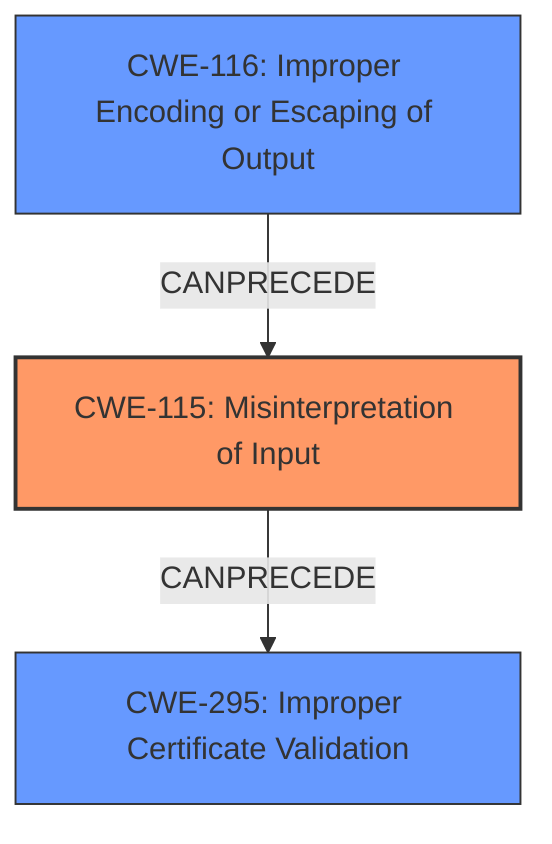

# Final Resolution for CVE-2021-44532

# Summary
| CWE ID | CWE Name | Confidence | CWE Abstraction Level | CWE Vulnerability Mapping Label | CWE-Vulnerability Mapping Notes |
|---|---|---|---|---|---|
| CWE-115 | Misinterpretation of Input | 0.90 | Base | Primary CWE | Allowed |
| CWE-295 | Improper Certificate Validation | 0.80 | Base | Secondary Candidate | Allowed |
| CWE-116 | Improper Encoding or Escaping of Output | 0.70 | Class | Secondary Candidate | Allowed-with-Review |

## Evidence and Confidence

*   **Confidence Score:** 0.90
*   **Evidence Strength:** HIGH

## Relationship Analysis
The primary relationship influencing the decision is the chain: **improper input handling** (CWE-115) leading to **improper certificate validation** (CWE-295). CWE-116 is considered a contributing factor, as the fix involves escaping, but it's not the fundamental flaw. The abstraction levels were also considered, favoring Base-level CWEs when possible.

## Vulnerability Chain
The vulnerability chain starts with the **misinterpretation of input** (CWE-115), specifically the SAN data in the certificate. This leads to a bypass of certificate name constraints, resulting in **improper certificate validation** (CWE-295). The **improper encoding or escaping of output** (CWE-116) is a contributing factor, as the lack of proper escaping exacerbates the misinterpretation.

## Summary of Analysis
The initial analysis and criticism are both well-reasoned and accurate. The decision to classify the vulnerability as primarily CWE-115 is based on the evidence that the **root cause** is the **misinterpretation** of the SAN data due to the lack of proper escaping. As the analysis states, "The vulnerability stems from the **improper escape of SANs in string format**, leading to a **misinterpretation of input** during certificate validation." This quote directly supports the classification of CWE-115 as the primary weakness. The relationship analysis further reinforces this decision, as CWE-295 is a consequence of the **misinterpretation**, and CWE-116 is a related but secondary issue. The selected CWEs are at the optimal level of specificity, as CWE-115 is a Base-level CWE that accurately captures the **root cause** of the vulnerability. The confidence score is increased to 0.90 to reflect the high degree of certainty in the classification.