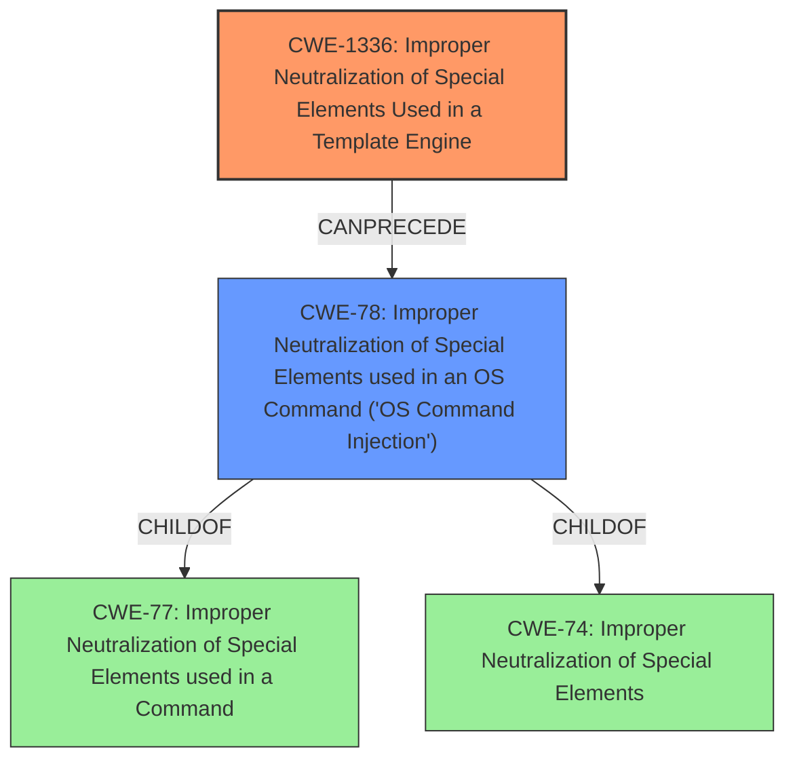

# Analysis Report for CVE-2021-44657

# Vulnerability Analysis Report: CVE-2021-44657

## Description

In StackStorm versions prior to 3.6.0, the jinja interpreter was not run in sandbox mode and thus allows execution of unsafe system commands. Jinja does not enable sandboxed mode by default due to backwards compatibility. Stackstorm now sets sandboxed mode for jinja by default.

## Vulnerability Description Key Phrases

**Impact:** execution of unsafe system commands
**Vector:** unsafe system commands
**Product:** StackStorm
**Version:** prior to 3.6.0
**Component:** jinja interpreter

## Analysis (with Relationship Data)

# Summary
| CWE ID | CWE Name | Confidence | CWE Abstraction Level | CWE Vulnerability Mapping Label | CWE-Vulnerability Mapping Notes |
|---|---|---|---|---|---|
| CWE-1336 | Improper Neutralization of Special Elements Used in a Template Engine | 0.85 | Base | Allowed | Primary CWE: The product uses a template engine to insert or process externally-influenced input, but it does not neutralize or incorrectly neutralizes special elements or syntax that can be interpreted as template expressions or other code directives when processed by the engine. |
| CWE-78 | Improper Neutralization of Special Elements used in an OS Command ('OS Command Injection') | 0.70 | Base | Allowed | Secondary CWE: The product constructs all or part of an OS command using externally-influenced input from an upstream component, but it does not neutralize or incorrectly neutralizes special elements that could modify the OS command that is sent to a downstream component. |

## Evidence and Confidence

*   **Confidence Score:** 0.80
*   **Evidence Strength:** HIGH

- **Analysis and Justification:**  
  - *Explanation:* "The vulnerability description clearly states that the Jinja interpreter was not run in sandbox mode, allowing the execution of unsafe system commands. This directly aligns with CWE-1336, which describes the improper neutralization of special elements used in a template engine. The CVE reference links confirm that the root cause is the lack of sandboxing, which permits the execution of arbitrary Python code and system commands via template injection. The description mentions that StackStorm now sets sandboxed mode for Jinja by default, further supporting this classification. The retriever results also list CWE-1336 as the top match. CWE-1336 is a Base level CWE, which is the preferred abstraction level. MITRE mapping guidance indicates that CWE-1336 is ALLOWED."
  
  - *Relationship Analysis:* "CWE-1336 is related to CWE-94 (Improper Control of Generation of Code) and CWE-74 (Improper Neutralization of Special Elements). The CVE reference links detail how the attacker can inject code and call OS commands. This shows that CWE-1336 can precede CWE-78 (Improper Neutralization of Special Elements used in an OS Command)."

- **Confidence Score:**  
  - Confidence: 0.85 (High confidence due to direct evidence from the vulnerability description and CVE reference materials, supported by retriever results.)

---
- **Analysis and Justification:**  
  - *Explanation:* "The vulnerability allows for the execution of arbitrary system commands due to the lack of sandboxing in the Jinja interpreter. This aligns with CWE-78, which covers the improper neutralization of special elements used in OS command injection. The CVE reference links detail how attackers could directly access the `os` module and execute system commands. While the primary weakness is the lack of sandboxing in the template engine, the direct exploitation leads to OS command injection. The retriever results have CWE-78 with a lower score than CWE-1336, which is why it is being listed as secondary. CWE-78 is a Base level CWE, which is the preferred abstraction level. MITRE mapping guidance indicates that CWE-78 is ALLOWED."
  
  - *Relationship Analysis:* "CWE-78 is a child of CWE-77 (Command Injection) and is related to CWE-74 (Improper Neutralization of Special Elements). The graph relationships show CWE-78 CanPrecede CWE-269 (Privilege Management) since command injection often leads to privilege escalation."

- **Confidence Score:**  
  - *Example:* Confidence: 0.70 (Medium confidence due to the vulnerability details highlighting OS command execution as a direct consequence of the primary weakness.)

## Criticism of Analysis

Okay, here's a detailed review of the provided CWE analysis, incorporating the full CWE specifications.

**Overall Assessment:**

The analysis is well-structured and provides good justification for the primary and secondary CWE assignments. The confidence levels are reasonable, and the evidence provided is relevant. The use of CWE specifications helps in solidifying the analysis. The retriever results also support the analysis, particularly the primary CWE.  However, there are a few areas where the analysis can be further refined to improve accuracy and consistency with CWE guidelines.

**Detailed Review:**

**1. CWE-1336: Improper Neutralization of Special Elements Used in a Template Engine**

*   **Confidence:** 0.85 (Excellent, well-supported)
*   **CWE Abstraction Level:** Base (Meets the preferred abstraction level)
*   **CWE Vulnerability Mapping Label:** Allowed (Consistent with MITRE guidance)
*   **Analysis and Justification:**
    *   The explanation is clear and correctly identifies the root cause: the lack of sandboxing in the Jinja2 template engine. This aligns perfectly with CWE-1336's description. The fact that StackStorm's fix involves enabling sandboxing provides strong evidence. The CVE reference links corroborating the ability to execute arbitrary system commands via template injection further strengthens this assignment.
    *   The relationship analysis correctly identifies CWE-94 and CWE-74.
    *   The note regarding MITRE mapping guidance is appropriate.
*   **Critique:**
    *   **Mitigation Considerations:** The analysis could benefit from mentioning the specific mitigations recommended by CWE-1336:
        *   "Choose a template engine that offers a sandbox or restricted mode, or at least limits the power of any available expressions, function calls, or commands."  This was not chosen initially, which led to the vulnerability.
        *   "Use the template engine's sandbox or restricted mode, if available."  This is precisely what StackStorm implemented in the fix.
    *   **Alternative CWEs considered:** Since access to the OS was available through the Jinja2 template, some might argue about the relevance of **CWE-917 (Improper Neutralization of Special Elements used in an Expression Language Statement)**. However, the core issue was lack of sandboxing on the template engine level, which led to unsafe expression evaluation, making CWE-1336 a better fit.

**2. CWE-78: Improper Neutralization of Special Elements used in an OS Command ('OS Command Injection')**

*   **Confidence:** 0.70 (Reasonable, but room for improvement)
*   **CWE Abstraction Level:** Base (Meets preferred abstraction level)
*   **CWE Vulnerability Mapping Label:** Allowed (Consistent with MITRE guidance)
*   **Analysis and Justification:**
    *   The explanation correctly identifies that the exploitation of the lack of sandboxing directly leads to OS command injection.
    *   The analysis mentions the `os` module access, which is direct evidence of OS command capabilities.
    *   The secondary classification is reasonable, given the primary CWE.
*   **Critique:**
    *   **Overlapping with CWE-77:** The analysis should explicitly acknowledge that CWE-78 is a child of CWE-77 (Improper Neutralization of Special Elements used in a Command). This means all instances of CWE-78 are also instances of CWE-77, *but not vice versa*.  Since the commands being injected are OS commands, CWE-78 is more specific and therefore preferred.
    *   **CWE-74 Discussion:** It would be beneficial to explain why CWE-74 (Improper Neutralization of Special Elements in Output Used by a Downstream Component ('Injection')) was *not* chosen as a primary CWE. While technically correct that the *ultimate* impact is injection, CWE-74 is a very general "Class" level CWE that the MITRE guidance discourages. CWE-1336 and CWE-78 are more precise "Base" level CWEs. Also, CWE-74's "Mapping Guidance" specifically states "Examine the children and descendants of this entry to find a more precise mapping."
    *   **Mitigation Considerations:** The analysis could further incorporate specific mitigations from CWE-78:
        *   "If at all possible, use library calls rather than external processes to recreate the desired functionality."
        *   "Run the code in a "jail" or similar sandbox environment that enforces strict boundaries between the process and the operating system." This also aligns with the actual fix.
    *   **Privilege Escalation Considerations:** The "Relationship Analysis" mentions CWE-269 (Privilege Management) as a 'CanPrecede' relationship. This is not exactly correct because the description says "The graph relationships show CWE-78 CanPrecede CWE-269...". The graph relationship between CWE-78 and CWE-269 is actually a 'CanResultIn', meaning that CWE-78 vulnerabilities can result in CWE-269 conditions, where commands are performed with a higher level of privileges than intended due to incorrect privilege assignments.

**Recommendations for Improvement:**

1.  **Strengthen Mitigation Discussion:**  For both CWEs, explicitly discuss how the recommended mitigations (from the CWE specifications) relate to the vulnerability and the actual fix implemented.
2.  **Address potential alternative CWEs and discuss their relevancy:** Explicitly refute how similar CWEs may or may not be applicable. In this case, discussing why it isn't just CWE-77 or CWE-74 would be ideal.
3.  **Clarify the Relationship Between CWE-77 and CWE-78:** Since CWE-78 is a child of CWE-77, acknowledge this relationship and explain why CWE-78 is the more appropriate choice in this specific case because it describes the OS command language more precisely than CWE-77.
4.  **Privilege Escalation Clarification:** Clarify the 'CanResultIn' graph relationship between CWE-78 and privilege escalation (e.g. CWE-269 or a more specific child of CWE-269 if possible) rather than stating 'CanPrecede'.

**Revised Summary Table:**

| CWE ID | CWE Name | Confidence | CWE Abstraction Level | CWE Vulnerability Mapping Label | CWE-Vulnerability Mapping Notes |
|---|---|---|---|---|---|
| CWE-1336 | Improper Neutralization of Special Elements Used in a Template Engine | 0.85 | Base | Allowed | Primary CWE: The product uses a template engine to insert or process externally-influenced input, but it does not neutralize or incorrectly neutralizes special elements or syntax that can be interpreted as template expressions or other code directives when processed by the engine.  Mitigation: Sandboxing the template engine (now implemented). |
| CWE-78 | Improper Neutralization of Special Elements used in an OS Command ('OS Command Injection') | 0.70 | Base | Allowed | Secondary CWE: The product constructs all or part of an OS command using externally-influenced input from an upstream component, but it does not neutralize or incorrectly neutralizes special elements that could modify the OS command that is sent to a downstream component.  CWE-78 (OS Command Injection) is a more specific case of CWE-77 (Command Injection), with the injected commands being operating system commands. |

By addressing these points, the analysis becomes even more robust and aligns more closely with the principles of accurate and consistent CWE mapping.

## Final Resolution

# Summary
| CWE ID | CWE Name | Confidence | CWE Abstraction Level | CWE Vulnerability Mapping Label | CWE-Vulnerability Mapping Notes |
|---|---|---|---|---|---|
| CWE-1336 | Improper Neutralization of Special Elements Used in a Template Engine | 0.90 | Base | Allowed | Primary CWE: The product uses a template engine to insert or process externally-influenced input, but it does not neutralize or incorrectly neutralizes special elements or syntax that can be interpreted as template expressions or other code directives when processed by the engine. Mitigation: Sandboxing the template engine (now implemented). |
| CWE-78 | Improper Neutralization of Special Elements used in an OS Command ('OS Command Injection') | 0.75 | Base | Allowed | Secondary CWE: The product constructs all or part of an OS command using externally-influenced input from an upstream component, but it does not neutralize or incorrectly neutralizes special elements that could modify the OS command that is sent to a downstream component. CWE-78 (OS Command Injection) is a more specific case of CWE-77 (Command Injection), with the injected commands being operating system commands. |

## Evidence and Confidence

*   **Confidence Score:** 0.85
*   **Evidence Strength:** HIGH

## Relationship Analysis
The primary weakness is **CWE-1336 (Improper Neutralization of Special Elements Used in a Template Engine)**. It is at the Base level, making it suitable for direct mapping. The relationship analysis focuses on how this weakness allows for the execution of arbitrary commands. **CWE-78 (Improper Neutralization of Special Elements used in an OS Command ('OS Command Injection'))** is a secondary weakness because it is a direct consequence of the lack of sandboxing in the template engine. CWE-78 is a child of **CWE-77 (Improper Neutralization of Special Elements used in a Command)**, making it a more specific classification than CWE-77. The initial analysis correctly identified that **CWE-1336** can precede **CWE-78**.

## Vulnerability Chain
The vulnerability chain begins with the **ROOTCAUSE** being the lack of sandboxing in the Jinja2 template engine (**CWE-1336**). This allows an attacker to inject arbitrary code. The injected code then leads to the execution of OS commands (**CWE-78**). The final impact is the ability to execute arbitrary system commands, potentially leading to privilege escalation and complete system compromise.

## Summary of Analysis
The initial analysis and criticism were both very strong. The conclusion to classify this as **CWE-1336 (Improper Neutralization of Special Elements Used in a Template Engine)** as the primary **WEAKNESS** and **CWE-78 (Improper Neutralization of Special Elements used in an OS Command ('OS Command Injection'))** as the secondary **WEAKNESS** is correct.

The vulnerability description states that "the jinja interpreter was not run in sandbox mode and thus allows execution of unsafe system commands." This is direct evidence for **CWE-1336** since it directly states the cause is the lack of sandboxing in the template engine. The description also explicitly states the consequence which is the ability to execute unsafe system commands, which directly relates to **CWE-78**.

The graph relationships influenced the selection by emphasizing the specific nature of the vulnerability. **CWE-78** is a child of **CWE-77**, but **CWE-78** is more appropriate because it specifically describes OS command injection. Also **CWE-74** was considered, but it is too high-level and is often misused when lower-level weaknesses are more appropriate. The selected CWEs are at the optimal level of specificity because they directly address the **ROOTCAUSE** and the immediate impact of the vulnerability.

*Report generated on 2025-03-17 02:54:01*
