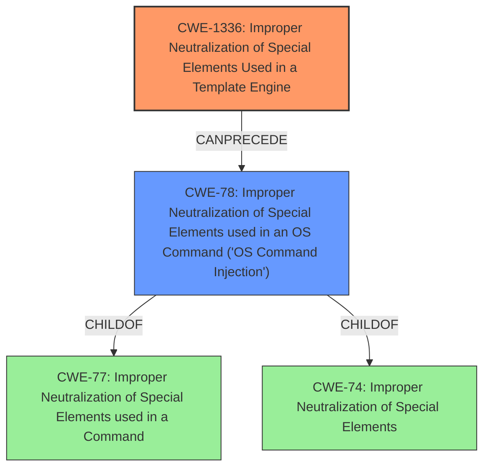

# Final Resolution for CVE-2021-44657

# Summary
| CWE ID | CWE Name | Confidence | CWE Abstraction Level | CWE Vulnerability Mapping Label | CWE-Vulnerability Mapping Notes |
|---|---|---|---|---|---|
| CWE-1336 | Improper Neutralization of Special Elements Used in a Template Engine | 0.90 | Base | Allowed | Primary CWE: The product uses a template engine to insert or process externally-influenced input, but it does not neutralize or incorrectly neutralizes special elements or syntax that can be interpreted as template expressions or other code directives when processed by the engine. Mitigation: Sandboxing the template engine (now implemented). |
| CWE-78 | Improper Neutralization of Special Elements used in an OS Command ('OS Command Injection') | 0.75 | Base | Allowed | Secondary CWE: The product constructs all or part of an OS command using externally-influenced input from an upstream component, but it does not neutralize or incorrectly neutralizes special elements that could modify the OS command that is sent to a downstream component. CWE-78 (OS Command Injection) is a more specific case of CWE-77 (Command Injection), with the injected commands being operating system commands. |

## Evidence and Confidence

*   **Confidence Score:** 0.85
*   **Evidence Strength:** HIGH

## Relationship Analysis
The primary weakness is **CWE-1336 (Improper Neutralization of Special Elements Used in a Template Engine)**. It is at the Base level, making it suitable for direct mapping. The relationship analysis focuses on how this weakness allows for the execution of arbitrary commands. **CWE-78 (Improper Neutralization of Special Elements used in an OS Command ('OS Command Injection'))** is a secondary weakness because it is a direct consequence of the lack of sandboxing in the template engine. CWE-78 is a child of **CWE-77 (Improper Neutralization of Special Elements used in a Command)**, making it a more specific classification than CWE-77. The initial analysis correctly identified that **CWE-1336** can precede **CWE-78**.

## Vulnerability Chain
The vulnerability chain begins with the **ROOTCAUSE** being the lack of sandboxing in the Jinja2 template engine (**CWE-1336**). This allows an attacker to inject arbitrary code. The injected code then leads to the execution of OS commands (**CWE-78**). The final impact is the ability to execute arbitrary system commands, potentially leading to privilege escalation and complete system compromise.

## Summary of Analysis
The initial analysis and criticism were both very strong. The conclusion to classify this as **CWE-1336 (Improper Neutralization of Special Elements Used in a Template Engine)** as the primary **WEAKNESS** and **CWE-78 (Improper Neutralization of Special Elements used in an OS Command ('OS Command Injection'))** as the secondary **WEAKNESS** is correct.

The vulnerability description states that "the jinja interpreter was not run in sandbox mode and thus allows execution of unsafe system commands." This is direct evidence for **CWE-1336** since it directly states the cause is the lack of sandboxing in the template engine. The description also explicitly states the consequence which is the ability to execute unsafe system commands, which directly relates to **CWE-78**.

The graph relationships influenced the selection by emphasizing the specific nature of the vulnerability. **CWE-78** is a child of **CWE-77**, but **CWE-78** is more appropriate because it specifically describes OS command injection. Also **CWE-74** was considered, but it is too high-level and is often misused when lower-level weaknesses are more appropriate. The selected CWEs are at the optimal level of specificity because they directly address the **ROOTCAUSE** and the immediate impact of the vulnerability.