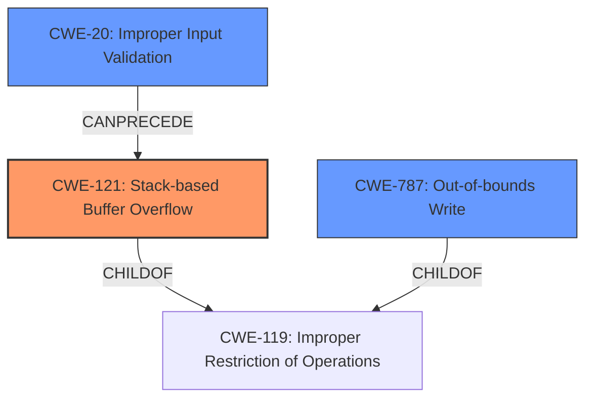

# Final Resolution for CVE-2021-44703

# Summary
| CWE ID | CWE Name | Confidence | CWE Abstraction Level | CWE Vulnerability Mapping Label | CWE-Vulnerability Mapping Notes |
|---|---|---|---|---|---|
| CWE-121 | Stack-based Buffer Overflow | 0.95 | Variant | Primary | Allowed |
| CWE-787 | Out-of-bounds Write | 0.75 | Base | Secondary | Allowed |
| CWE-20 | Improper Input Validation | 0.50 | Class | Contributing | Allowed |

## Evidence and Confidence

*   **Confidence Score:** 0.90
*   **Evidence Strength:** HIGH

## Relationship Analysis
The primary CWE is CWE-121 (**CWE-121: Stack-based Buffer Overflow**), which is a variant of CWE-119 (**CWE-119: Improper Restriction of Operations within the Bounds of a Memory Buffer**). This hierarchical relationship makes CWE-121 a more specific and appropriate choice given the explicit mention of "stack buffer overflow" in the vulnerability description. The secondary CWE, CWE-787 (**CWE-787: Out-of-bounds Write**), is a more general base class that encompasses CWE-121, providing broader context. Including CWE-20 (**CWE-20: Improper Input Validation**) acknowledges that the vulnerability is triggered by a crafted file, suggesting a failure to properly validate input. This adds another dimension to the analysis, showing that improper input validation can precede a buffer overflow.

## Vulnerability Chain
The vulnerability chain starts with a crafted file that is not properly validated (CWE-20 (**CWE-20: Improper Input Validation**)). This leads to a stack-based buffer overflow (CWE-121 (**CWE-121: Stack-based Buffer Overflow**)), which is a specific type of out-of-bounds write (CWE-787 (**CWE-787: Out-of-bounds Write**)). The consequence of this overflow is arbitrary code execution. The relationships clearly show the progression from a root cause (input validation failure) to the final impact (code execution).

## Summary of Analysis
The initial analysis correctly identified CWE-121 (**CWE-121: Stack-based Buffer Overflow**) as the primary weakness due to the explicit mention of "stack buffer overflow" in the vulnerability description. The inclusion of CWE-787 (**CWE-787: Out-of-bounds Write**) as a secondary CWE is also appropriate, as it is the base class of CWE-121.

The criticism correctly pointed out the need to consider how the crafted file leads to the overflow and to explicitly rule out alternative CWEs. Based on this, CWE-20 (**CWE-20: Improper Input Validation**) was added to account for the insecure handling of the crafted file. The analysis is based on the evidence: "Acrobat Reader DC version 21.007.20099 (and earlier), 20.004.30017 (and earlier) and 17.011.30204 (and earlier) are affected by a stack buffer overflow vulnerability due to insecure handling of a crafted file". The relationships between CWEs influenced the final selection by highlighting the hierarchical structure and potential vulnerability chain. The selected CWEs are at the optimal level of specificity, with CWE-121 being a precise match for the described vulnerability and CWE-787 providing broader context.