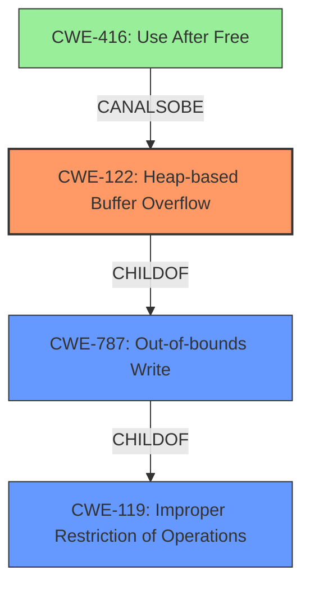

# Analysis Report for CVE-2021-44709

# Vulnerability Analysis Report: CVE-2021-44709

## Description

Acrobat Reader DC version 21.007.20099 (and earlier), 20.004.30017 (and earlier) and 17.011.30204 (and earlier) are affected by a heap overflow vulnerability due to insecure handling of a crafted file, potentially resulting in arbitrary code execution in the context of the current user. Exploitation of this issue requires user interaction in that a victim must open a malicious file.

## Vulnerability Description Key Phrases

**Rootcause:** insecure handling
**Weakness:** heap overflow
**Impact:** arbitrary code execution
**Vector:** crafted file
**Product:** Acrobat Reader DC
**Version:** ['21.007.20099 (and earlier)', '20.004.30017 (and earlier)', '17.011.30204 (and earlier)']

## Analysis (with Relationship Data)

# Summary
| CWE ID | CWE Name | Confidence | CWE Abstraction Level | CWE Vulnerability Mapping Label | CWE-Vulnerability Mapping Notes |
|---|---|---|---|---|---|
| CWE-122 | Heap-based Buffer Overflow | 0.95 | Variant | Allowed | Primary CWE |
| CWE-787 | Out-of-bounds Write | 0.75 | Base | Allowed | Secondary Candidate |
| CWE-416 | Use After Free | 0.6 | Variant | Allowed | Secondary Candidate |

## Evidence and Confidence

*   **Confidence Score:** 0.90
*   **Evidence Strength:** HIGH

- **Analysis and Justification:**  
  - *Explanation:* The vulnerability description explicitly states a "**heap overflow**" due to "**insecure handling**" of a crafted file. The CVE Reference Links Content Summary confirms the **Root cause of vulnerability** is a "Heap-based Buffer Overflow (CWE-122)". CWE-122 (Heap-based Buffer Overflow) is a Variant of buffer overflow that occurs in the heap portion of memory. This aligns directly with the provided evidence.
  
  - *Relationship Analysis:* CWE-122 is a variant of CWE-119 (Improper Restriction of Operations within the Bounds of a Memory Buffer). The provided description and reference material specifically mention heap allocation, making CWE-122 a more precise match than its parent CWE-119.

- **Confidence Score:**  
  - Confidence: 0.95 (Strong evidence from the vulnerability description and supporting CVE reference links.)

---
- **Analysis and Justification:**  
  - *Explanation:* CWE-787 (Out-of-bounds Write) describes a condition where data is written past the end or before the beginning of the intended buffer. While CWE-122 specifically indicates the overflow occurs in the heap, CWE-787 represents the broader class of out-of-bounds write vulnerabilities. Given that the vulnerability involves writing beyond the allocated buffer on the heap, CWE-787 is a relevant secondary candidate to represent the underlying mechanism causing the overflow.

  - *Relationship Analysis:* CWE-787 is a base level CWE and a child of CWE-119 (Improper Restriction of Operations within the Bounds of a Memory Buffer). It is also a parent of CWE-122 (Heap-based Buffer Overflow).

- **Confidence Score:**  
  - Confidence: 0.75 (CWE-787 is a broader characterization of the out-of-bounds write, supporting its inclusion.)

---
- **Analysis and Justification:**  
  - *Explanation:* The primary CWE match for similar CVE Descriptions is CWE-416 (Use After Free). While the primary weakness described in the vulnerability is a heap overflow, the "**insecure handling**" of a crafted file *could* potentially lead to a use-after-free condition if memory is freed and then accessed later. However, the provided description focuses on the overflow aspect, so CWE-416 is a less direct match, but is included as a secondary candidate.

  - *Relationship Analysis:* CWE-416 (Use After Free) can occur if the "**insecure handling**" leads to premature freeing of memory followed by subsequent access, potentially contributing to the vulnerability's exploitability.

- **Confidence Score:**  
  - Confidence: 0.6 (CWE-416 is a possible secondary weakness, but less directly supported by the evidence than CWE-122 and CWE-787.)

## Criticism of Analysis

Okay, I've reviewed the provided analysis and the full CWE specifications for the referenced weaknesses. Here's my critique:

**Overall Assessment:**

The analysis is generally well-reasoned and provides a solid justification for the primary CWE mapping (CWE-122). The inclusion of secondary candidates (CWE-787 and CWE-416) is also appropriate, though the reasoning for CWE-416 could be stronger.  The Confidence scores seem reasonable given the evidence.

**Detailed Critique:**

1.  **CWE-122: Heap-based Buffer Overflow (Primary Mapping):**

    *   **Strengths:** The analysis correctly identifies the primary cause as a heap-based buffer overflow, supported by the vulnerability description and the CVE reference summary. The explanation clearly links the overflow to memory allocated on the heap.  The confidence score of 0.95 is justified.
    *   **Improvements:** None. The analysis thoroughly supports the selection of this CWE.
    *   **Specification Compliance:** The mapping complies with the specification's "Usage: Allowed" guidance and the "Rationale" provided.
    *   **Mitigation Considerations:** The analysis implicitly touches on mitigations by referencing languages with automatic bounds checking. It could be slightly improved by explicitly mentioning some of the mitigations from the CWE-122 specification, such as using abstraction libraries or enabling compiler-based overflow detection.

2.  **CWE-787: Out-of-bounds Write (Secondary Candidate):**

    *   **Strengths:** The justification for CWE-787 is reasonable. It acknowledges that CWE-787 is a broader, more general category than CWE-122, but it accurately describes the underlying mechanism of an out-of-bounds write, even if it is specifically on the heap.
    *   **Improvements:** The analysis could be slightly strengthened by emphasizing that while CWE-122 is a more *specific* instance of CWE-787, CWE-787 captures the fundamental *nature* of the vulnerability. In other words, the core problem *is* writing beyond the boundary of a buffer. It just happens to be on the heap.
    *   **Specification Compliance:** The mapping complies with the specification's "Usage: Allowed" guidance.
    *   **Mitigation Considerations:** The provided mitigations for CWE-787 like using safer string handling functions are applicable, but not as directly helpful as those listed for CWE-122.

3.  **CWE-416: Use After Free (Secondary Candidate):**

    *   **Strengths:** The analysis acknowledges that CWE-416 is less directly supported by the evidence. The potential connection to "insecure handling" leading to a UAF condition is plausible, especially if the code has memory management issues.  This is a reasonable candidate for secondary consideration based on the 'insecure handling' aspect of the description.
    *   **Improvements:** The analysis should acknowledge that this is speculation. There is no specific mention of freeing memory too early. Stating that the "insecure handling" *could* lead to a UAF condition if the heap overflow corrupts data structures used for memory management would strengthen the justification. Explain how a heap overflow could lead to memory being freed twice, and then later accessed again.
    *   **Specification Compliance:** The mapping complies with the specification's "Usage: Allowed" guidance.
    *   **Mitigation Considerations:** The mitigations provided for CWE-416 such as automatic memory management and setting pointers to NULL after freeing them are relevant, but *only* if the speculated UAF condition is present.

4.  **Retriever Results:**

    *   The Retriever results appear to be well-aligned with the analysis. CWE-787 (Out-of-bounds Write) is correctly identified as a top candidate, and CWE-122 (Heap-based Buffer Overflow) also scores reasonably well. The inclusion of CWE-416 is also captured within the Top Combined Results.
    *   CWE-190 (Integer Overflow) and CWE-356 (Product UI does not Warn User of Unsafe Actions) are likely false positives.
5.  **CWE Examples from Database:** The examples provided for CWE-122 are appropriate and illustrate real-world instances of the vulnerability.

**Recommendations:**

*   **Strengthen the Justification for CWE-416:** Explicitly state that the assignment of CWE-416 is speculative. Strengthen the explanation of how a *heap overflow* can *lead* to a Use-After-Free condition through corruption of memory management data structures.
*   **Consider adding mitigations of primary weakness:** Include discussion on how tools and processes for mitigating buffer overflows may be applicable.
*   **Explicitly Address Limitations:** Acknowledge that the analysis is based on the provided information and that a full code review might reveal other weaknesses.

**Revised Summary Table:**

| CWE ID | CWE Name | Confidence | CWE Abstraction Level | CWE Vulnerability Mapping Label | CWE-Vulnerability Mapping Notes |
|---|---|---|---|---|---|
| CWE-122 | Heap-based Buffer Overflow | 0.95 | Variant | Allowed | Primary CWE |
| CWE-787 | Out-of-bounds Write | 0.75 | Base | Allowed | Secondary Candidate |
| CWE-416 | Use After Free | 0.5 | Variant | Allowed | Secondary Candidate (Speculative) |

By incorporating these suggestions, the analysis can be even more robust and provide a clearer understanding of the vulnerability and its potential impact.

## Final Resolution

# Summary

| CWE ID | CWE Name | Confidence | CWE Abstraction Level | CWE Vulnerability Mapping Label | CWE-Vulnerability Mapping Notes |
|---|---|---|---|---|---|
| CWE-122 | Heap-based Buffer Overflow | 0.95 | Variant | Allowed | Primary CWE |
| CWE-787 | Out-of-bounds Write | 0.75 | Base | Allowed | Secondary Candidate |
| CWE-416 | Use After Free | 0.5 | Variant | Allowed | Secondary Candidate (Speculative) |

## Evidence and Confidence

*   **Confidence Score:** 0.90
*   **Evidence Strength:** HIGH

## Relationship Analysis
The primary relationship influencing the decision is the parent-child relationship between CWE-787 (**Out-of-bounds Write**) and CWE-122 (**Heap-based Buffer Overflow**). CWE-122 is a specific type of CWE-787 occurring on the heap. Therefore, while CWE-787 is applicable, CWE-122 provides a more precise classification. CWE-416 (**Use After Free**) is considered due to the "insecure handling" aspect of the description, suggesting a potential, though speculative, vulnerability chain involving memory management issues. The abstraction levels are appropriate, with CWE-122 at the Variant level, providing specificity, and CWE-787 at the Base level, capturing the fundamental nature of the out-of-bounds write.

## Vulnerability Chain
The vulnerability chain starts with **insecure handling** of a crafted file, leading to a **CWE-122 (Heap-based Buffer Overflow)**. This means that the application copies data into a heap-allocated buffer without proper bounds checking. As a consequence, data is written past the end of the buffer (**CWE-787 (Out-of-bounds Write)**). A speculative chain could involve the heap overflow corrupting memory management data structures, leading to a **CWE-416 (Use After Free)** if a corrupted pointer is later used to free memory twice. The final impact is arbitrary code execution.

## Summary of Analysis
The analysis correctly identifies **CWE-122 (Heap-based Buffer Overflow)** as the primary weakness, supported by the vulnerability description's explicit mention of a "heap overflow" and "insecure handling" of a crafted file. The CVE Reference Links Content Summary confirms the **root cause of the vulnerability** is a "Heap-based Buffer Overflow (CWE-122)". The relationship analysis reinforces this decision, highlighting the parent-child relationship between CWE-787 and CWE-122. The initial analysis and the criticism both agree on the primary weakness.

The inclusion of **CWE-787 (Out-of-bounds Write)** is justified because it describes the underlying mechanism of writing beyond the buffer's boundary. The justification for **CWE-416 (Use After Free)** is weaker, as it relies on the speculative possibility that the heap overflow could corrupt memory management structures, leading to a use-after-free condition. As the criticism suggests, this is not explicitly stated in the vulnerability description, but is inferred based on the "**insecure handling**" aspect.

The classification reflects an optimal level of specificity. **CWE-122 (Heap-based Buffer Overflow)** is a Variant-level CWE, providing more detail than its parent **CWE-787 (Out-of-bounds Write)**, while still being directly relevant to the vulnerability description.

*Report generated on 2025-03-18 03:34:44*
