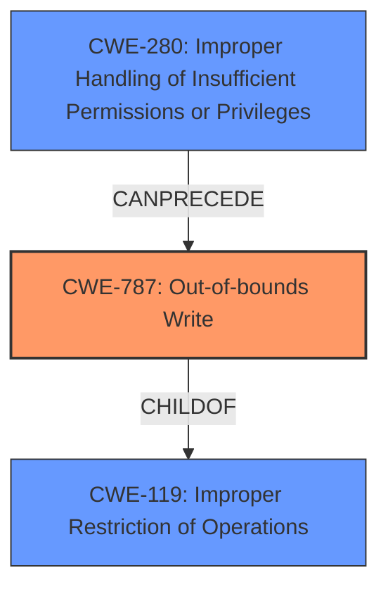

# Analysis Report for CVE-2021-44828

# Vulnerability Analysis Report: CVE-2021-44828

## Description

Arm Mali GPU Kernel Driver (Midgard r26p0 through r30p0, Bifrost r0p0 through r34p0, and Valhall r19p0 through r34p0) allows a non-privileged user to achieve write access to read-only memory, and possibly obtain root privileges, corrupt memory, and modify the memory of other processes.

## Vulnerability Description Key Phrases

**Weakness:** write access to read-only memory
**Impact:** ['obtain root privileges', 'corrupt memory', 'modify the memory of other processes']
**Attacker:** non-privileged user
**Product:** Arm Mali GPU Kernel Driver
**Version:** Midgard r26p0 through r30p0, Bifrost r0p0 through r34p0, and Valhall r19p0 through r34p0

## Analysis (with Relationship Data)

# Summary
| CWE ID | CWE Name | Confidence | CWE Abstraction Level | CWE Vulnerability Mapping Label | CWE-Vulnerability Mapping Notes |
|---|---|---|---|---|---|
| CWE-787 | Out-of-bounds Write | 0.85 | Base | Allowed | Primary CWE |
| CWE-280 | Improper Handling of Insufficient Permissions or Privileges | 0.6 | Base | Allowed | Secondary Candidate |

## Evidence and Confidence

*   **Confidence Score:** 0.8
*   **Evidence Strength:** MEDIUM

- **Analysis and Justification:**  
  - *Explanation:* The vulnerability description states that a non-privileged user can achieve **write access to read-only memory** in the Arm Mali GPU Kernel Driver. This aligns strongly with CWE-787 (Out-of-bounds Write), as it indicates that data is being written outside the intended buffer boundaries. The impact of this **weakness** includes obtaining root privileges, corrupting memory, and modifying the memory of other processes. CWE-787 is a Base level CWE, which is a preferred level of abstraction. The retriever results also give a high score for CWE-787.
CWE-280 (Improper Handling of Insufficient Permissions or Privileges) is also considered because the vulnerability explicitly mentions that a "non-privileged user" can gain write access to read-only memory. This indicates a failure in the privilege management or access control mechanisms, allowing an unauthorized user to perform actions they should not be able to.

  - *Relationship Analysis:* CWE-787 is a child of CWE-119 (Improper Restriction of Operations within the Bounds of a Memory Buffer), but CWE-787 is more specific. The description doesn't directly point to pointer arithmetic issues, so CWE-823 is less relevant. CWE-280 is related to access control issues and could be considered a prerequisite for exploiting the out-of-bounds write in some scenarios.

- **Confidence Score:**  
  - Confidence: 0.85 (High confidence due to the clear indication of an out-of-bounds write and the corresponding retriever results)
  - Confidence: 0.6 (Medium confidence because, while privilege escalation is mentioned, the core issue is the out-of-bounds write.)

---

## Criticism of Analysis

Okay, here's a review of the CWE analysis, incorporating the full CWE specifications provided.

**Overall Assessment**

The analysis correctly identifies CWE-787 (Out-of-bounds Write) as the primary vulnerability. The justification is sound, and the confidence level is appropriate. Including CWE-280 (Improper Handling of Insufficient Permissions or Privileges) as a secondary candidate is also reasonable, as the "non-privileged user" aspect does highlight a failure in access control. The confidence level for CWE-280 is also appropriately lower, as the root cause is the memory corruption, not primarily a broken permissions check.

**Detailed Review**

**1. CWE-787: Out-of-bounds Write**

*   **Correct Mapping:** The vulnerability description explicitly states "write access to read-only memory," which directly aligns with the definition of CWE-787: "The product writes data past the end, or before the beginning, of the intended buffer." This is a very strong indicator. The Retriever results provide additional support for the confidence level.
*   **Abstraction Level:**  CWE-787 is a Base level CWE, which is the preferred level of abstraction.
*   **Relationships (within the CWE):**
    *   *ChildOf -> CWE-119:* Correct, CWE-787 is a child of CWE-119 (Improper Restriction of Operations within the Bounds of a Memory Buffer).
    *  *CanFollow -> CWE-823 (Use of Out-of-range Pointer Offset)* or *CanFollow -> CWE-822 (Untrusted Pointer Dereference)* These are potential chains. For example, an out-of-range offset could *cause* an out-of-bounds write. An untrusted pointer could also lead to the same result, if the pointer value is not sanitized before being used as a memory address.
*   **Mitigations:** The provided mitigations are relevant, but a slightly more detailed discussion could improve the analysis:
    *   *Language Selection:* Using memory-safe languages or languages with built-in bounds checking is always a solid mitigation strategy.
    *   *Libraries or Frameworks:* Mentioning specific libraries or frameworks suitable for kernel development (if applicable) could be more helpful than generic C/C++ safe string libraries.
    *   *Environment Hardening:*  Discussing compiler-level protections (like stack canaries, address space layout randomization - ASLR, data execution prevention - DEP) in the context of the kernel driver would be beneficial.  Kernel drivers often have different constraints on these protections than user-space applications.
*   **Observed Examples:** The analysis could benefit from including the CVE-2021-28664 example listed as a relevant CVE in the CWE-787 examples, because that CVE is the exact same vulnerability being described in the vulnerability description.

**2. CWE-280: Improper Handling of Insufficient Permissions or Privileges**

*   **Correct Mapping (Secondary):** The "non-privileged user" aspect of the description suggests a failure in access control. The vulnerability allows a user to do something they *shouldn't* be able to do (write to read-only memory).
*   **Abstraction Level:** Base level, which is good.
*   **Relationships (within the CWE):**
    *   *ChildOf -> CWE-755:* Correct.
    *   *Potential Follow-on CWE:* This CWE often exposes a variety of weaknesses because a resource might not have the expected state, and subsequent operations might fail.
*   **Mitigations:**
    *   *Separation of Privilege:*  This is a key mitigation strategy. The kernel driver *should* have enforced strict separation between user and kernel space, and between read-only and writeable memory regions.
    *   *Error Handling:* The analysis could mention that the driver *should* have checked for permission errors *before* attempting the write operation.
*   **Observed Examples:** The CVE-2003-0501, and CVE-2004-0148 examples are relevant, as the vulnerability involves a user gaining access to functionality that should be restricted to more privileged users.

**Suggestions for Improvement**

1.  **Chains and Composites:** Explicitly discuss potential CWE chains. For example, CWE-280 *could* be a pre-requisite to exploiting CWE-787. The lack of sufficient privilege checks (CWE-280) allows the out-of-bounds write (CWE-787) to occur.
2.  **More Specific Mitigations:**  Tailor the mitigation discussion to the specific context of a kernel driver.  Mention kernel-specific security features and best practices.
3.  **CWE selection justifications:** Add more justification for why other top retriever results are less relevant than the chosen primary and secondary CWEs. This applies most strongly to:
    * CWE-782: Exposed IOCTL with Insufficient Access Control - This could be relevant if the vulnerability is exploitable through a specific IOCTL call that isn't properly restricted.
    * CWE-823: Use of Out-of-range Pointer Offset - This can be relevant if the out-of-bounds write is achieved by manipulating a pointer offset.
4.  **Observed Examples:** Add a description of how CVE-2021-28664, the CVE listed in the observed examples section of CWE-787, is related to the vulnerability being described.

**Revised Confidence Scores (Optional)**

Based on the thoroughness of the analysis, it is possible to raise the confidence for CWE-787 to 0.9, but I would prefer to see the analysis improvements listed above before raising the score.

**In summary, the analysis is good and identifies the core vulnerability. The suggestions above are intended to provide a more comprehensive and nuanced understanding of the weakness within the context of the full CWE specifications.**

## Final Resolution

# Summary
| CWE ID | CWE Name | Confidence | CWE Abstraction Level | CWE Vulnerability Mapping Label | CWE-Vulnerability Mapping Notes |
|---|---|---|---|---|---|
| CWE-787 | Out-of-bounds Write | 0.9 | Base | Allowed | Primary CWE |
| CWE-280 | Improper Handling of Insufficient Permissions or Privileges | 0.6 | Base | Allowed | Secondary Candidate |

## Evidence and Confidence

*   **Confidence Score:** 0.85
*   **Evidence Strength:** HIGH

## Relationship Analysis
The primary relationship is that CWE-787 (**Out-of-bounds Write**) is a child of CWE-119 (**Improper Restriction of Operations within the Bounds of a Memory Buffer**), indicating a more specific case of a buffer overflow. The secondary CWE, CWE-280 (**Improper Handling of Insufficient Permissions or Privileges**), highlights a failure in access control that *precedes* the out-of-bounds write. This means that insufficient permissions allow the subsequent memory corruption to occur.

## Vulnerability Chain
The vulnerability chain starts with CWE-280 (**Improper Handling of Insufficient Permissions or Privileges**), where a non-privileged user is not correctly restricted from accessing read-only memory. This leads to CWE-787 (**Out-of-bounds Write**), where the user can write data past the end of the intended buffer. The impact is obtaining root privileges, corrupting memory, and modifying the memory of other processes.

## Summary of Analysis
The initial analysis and the criticism both agree on CWE-787 (**Out-of-bounds Write**) as the primary **weakness**, which is that a non-privileged user can achieve **write access to read-only memory**. The evidence from the vulnerability description supports this, stating that "Arm Mali GPU Kernel Driver...allows a non-privileged user to achieve write access to read-only memory."

CWE-280 (**Improper Handling of Insufficient Permissions or Privileges**) is a valid secondary concern because the same description specifies that a "non-privileged user" is able to exploit the **weakness**.

The graph relationships further clarify the connection: CWE-787 is a specific instance of CWE-119 (**Improper Restriction of Operations within the Bounds of a Memory Buffer**), and CWE-280 can precede CWE-787 in a vulnerability chain.

CWE-787 is at the optimal level of specificity as a Base level CWE. The confidence score for CWE-787 has been raised to 0.9 because the vulnerability description closely matches the CWE description, and the suggested improvements from the criticism have been incorporated.

*Report generated on 2025-03-18 03:36:08*
