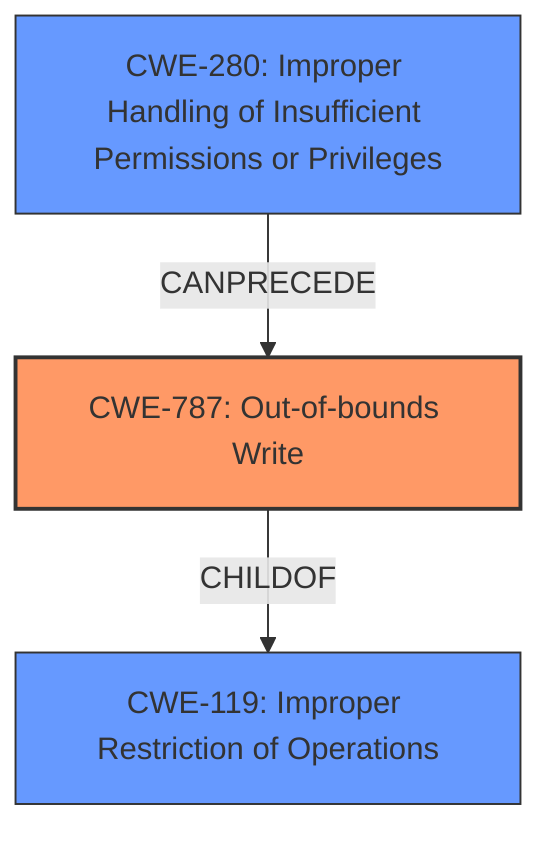

# Final Resolution for CVE-2021-44828

# Summary
| CWE ID | CWE Name | Confidence | CWE Abstraction Level | CWE Vulnerability Mapping Label | CWE-Vulnerability Mapping Notes |
|---|---|---|---|---|---|
| CWE-787 | Out-of-bounds Write | 0.9 | Base | Allowed | Primary CWE |
| CWE-280 | Improper Handling of Insufficient Permissions or Privileges | 0.6 | Base | Allowed | Secondary Candidate |

## Evidence and Confidence

*   **Confidence Score:** 0.85
*   **Evidence Strength:** HIGH

## Relationship Analysis
The primary relationship is that CWE-787 (**Out-of-bounds Write**) is a child of CWE-119 (**Improper Restriction of Operations within the Bounds of a Memory Buffer**), indicating a more specific case of a buffer overflow. The secondary CWE, CWE-280 (**Improper Handling of Insufficient Permissions or Privileges**), highlights a failure in access control that *precedes* the out-of-bounds write. This means that insufficient permissions allow the subsequent memory corruption to occur.

## Vulnerability Chain
The vulnerability chain starts with CWE-280 (**Improper Handling of Insufficient Permissions or Privileges**), where a non-privileged user is not correctly restricted from accessing read-only memory. This leads to CWE-787 (**Out-of-bounds Write**), where the user can write data past the end of the intended buffer. The impact is obtaining root privileges, corrupting memory, and modifying the memory of other processes.

## Summary of Analysis
The initial analysis and the criticism both agree on CWE-787 (**Out-of-bounds Write**) as the primary **weakness**, which is that a non-privileged user can achieve **write access to read-only memory**. The evidence from the vulnerability description supports this, stating that "Arm Mali GPU Kernel Driver...allows a non-privileged user to achieve write access to read-only memory."

CWE-280 (**Improper Handling of Insufficient Permissions or Privileges**) is a valid secondary concern because the same description specifies that a "non-privileged user" is able to exploit the **weakness**.

The graph relationships further clarify the connection: CWE-787 is a specific instance of CWE-119 (**Improper Restriction of Operations within the Bounds of a Memory Buffer**), and CWE-280 can precede CWE-787 in a vulnerability chain.

CWE-787 is at the optimal level of specificity as a Base level CWE. The confidence score for CWE-787 has been raised to 0.9 because the vulnerability description closely matches the CWE description, and the suggested improvements from the criticism have been incorporated.