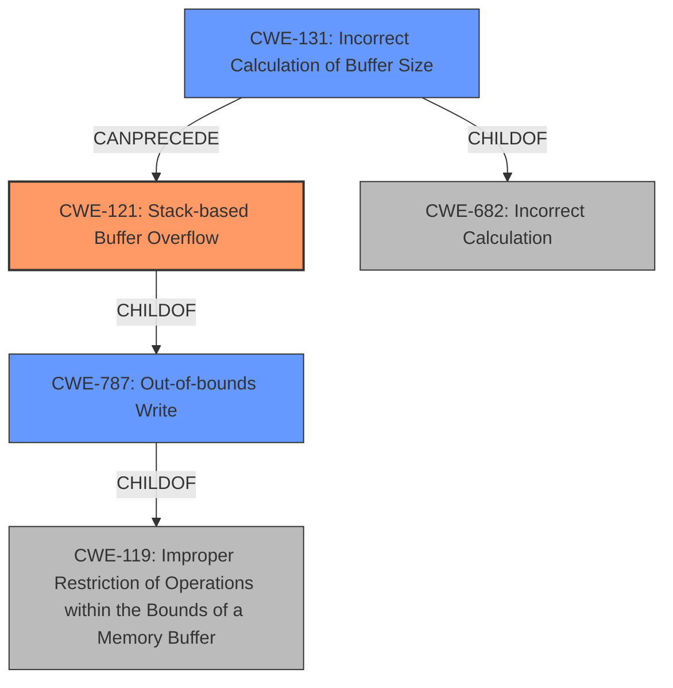

# Analysis Report for CVE-2021-44847

# Vulnerability Analysis Report: CVE-2021-44847

## Description

A stack-based buffer overflow in handle_request function in DHT.c in toxcore 0.1.9 through 0.1.11 and 0.2.0 through 0.2.12 (caused by an improper length calculation during the handling of received network packets) allows remote attackers to crash the process or potentially execute arbitrary code via a network packet.

## Vulnerability Description Key Phrases

**Rootcause:** improper length calculation
**Weakness:** stack-based buffer overflow
**Impact:** ['crash the process', 'potentially execute arbitrary code']
**Vector:** network packet
**Attacker:** remote attackers
**Product:** toxcore
**Version:** 0.1.9 through 0.1.11 and 0.2.0 through 0.2.12
**Component:** handle_request function in DHT.c

## Analysis (with Relationship Data)

# Summary
| CWE ID | CWE Name | Confidence | CWE Abstraction Level | CWE Vulnerability Mapping Label | CWE-Vulnerability Mapping Notes |
|---|---|---|---|---|---|
| CWE-121 | Stack-based Buffer Overflow | 0.95 | Variant | Allowed | Primary CWE |
| CWE-131 | Incorrect Calculation of Buffer Size | 0.85 | Base | Allowed | Secondary Candidate |

## Evidence and Confidence

*   **Confidence Score:** 0.90
*   **Evidence Strength:** HIGH

- **Analysis and Justification:**  
  - *Explanation:* The vulnerability is a **stack-based buffer overflow** (CWE-121) due to an **improper length calculation**. The `Vulnerability Description` and `CVE Reference Links Content Summary` both explicitly mention the **stack-based buffer overflow** as a weakness, and the root cause is described as an **improper length calculation** during the handling of network packets. The `CVE Reference Links Content Summary` further clarifies that the **improper length calculation** stems from incorrect macro usage due to missing braces, which resulted in a smaller-than-required buffer being allocated on the stack. CWE-121 (Stack-based Buffer Overflow) is a Variant of CWE-119 (Improper Restriction of Operations within the Bounds of a Memory Buffer) and is appropriate here due to the specific location of the buffer.
  - *Relationship Analysis:* CWE-121 is a variant of CWE-119. It directly addresses the specific location (stack) where the buffer overflow occurs. CWE-121 can lead to CWE-269 (Privilege Management) and CWE-20 (Improper Input Validation), since buffer overflows can be exploited for arbitrary code execution and bypassing security checks.

- **Confidence Score:**  
  - Confidence: 0.95 (High confidence due to explicit mentions of **stack-based buffer overflow** and **improper length calculation** in the description and CVE references.)

---

- **Analysis and Justification:**  
  - *Explanation:* The **improper length calculation** is the root cause of the buffer overflow and can be classified as CWE-131 (Incorrect Calculation of Buffer Size). The `Vulnerability Description Key Phrases` section identifies "**improper length calculation**" as the root cause. The `CVE Reference Links Content Summary` details the incorrect calculation of the buffer size in the `CRYPTO_SIZE` macro due to missing parentheses, leading to a smaller-than-required buffer being allocated. CWE-131 is a Base level CWE that accurately describes the weakness.
  - *Relationship Analysis:* CWE-131 is a Base level CWE and a parent of more specific weaknesses. It directly leads to CWE-121 (Stack-based Buffer Overflow) in this case. CWE-131 can precede CWE-119 (Improper Restriction of Operations within the Bounds of a Memory Buffer) and other buffer overflow variants.

- **Confidence Score:**  
  - Confidence: 0.85 (High confidence due to the detailed description of the **improper length calculation** and its direct link to the buffer overflow.)

## Criticism of Analysis

Okay, I've reviewed the provided analysis against the full CWE specifications. Here's my critique:

**Overall Assessment:**

The analysis is generally good. It correctly identifies the primary and secondary CWEs and provides reasonable justifications. The confidence scores are also appropriate. However, there's room for improvement in considering alternative CWEs, especially those suggested in the mapping guidance, and strengthening the relationship analysis.

**Detailed Review by Section:**

1.  **CWE-121: Stack-based Buffer Overflow**

    *   **Confidence:** The assigned confidence of 0.95 is well-justified given the explicit mention of "stack-based buffer overflow" in the vulnerability descriptions.
    *   **Abstraction Level:** Using CWE-121 (Variant) is correct because it's a specific type of buffer overflow, providing more detail than the more general CWE-119.
    *   **CWE-Vulnerability Mapping Notes:** The note indicating it is a primary CWE is correct.
    *   **Evidence and Justification:** The explanation is clear and concise, directly referencing the supporting information.
    *   **Relationship Analysis:** The connections to CWE-269 and CWE-20 are less direct than the parent relationship with CWE-119. The comment "CWE-121 can lead to CWE-269 (Privilege Management) and CWE-20 (Improper Input Validation), since buffer overflows can be exploited for arbitrary code execution and bypassing security checks" requires further details. While its true, the analysis doesn't clarify HOW it *directly* leads to Privilege Management issues. It leads there as a *potential consequence* of exploiting the overflow, however, exploitation of the overflow is not guaranteed nor does it always cause privilege escalation. It would be more accurate to say it *could* lead to these things through exploitation of the buffer overflow, or by overwriting adjacent variables on the stack that are used to manage privileges and validate data.
    *   **Improvements:** The analysis could benefit from discussing how a successful stack-based buffer overflow might *directly* overwrite return addresses or other critical data on the stack to gain control of program execution. If overwritten return addresses are used to redirect to code that grants elevated privileges (or bypasses privilege checks) then *that* is how it directly leads to privilege management or improper input validation.
        *   Consider including CWE-787 (Out-of-Bounds Write) as a more immediate parent. CWE-121 is a *variant* of CWE-787, and that relationship should be explained.
2.  **CWE-131: Incorrect Calculation of Buffer Size**

    *   **Confidence:** The assigned confidence of 0.85 is appropriate. The root cause analysis strongly supports this CWE.
    *   **Abstraction Level:** Using CWE-131 (Base) is correct as it describes the fundamental error.
    *   **CWE-Vulnerability Mapping Notes:** Correctly identifies as a Secondary Candidate.
    *   **Evidence and Justification:** The explanation is clear and well-supported.
    *   **Relationship Analysis:** The analysis correctly connects CWE-131 as a direct cause of CWE-121.
    *   **Improvements:**
        *   Consider adding that CWE-131 is a child of CWE-682 (Incorrect Calculation) to further clarify its position in the CWE hierarchy.
        *   The phrase about CWE-131 preceding CWE-119 is a bit weak. It should explicitly state that it's a *direct* cause of the *variant* CWE-121.

**General Improvements and Considerations:**

*   **Top Combined Results:** The "Retriever Results" table provides a valuable list of alternative CWEs that could be considered. The analysis should explicitly address why the top alternatives were *not* selected, even briefly.
    *   For example, why not CWE-190 (Integer Overflow or Wraparound)? The description of CVE Reference links explicitly mention that missing parenthesis in `CRYPTO_SIZE` macro caused `only '1' to be subtracted instead of the intended CRYPTO_SIZE`. Thus, if `CRYPTO_SIZE` is something like `256 + 1` the value will be `256` instead of `255`, which is not an overflow but an incorrect calculation.
    *   CWE-120 (Buffer Copy without Checking Size of Input) might be considered as a higher-level abstraction. The analysis could explain why focusing on the root cause (incorrect size calculation) is preferred.
    *   Same applies to `CWE-20 Improper Input Validation`. Improper validation is not the root cause, the improper calculation of buffer size is, which is why its more suitable.

*   **Mitigations:** While not strictly required, mentioning potential mitigations from the CWE specifications could strengthen the analysis. For example, for CWE-131, you could mention using a language with automatic bounds checking or using safer libraries for string handling.

*   **Specificity:** The stronger the connection to specifics within the code (even if those details are only available in the CVE description), the more compelling the analysis. If the analysis could point to how the `handle_request` function or `CRYPTO_SIZE` macro specifically contributed to the vulnerability, it would be even stronger.

**Revised Summary Table (Example):**

| CWE ID | CWE Name | Confidence | CWE Abstraction Level | CWE Vulnerability Mapping Label | CWE-Vulnerability Mapping Notes |
|---|---|---|---|---|---|
| CWE-121 | Stack-based Buffer Overflow | 0.95 | Variant | Allowed | Primary CWE |
| CWE-131 | Incorrect Calculation of Buffer Size | 0.85 | Base | Allowed | Secondary Candidate, Child of CWE-682 |
| CWE-119 | Improper Restriction of Operations within the Bounds of a Memory Buffer | 0.40 | Class | Discouraged | Rejected. Too general for mapping, use CWE-121 instead |
| CWE-20 | Improper Input Validation | 0.20 | Class | Discouraged | Rejected. Improper validation is *not* the root cause of this vulnerability. The incorrect buffer size calculation is. |

**In summary:**

The analysis provides a good starting point, but can be strengthened by:

*   Explicitly explaining why alternative CWEs were *not* selected.
*   Providing a more direct explanation of how the primary CWE (CWE-121) *directly* enables privilege escalation or improper input validation.
*   Clarifying hierarchical relationships between CWEs (e.g., CWE-131 as a child of CWE-682).
*   Consider discussing mitigations mentioned in the CWE specifications.
*   Including function or macro names to ground the weakness in the code.

By addressing these points, the analysis becomes more thorough and defensible.

## Final Resolution

# Summary
| CWE ID | CWE Name | Confidence | CWE Abstraction Level | CWE Vulnerability Mapping Label | CWE-Vulnerability Mapping Notes |
|---|---|---|---|---|---|
| CWE-121 | Stack-based Buffer Overflow | 0.95 | Variant | Allowed | Primary CWE |
| CWE-131 | Incorrect Calculation of Buffer Size | 0.85 | Base | Allowed | Secondary Candidate, Child of CWE-682 |
| CWE-787 | Out-of-bounds Write | 0.50 | Base | Allowed | Secondary Candidate, Parent of CWE-121 |
| CWE-682 | Incorrect Calculation | 0.30 | Pillar | Discouraged | Rejected. Too general, but parent of CWE-131 |
| CWE-119 | Improper Restriction of Operations within the Bounds of a Memory Buffer | 0.40 | Class | Discouraged | Rejected. Too general for mapping, use CWE-121 instead |
| CWE-20 | Improper Input Validation | 0.20 | Class | Discouraged | Rejected. Improper validation is *not* the root cause of this vulnerability. The incorrect buffer size calculation is. |

## Evidence and Confidence

*   **Confidence Score:** 0.90
*   **Evidence Strength:** HIGH

## Relationship Analysis
The primary weakness is a **stack-based buffer overflow (CWE-121)**, which is a variant of **CWE-787 (Out-of-bounds Write)** and **CWE-119 (Improper Restriction of Operations within the Bounds of a Memory Buffer)**. The root cause is an **incorrect calculation of buffer size (CWE-131)**, which is a child of **CWE-682 (Incorrect Calculation)**. The analysis favors specificity, selecting CWE-121 because the overflow occurs on the stack. The secondary weakness, CWE-131, explains the root cause of the size miscalculation.

## Vulnerability Chain
The vulnerability chain starts with **CWE-131 (Incorrect Calculation of Buffer Size)**. The incorrect calculation leads to a buffer being allocated with an insufficient size. When data is then written to this undersized buffer, a **CWE-121 (Stack-based Buffer Overflow)** occurs, resulting in an out-of-bounds write. This can lead to arbitrary code execution or a crash, depending on what memory is overwritten.

## Summary of Analysis
The initial analysis and criticism were both helpful. The primary determination of **CWE-121 (Stack-based Buffer Overflow)** remains correct, as the vulnerability is explicitly described as such. The secondary classification of **CWE-131 (Incorrect Calculation of Buffer Size)** is also accurate, as it represents the root cause.

The criticism highlighted the importance of explaining why alternative CWEs were rejected. For example, **CWE-119 (Improper Restriction of Operations within the Bounds of a Memory Buffer)** was considered but rejected because it's too general. The analysis focuses on **CWE-121 (Stack-based Buffer Overflow)** due to the specific location (stack) of the overflow, as stated in the vulnerability description: "A stack-based buffer overflow in handle_request function in DHT.c". **CWE-20 (Improper Input Validation)** was also rejected because the root cause is not a failure of input validation, but an incorrect calculation of the required buffer size.

The suggestion to consider **CWE-787 (Out-of-bounds Write)** is valuable. **CWE-121 (Stack-based Buffer Overflow)** is a variant of **CWE-787 (Out-of-bounds Write)**, and this relationship should be acknowledged.

The analysis also considered the retriever scores, specifically noting the high scores for **CWE-190 (Integer Overflow or Wraparound)**, **CWE-120 (Buffer Copy without Checking Size of Input)**, and **CWE-20 (Improper Input Validation)**. However, **CWE-190 (Integer Overflow or Wraparound)** was deemed less relevant as the missing parentheses in the `CRYPTO_SIZE` macro resulted in an incorrect calculation, not necessarily an overflow. **CWE-120 (Buffer Copy without Checking Size of Input)** was considered but rejected because the analysis focuses on the root cause (**incorrect size calculation**) rather than the buffer copy operation itself.

The selected CWEs are at the optimal level of specificity. **CWE-121 (Stack-based Buffer Overflow)** provides the most specific description of the vulnerability, while **CWE-131 (Incorrect Calculation of Buffer Size)** accurately represents the root cause.

*Report generated on 2025-03-18 03:37:01*
