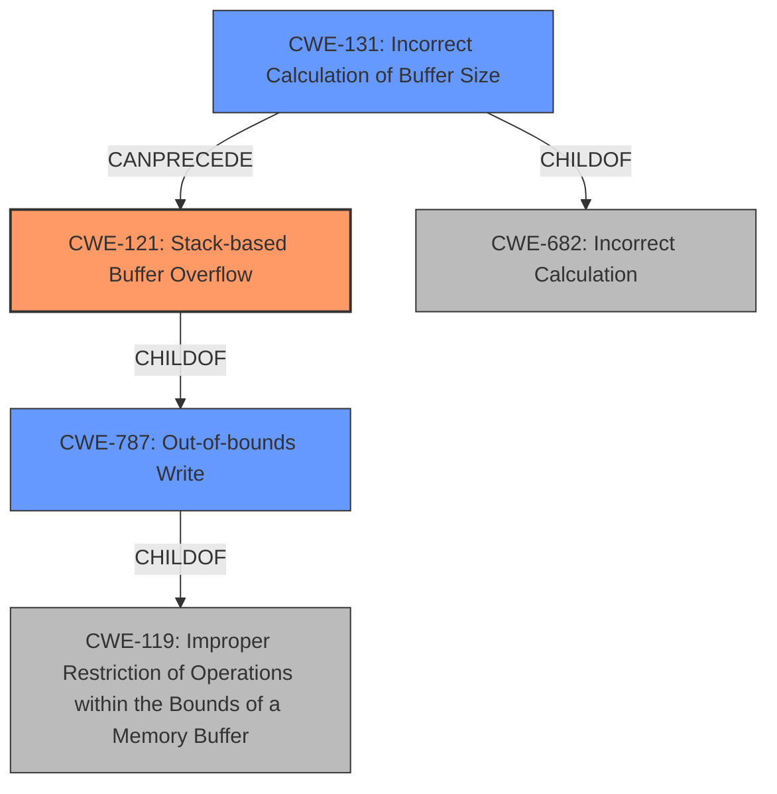

# Final Resolution for CVE-2021-44847

# Summary
| CWE ID | CWE Name | Confidence | CWE Abstraction Level | CWE Vulnerability Mapping Label | CWE-Vulnerability Mapping Notes |
|---|---|---|---|---|---|
| CWE-121 | Stack-based Buffer Overflow | 0.95 | Variant | Allowed | Primary CWE |
| CWE-131 | Incorrect Calculation of Buffer Size | 0.85 | Base | Allowed | Secondary Candidate, Child of CWE-682 |
| CWE-787 | Out-of-bounds Write | 0.50 | Base | Allowed | Secondary Candidate, Parent of CWE-121 |
| CWE-682 | Incorrect Calculation | 0.30 | Pillar | Discouraged | Rejected. Too general, but parent of CWE-131 |
| CWE-119 | Improper Restriction of Operations within the Bounds of a Memory Buffer | 0.40 | Class | Discouraged | Rejected. Too general for mapping, use CWE-121 instead |
| CWE-20 | Improper Input Validation | 0.20 | Class | Discouraged | Rejected. Improper validation is *not* the root cause of this vulnerability. The incorrect buffer size calculation is. |

## Evidence and Confidence

*   **Confidence Score:** 0.90
*   **Evidence Strength:** HIGH

## Relationship Analysis
The primary weakness is a **stack-based buffer overflow (CWE-121)**, which is a variant of **CWE-787 (Out-of-bounds Write)** and **CWE-119 (Improper Restriction of Operations within the Bounds of a Memory Buffer)**. The root cause is an **incorrect calculation of buffer size (CWE-131)**, which is a child of **CWE-682 (Incorrect Calculation)**. The analysis favors specificity, selecting CWE-121 because the overflow occurs on the stack. The secondary weakness, CWE-131, explains the root cause of the size miscalculation.

## Vulnerability Chain
The vulnerability chain starts with **CWE-131 (Incorrect Calculation of Buffer Size)**. The incorrect calculation leads to a buffer being allocated with an insufficient size. When data is then written to this undersized buffer, a **CWE-121 (Stack-based Buffer Overflow)** occurs, resulting in an out-of-bounds write. This can lead to arbitrary code execution or a crash, depending on what memory is overwritten.

## Summary of Analysis
The initial analysis and criticism were both helpful. The primary determination of **CWE-121 (Stack-based Buffer Overflow)** remains correct, as the vulnerability is explicitly described as such. The secondary classification of **CWE-131 (Incorrect Calculation of Buffer Size)** is also accurate, as it represents the root cause.

The criticism highlighted the importance of explaining why alternative CWEs were rejected. For example, **CWE-119 (Improper Restriction of Operations within the Bounds of a Memory Buffer)** was considered but rejected because it's too general. The analysis focuses on **CWE-121 (Stack-based Buffer Overflow)** due to the specific location (stack) of the overflow, as stated in the vulnerability description: "A stack-based buffer overflow in handle_request function in DHT.c". **CWE-20 (Improper Input Validation)** was also rejected because the root cause is not a failure of input validation, but an incorrect calculation of the required buffer size.

The suggestion to consider **CWE-787 (Out-of-bounds Write)** is valuable. **CWE-121 (Stack-based Buffer Overflow)** is a variant of **CWE-787 (Out-of-bounds Write)**, and this relationship should be acknowledged.

The analysis also considered the retriever scores, specifically noting the high scores for **CWE-190 (Integer Overflow or Wraparound)**, **CWE-120 (Buffer Copy without Checking Size of Input)**, and **CWE-20 (Improper Input Validation)**. However, **CWE-190 (Integer Overflow or Wraparound)** was deemed less relevant as the missing parentheses in the `CRYPTO_SIZE` macro resulted in an incorrect calculation, not necessarily an overflow. **CWE-120 (Buffer Copy without Checking Size of Input)** was considered but rejected because the analysis focuses on the root cause (**incorrect size calculation**) rather than the buffer copy operation itself.

The selected CWEs are at the optimal level of specificity. **CWE-121 (Stack-based Buffer Overflow)** provides the most specific description of the vulnerability, while **CWE-131 (Incorrect Calculation of Buffer Size)** accurately represents the root cause.