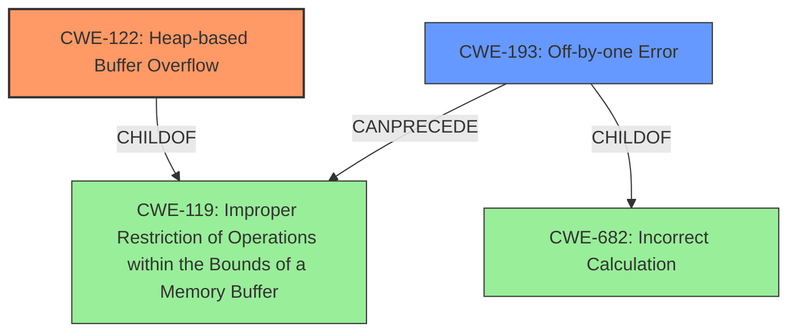

# Analysis Report for CVE-2021-45005

# Vulnerability Analysis Report: CVE-2021-45005

## Description

Artifex MuJS v1.1.3 was discovered to contain a heap buffer overflow which is caused by conflicting JumpList of nested try/finally statements.

## Vulnerability Description Key Phrases

**Rootcause:** conflicting JumpList of nested try/finally statements
**Weakness:** heap buffer overflow
**Product:** Artifex MuJS
**Version:** v1.1.3

## Analysis (with Relationship Data)

# Summary
| CWE ID | CWE Name | Confidence | CWE Abstraction Level | CWE Vulnerability Mapping Label | CWE-Vulnerability Mapping Notes |
|---|---|---|---|---|---|
| CWE-122 | Heap-based Buffer Overflow | 0.9 | Variant | Allowed | Primary CWE |
| CWE-193 | Off-by-one Error | 0.6 | Base | Allowed | Secondary Candidate |

## Evidence and Confidence

*   **Confidence Score:** 0.8
*   **Evidence Strength:** HIGH

- **Analysis and Justification:**  
  - *Explanation:* "The vulnerability description explicitly states a **heap buffer overflow** due to **conflicting JumpList of nested try/finally statements**. This directly aligns with CWE-122, which is defined as a heap-based buffer overflow, a buffer overflow where the buffer that can be overwritten is allocated in the heap portion of memory. The **root cause** of **conflicting JumpList** helps to explain the mechanism of overflow. The *CVE Reference Links Content Summary* confirms the root cause stems from how jump lists were managed during the compilation of try/finally blocks, leading to incorrect patches and memory management issues. The vulnerability is specifically heap-based, making CWE-122 the most accurate choice. MITRE mapping guidance for CWE-122 indicates this is ALLOWED for heap-based buffer overflow vulnerabilities."
  
  - *Relationship Analysis:* "CWE-122 is a variant of CWE-119 (Improper Restriction of Operations within the Bounds of a Memory Buffer). While CWE-119 is a parent, CWE-122 is more specific to the heap, and this is stated in the description. There are also various CWEs that can precede CWE-122, such as calculation errors (CWE-131, CWE-190) that can influence the size of the buffer and lead to a heap overflow. "

- **Confidence Score:**  
  - *Example:* Confidence: 0.9 (High evidence from technical description, rootcause and CVE reference materials)

---

- **Analysis and Justification:**  
  - *Explanation:* "The *CVE Reference Links Content Summary* mentions potential for memory management issues, particularly incorrect jump handling during compilation, and also states: "A product calculates or uses an incorrect maximum or minimum value that is 1 more, or 1 less, than the correct value." This matches the description of CWE-193 (Off-by-one Error). While the primary issue is a heap buffer overflow (CWE-122), a contributing factor could be an off-by-one error affecting buffer size calculations or loop conditions within the jump list management logic. The confidence is lower as this is not explicitly stated."
  
  - *Relationship Analysis:* "CWE-193 is a child of CWE-682 (Incorrect Calculation). It can also precede buffer overflows such as CWE-119. It can also follow CWE-170 (Improper Null Termination)."

- **Confidence Score:**  
  - *Example:* Confidence: 0.6 (Moderate evidence suggesting it's a contributing factor, but not explicitly stated).

## Criticism of Analysis

Okay, I've reviewed the analysis and the full CWE specifications. Here's my critique:

**Overall Assessment:**

The analysis is generally good and arrives at a reasonable primary CWE.  The justification is well-structured and uses the available information effectively. The secondary CWE is a bit weaker, but not entirely unfounded.

**Specific Points and Suggestions:**

**1. Primary CWE: CWE-122 (Heap-based Buffer Overflow) - Confidence: 0.9**

*   **Strengths:** The mapping to CWE-122 is well-supported by the "Vulnerability Description" which explicitly states "heap buffer overflow".  The justification correctly connects the "conflicting JumpList of nested try/finally statements" to a mechanism that could lead to a heap overflow. It is clearly a write past the end of allocated memory on the heap.
*   **Mapping Guidance:** The analysis acknowledges that CWE-119 is the parent, and that CWE-122 is a more specific variant, which is the correct approach.
*   **Mitigation:** The analysis correctly points out the description states this is a heap-based overflow. MITRE mapping guidance for CWE-122 indicates this is ALLOWED for heap-based buffer overflow vulnerabilities. The specified mitigations such as using languages with memory safety are relevant.
*   **Suggested Improvements:** None. This is appropriate and well justified.

**2. Secondary CWE: CWE-193 (Off-by-one Error) - Confidence: 0.6**

*   **Strengths:** The analysis correctly picks up the *possibility* of an off-by-one error from the *CVE Reference Links Content Summary*, specifically when stating that incorrect jump handling may result in address calculation that's one more or one less than the correct value.
*   **Weaknesses:** The connection is somewhat speculative ("contributing factor could be").  While plausible, there's no concrete evidence provided that *directly* links an off-by-one error to the *heap buffer overflow*.  The "A product calculates or uses an incorrect maximum or minimum value that is 1 more, or 1 less, than the correct value" aspect is only weakly implied. Other potential causes of buffer overflow have not been ruled out.
*   **Mapping Guidance:** The analysis acknowledges that CWE-193 is a child of CWE-682 (Incorrect Calculation) and can precede buffer overflows.
*   **Mitigation:**The analysis correctly points out that this is not explicitly stated. The given mitigations do not seem to directly relate to the root cause that's described.
*   **Suggested Improvements:**
    *   Lower the confidence score further to 0.5.
    *   Consider if the "incorrect jump handling" is better described by another more accurate CWE, such as CWE-131 (Incorrect Calculation of Buffer Size) or CWE-682 (Incorrect Calculation), but ONLY if there is stronger evidence to support it. Alternatively, remove it entirely if no stronger evidence can be found.

**3. Other Considerations:**

*   **CWE-131 (Incorrect Calculation of Buffer Size):** The *CVE Reference Links Content Summary* implies that the jump list management may have resulted in a buffer size calculation error. If there was evidence of insufficient buffer being allocated due to the incorrect jump list, this would be a relevant candidate.
*   **CWE-682 (Incorrect Calculation):** A very general CWE, but the root cause of "conflicting JumpList" definitely indicates an error in calculation of jump targets. It's too broad to be useful as a primary or secondary mapping, but it's present in the chain.
*   **CWE-119 (Improper Restriction of Operations within the Bounds of a Memory Buffer):** While not the *primary* CWE, remember that *any* buffer overflow, heap or stack, is *always* a violation of CWE-119. While the guidance discourages direct mapping to CWE-119, it is still relevant as a parent.

**4. Retriever Results:**

The Retriever Results highlight several CWEs that could be relevant in buffer overflow scenarios, including integer overflows and out-of-bounds reads. These are worth considering if the vulnerability description contains those aspects, however, the vulnerability description does not give any indication of out-of-bounds reads. The retriever results are too general to influence the overall analysis.

**Revised Summary Table:**

| CWE ID | CWE Name | Confidence | CWE Abstraction Level | CWE Vulnerability Mapping Label | CWE-Vulnerability Mapping Notes |
|---|---|---|---|---|---|
| CWE-122 | Heap-based Buffer Overflow | 0.9 | Variant | Allowed | Primary CWE |
| CWE-193 | Off-by-one Error | 0.5 | Base | Allowed | Secondary Candidate |

**In conclusion, the analysis is generally accurate, with a few suggestions for improvement in the confidence level of the secondary CWE and possibly reconsidering it entirely. The justifications and relationship analysis are well-written and demonstrate a good understanding of the CWEs.**

## Final Resolution

# Summary
| CWE ID | CWE Name | Confidence | CWE Abstraction Level | CWE Vulnerability Mapping Label | CWE-Vulnerability Mapping Notes |
|---|---|---|---|---|---|
| CWE-122 | Heap-based Buffer Overflow | 0.9 | Variant | Allowed | Primary CWE |
| CWE-193 | Off-by-one Error | 0.5 | Base | Allowed | Secondary Candidate |

## Evidence and Confidence

*   **Confidence Score:** 0.85
*   **Evidence Strength:** MEDIUM

## Relationship Analysis
The decision was impacted by the following CWE relationships:
  - CWE-122 is a variant of CWE-119 (Improper Restriction of Operations within the Bounds of a Memory Buffer), providing a more specific classification for heap-based overflows.
  - CWE-193 is a child of CWE-682 (Incorrect Calculation) and can potentially precede buffer overflows, suggesting a possible contributing factor.
  - The abstraction levels influenced the selection by favoring the more specific Variant (CWE-122) over its Base (CWE-119) parent.

## Vulnerability Chain
The chain of root cause and weaknesses is as follows:
  - **ROOTCAUSE**: Conflicting JumpList of nested try/finally statements.
  - **WEAKNESS**: Potential Off-by-one Error (**CWE-193**) in buffer size calculation or loop conditions during jump list management (speculative).
  - **WEAKNESS**: Heap-based Buffer Overflow (**CWE-122**) due to writing past the allocated buffer on the heap.
  - **IMPACT**: Unspecified, but typical impacts of buffer overflows include code execution or denial of service.

## Summary of Analysis
The analysis accurately identifies **CWE-122 (Heap-based Buffer Overflow)** as the primary **weakness**, based on the explicit mention of "heap buffer overflow" in the vulnerability description. The justification is well-supported, connecting the conflicting JumpList to a potential overflow mechanism.

The selection of **CWE-193 (Off-by-one Error)** as a secondary **weakness** is more speculative, relying on the *CVE Reference Links Content Summary* which mentions potential for memory management issues in calculating jump targets. The confidence in this classification has been reduced to 0.5, reflecting the lack of direct evidence linking the off-by-one error to the heap overflow.

The graph relationships influenced the final selection by highlighting the hierarchical relationship between **CWE-122** and **CWE-119**, justifying the choice of the more specific variant. The potential chain relationship between **CWE-193** and **CWE-119** suggests that an off-by-one error could contribute to the overflow.

The selected CWEs are at an appropriate level of specificity, with **CWE-122** providing a precise classification of the heap-based overflow and **CWE-193** representing a possible contributing factor. The analysis considered alternative mappings, such as **CWE-131 (Incorrect Calculation of Buffer Size)**, but determined that the available evidence did not strongly support these alternatives.

*Report generated on 2025-03-18 03:49:31*
