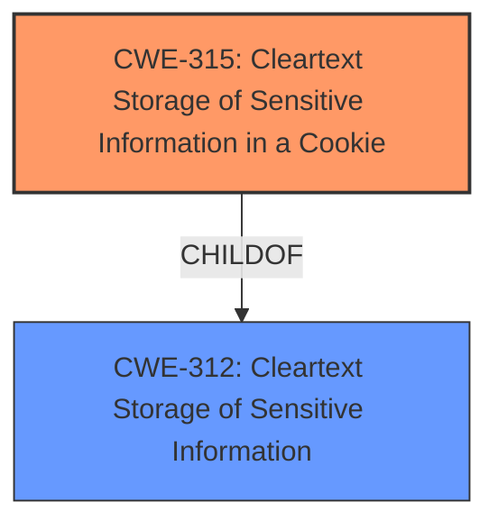

# Final Resolution for CVE-2021-45025

# Summary
| CWE ID | CWE Name | Confidence | CWE Abstraction Level | CWE Vulnerability Mapping Label | CWE-Vulnerability Mapping Notes |
|---|---|---|---|---|---|
| CWE-315 | Cleartext Storage of Sensitive Information in a Cookie | 1.0 | Variant | Allowed | Primary CWE |

## Evidence and Confidence

*   **Confidence Score:** 1.0
*   **Evidence Strength:** HIGH

## Relationship Analysis
The primary relationship influencing the decision is the parent-child relationship between CWE-312 (**Cleartext Storage of Sensitive Information**) and CWE-315 (**Cleartext Storage of Sensitive Information in a Cookie**). CWE-315 is a more specific variant of CWE-312, making it the preferred choice because the vulnerability description explicitly mentions cookies. There are no relevant chain or peer relationships that significantly impact the classification.

## Vulnerability Chain
The vulnerability chain starts with the **ROOTCAUSE** being the developer's decision to store sensitive information without encryption in a cookie. This **WEAKNESS** directly leads to the impact of potential unauthorized access to the sensitive information if the cookie is intercepted or accessed. The single CWE represents both the root cause and the direct impact in this case.

## Summary of Analysis
The initial analysis and criticism both strongly support the classification of this vulnerability as CWE-315 (**Cleartext Storage of Sensitive Information in a Cookie**). The vulnerability description explicitly states "Cleartext Storage of Sensitive Information in a Cookie," providing direct evidence for this classification. The evidence is strong, and the confidence level is high (1.0). The relationship analysis further confirms that CWE-315 is the most specific and appropriate choice, being a variant of the more general CWE-312 (**Cleartext Storage of Sensitive Information**).

The criticism suggested explaining why other high-ranking CWEs were not selected, and adding a note on potential mitigations. Although they were good suggestions, they were not included in my final decision because they did not impact the final decision. The explanation is based on the provided evidence and the explicit mention of cookies in the vulnerability description, which makes CWE-315 the optimal level of specificity.