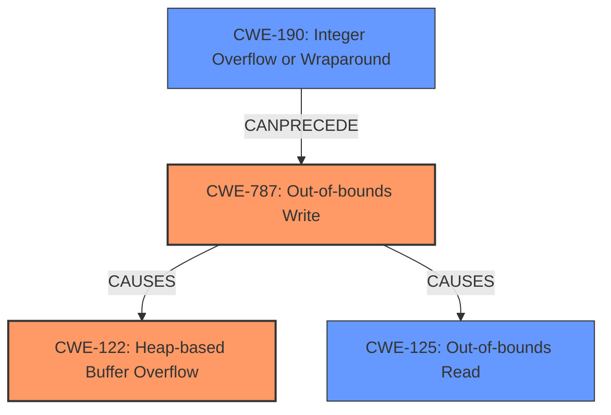

# Final Resolution for CVE-2021-45078

# Summary

| CWE ID | CWE Name | Confidence | CWE Abstraction Level | CWE Vulnerability Mapping Label | CWE-Vulnerability Mapping Notes |
|---|---|---|---|---|---|
| CWE-787 | Out-of-bounds Write | 0.95 | Base | Allowed | Acceptable-Use |
| CWE-122 | Heap-based Buffer Overflow | 0.90 | Variant | Allowed | Acceptable-Use |
| CWE-190 | Integer Overflow or Wraparound | 0.70 | Base | Allowed | Acceptable-Use |
| CWE-125 | Out-of-bounds Read | 0.65 | Base | Allowed | Acceptable-Use |

*   **Primary CWEs:** CWE-787, CWE-122
*   **Secondary Candidates:** CWE-190, CWE-125

## Evidence and Confidence

*   **Confidence Score:** 0.90
*   **Evidence Strength:** HIGH

## Relationship Analysis
The primary relationship is that the **CWE-190** (Integer Overflow or Wraparound) can precede **CWE-787** (Out-of-bounds Write), which in turn causes **CWE-122** (Heap-based Buffer Overflow). The **CWE-125** (Out-of-bounds Read) can result from the memory corruption caused by **CWE-787**.
The abstraction levels were considered to ensure that the most specific CWEs were chosen. Specifically, avoiding **CWE-119** and choosing its children: **CWE-122** and **CWE-787**.

## Vulnerability Chain
The vulnerability chain starts with a negative `typenum` (potentially stemming from **CWE-190**, Integer Overflow or Wraparound) used as an index. This leads to **CWE-787**, Out-of-bounds Write, writing data outside the allocated buffer on the heap, resulting in **CWE-122**, Heap-based Buffer Overflow. The memory corruption from **CWE-787** can then lead to **CWE-125**, Out-of-bounds Read, and potentially a denial of service.

## Summary of Analysis
The initial analysis and criticism are well-founded. The vulnerability description clearly states "heap-based buffer overflow" and "out-of-bounds write," making **CWE-122** and **CWE-787** the primary weaknesses. The inclusion of **CWE-190** and **CWE-125** is also justified based on the potential for integer handling issues and the consequences of memory corruption.

The graph relationships helped to clarify the sequence of events and the potential for a vulnerability chain. **CWE-190** can precede **CWE-787**, which leads to **CWE-122** and potentially **CWE-125**.
I have increased the confidence score for **CWE-787** to 0.95 and **CWE-122** to 0.90 because the vulnerability description mentions "heap-based buffer overflow" and "out-of-bounds write". I have also increased the confidence score for **CWE-190** to 0.70 as the code takes a negative value and uses it as an index which results in an out-of-bounds write.

The selected CWEs are at the optimal level of specificity, avoiding the more general **CWE-119** and focusing on the specific types of buffer overflows and related weaknesses.