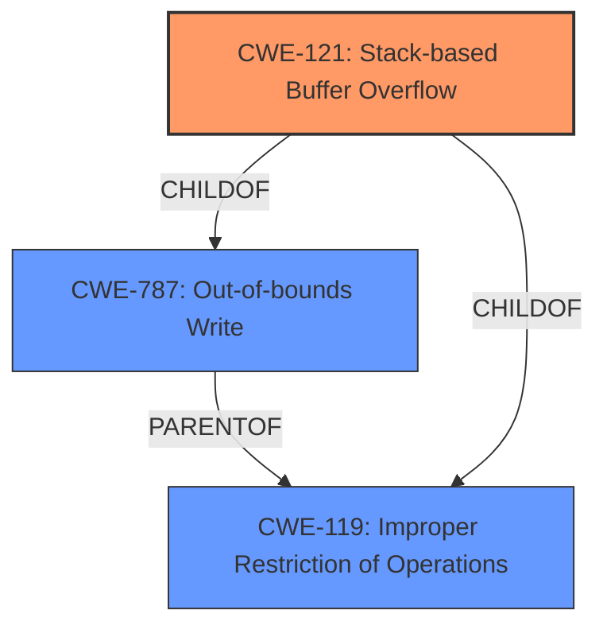

# Final Resolution for CVE-2021-45258

# Summary

| CWE ID | CWE Name | Confidence | CWE Abstraction Level | CWE Vulnerability Mapping Label | CWE-Vulnerability Mapping Notes |
|---|---|---|---|---|---|
| CWE-121 | Stack-based Buffer Overflow | 0.95 | Variant | Primary CWE | Allowed |

## Evidence and Confidence

*   **Confidence Score:** 0.95
*   **Evidence Strength:** HIGH

## Relationship Analysis
The primary relationship influencing the decision is the parent-child relationship where CWE-121 (Stack-based Buffer Overflow) is a variant (child) of CWE-119 (Improper Restriction of Operations within the Bounds of a Memory Buffer) and a child of CWE-787 (Out-of-bounds Write). This hierarchy indicates that CWE-121 provides a more specific classification than the broader CWE-119. The absence of other relevant chain or peer relationships reinforces the selection of CWE-121 as the most fitting primary CWE.

## Vulnerability Chain
The vulnerability chain starts with the `gf_bifs_dec_proto_list` function's improper handling of data. This leads to a **buffer overflow** on the stack (the **WEAKNESS**), which results in a segmentation fault and application crash (the impact). The **ROOTCAUSE** is the lack of proper bounds checking when writing data to the stack buffer.

## Summary of Analysis
The initial analysis correctly identified CWE-121 (Stack-based Buffer Overflow) as the primary CWE based on the vulnerability description: "A **stack overflow** vulnerability exists in gpac 1.1.0 via the gf_bifs_dec_proto_list function, which causes a segmentation fault and application crash." The criticism confirmed this selection, highlighting the explicit mention of "stack overflow" as strong evidence.

The graph relationships further support this decision. CWE-121 is a variant of CWE-119, offering a more specific classification. The MITRE mapping guidance for CWE-121 explicitly allows its usage.

The decision to use CWE-121 is justified because it directly reflects the reported vulnerability, is at the optimal level of specificity (Variant), and aligns with MITRE's mapping guidance.