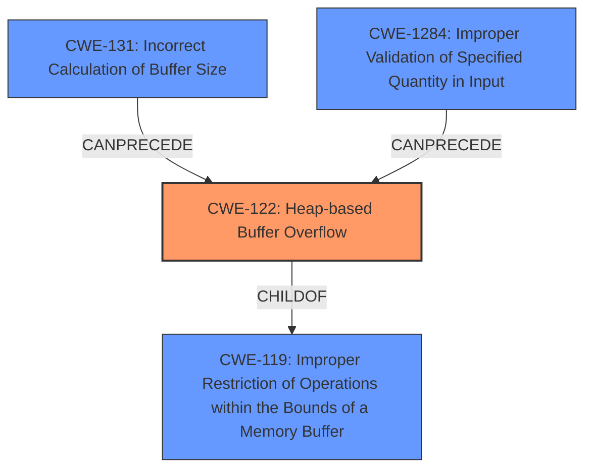

# Analysis Report for CVE-2021-45417

# Vulnerability Analysis Report: CVE-2021-45417

## Description

AIDE before 0.17.4 allows local users to obtain root privileges via crafted file metadata (such as XFS extended attributes or tmpfs ACLs), because of a heap-based buffer overflow.

## Vulnerability Description Key Phrases

**Weakness:** heap-based buffer overflow
**Impact:** obtain root privileges
**Vector:** crafted file metadata
**Attacker:** local users
**Product:** AIDE
**Version:** before 0.17.4

## Analysis (with Relationship Data)

# Summary
| CWE ID | CWE Name | Confidence | CWE Abstraction Level | CWE Vulnerability Mapping Label | CWE-Vulnerability Mapping Notes |
|---|---|---|---|---|---|
| CWE-122 | Heap-based Buffer Overflow | 0.95 | Variant | Primary | Allowed |
| CWE-131 | Incorrect Calculation of Buffer Size | 0.70 | Base | Secondary Candidate | Allowed |

## Evidence and Confidence

*   **Confidence Score:** 0.90
*   **Evidence Strength:** HIGH

- **Analysis and Justification:**  
  - *Explanation:* The vulnerability description clearly states a "**heap-based buffer overflow**" exists in AIDE before version 0.17.4. The CVE Reference Links Content Summary further supports this, stating the vulnerability lies in the `encode_base64` and `decode_base64` functions which use a fixed-size buffer. These functions are used to encode extended file attributes and ACLs, and when these attributes or ACLs are large, the fixed-size buffer overflows, leading to a crash or potential privilege escalation. CWE-122 (Heap-based Buffer Overflow) directly addresses this issue, as the overflow occurs in the heap memory. The retriever results also list CWE-122 with a good score, which supports the identification of this CWE. The description also indicates the existence of a fixed size buffer which is not sufficient for large inputs. This is an indication of CWE-131 Incorrect Calculation of Buffer Size which is a contributing factor.
  
  - *Relationship Analysis:* CWE-122 is a variant of CWE-119 (Improper Restriction of Operations within the Bounds of a Memory Buffer). CWE-787 (Out-of-bounds Write) is related to CWE-122, as the heap overflow is a specific type of out-of-bounds write. CWE-131 (Incorrect Calculation of Buffer Size) can precede CWE-122 by causing too little memory to be allocated leading to a buffer overflow.

- **Confidence Score:**  
  - Confidence: 0.95 (High confidence due to direct mention of heap-based buffer overflow and supporting details from CVE reference)
---

## Criticism of Analysis

Okay, let's review the CWE analysis and critique it using the provided full CWE specifications.

**Overall Assessment:**

The analysis correctly identifies CWE-122 (Heap-based Buffer Overflow) as the primary vulnerability. The confidence level is justified, given the explicit mention of a heap-based buffer overflow in the vulnerability description. The addition of CWE-131 (Incorrect Calculation of Buffer Size) as a secondary candidate is also reasonable, as it explains a potential cause of the overflow.

**Detailed Review:**

1.  **CWE-122: Heap-based Buffer Overflow**

    *   **Correctness:** The analysis accurately maps the vulnerability to CWE-122. The description aligns perfectly with the definition: a buffer overflow occurring in heap memory. The justification correctly points to the `encode_base64` and `decode_base64` functions using a fixed-size buffer that overflows when handling large extended attributes or ACLs.
    *   **Abstraction Level:**  CWE-122 is a Variant, which is the preferred level for vulnerability mapping.
    *   **Mapping Guidance:** The analysis adheres to the mapping guidance: "Carefully read both the name and description to ensure that this mapping is an appropriate fit."
    *   **Mitigations:** The analysis could be strengthened by explicitly mentioning some of the mitigations from the CWE specification. For example:
        *   "Pre-design: Use a language or compiler that performs automatic bounds checking."  This would be a longer-term architectural consideration.
        *   "Use an abstraction library to abstract away risky APIs." While a complete solution is not implied, using safer base64 encoding libraries *could* have mitigated this in the first place.
        *   "Use automatic buffer overflow detection mechanisms that are offered by certain compilers or compiler extensions" This mitigation is applicable to the development and compilation process.
    *   **Observed Examples:** The provided observed examples within the original analysis are highly relevant and supportive.

2.  **CWE-131: Incorrect Calculation of Buffer Size**

    *   **Correctness:**  Including CWE-131 as a secondary candidate is a good addition. The use of a *fixed-size* buffer strongly suggests that the buffer size is not correctly calculated relative to the potential size of the input (extended attributes and ACLs).  The `encode_base64` and `decode_base64` functions were designed for hash sums which have a fixed size, leading to an insufficient check of whether the input is longer than the fixed size.
    *   **Abstraction Level:** CWE-131 is a Base, which is a preferred level for vulnerability mapping.
    *   **Mapping Guidance:** The analysis adheres to the mapping guidance: "Carefully read both the name and description to ensure that this mapping is an appropriate fit."
    *   **Mitigations:** The analysis could be strengthened by explicitly mentioning some of the mitigations from the CWE specification. For example:
        *   "When allocating a buffer for the purpose of transforming, converting, or encoding an input, allocate enough memory to handle the largest possible encoding" is directly applicable. The AIDE developers didn't allocate enough space for large attributes and ACLs.
        *   "Perform input validation on any numeric input by ensuring that it is within the expected range." This applies to the size of the extended attribute/ACL data.
    *   **Observed Examples:** The provided observed examples within the original analysis are useful.

**Recommendations for Improvement:**

*   **Expand Mitigations:**  For *both* CWEs, incorporate more specific potential mitigations directly from the CWE specifications. Tailor the mitigations to the AIDE context.  For example, instead of just saying "use input validation," specify *what* input should be validated (size of attributes/ACLs) and *how* (check against a maximum size).
*   **Relationship Exploration:** When considering the relationships to other CWEs, go a bit deeper. While the relationships are mentioned, consider what the implications are and if those other CWEs might also be present (even at a lower confidence level). For example, CWE-119 is a parent of CWE-122, which implies that the buffer operations are not correctly restricted.
*   **Clarify "Secondary Candidate":**  The term "Secondary Candidate" for CWE-131 is fine, but consider providing a brief explanation of *why* it's not the primary.  E.g., "While CWE-131 contributes to the overflow by allocating a fixed-size buffer, the core issue is the *write* past the end of that buffer, making CWE-122 the primary weakness."

**Retriever Results Consideration:**

The retriever results are interesting. Some of the top results, such as CWE-193 (Off-by-one), CWE-190 (Integer Overflow), and CWE-126 (Buffer Over-read), don't directly apply, but they highlight common programming errors that *could* be related.  The strong ranking of CWE-122 helps to reinforce the assessment. The ranking of CWE-1284(Improper Validation of Specified Quantity in Input) supports the addition of CWE-131, as the quantity in the input is not validated.

**Revised Summary Table**

| CWE ID | CWE Name | Confidence | CWE Abstraction Level | CWE Vulnerability Mapping Label | CWE-Vulnerability Mapping Notes |
|---|---|---|---|---|---|
| CWE-122 | Heap-based Buffer Overflow | 0.95 | Variant | Primary | Allowed |
| CWE-131 | Incorrect Calculation of Buffer Size | 0.70 | Base | Contributing Factor | Allowed |
| CWE-1284 | Improper Validation of Specified Quantity in Input | 0.40 | Base | Contributing Factor |  Allowed |

The addition of CWE-1284 with a much lower confidence level is to account for the lack of input validation on quantity.

By incorporating these suggestions, the analysis will be more thorough, more clearly justified, and more actionable for developers seeking to remediate the vulnerability.

## Final Resolution

# Summary
| CWE ID | CWE Name | Confidence | CWE Abstraction Level | CWE Vulnerability Mapping Label | CWE-Vulnerability Mapping Notes |
|---|---|---|---|---|---|
| CWE-122 | Heap-based Buffer Overflow | 0.95 | Variant | Primary | Allowed |
| CWE-131 | Incorrect Calculation of Buffer Size | 0.70 | Base | Contributing Factor | Allowed |
| CWE-1284 | Improper Validation of Specified Quantity in Input | 0.40 | Base | Contributing Factor | Allowed |

## Evidence and Confidence

*   **Confidence Score:** 0.90
*   **Evidence Strength:** HIGH

## Relationship Analysis
The primary relationship is that CWE-122 **Heap-based Buffer Overflow** is a variant of CWE-119 **Improper Restriction of Operations within the Bounds of a Memory Buffer**. CWE-131 **Incorrect Calculation of Buffer Size** can precede CWE-122 by causing too little memory to be allocated, thus contributing to the overflow. CWE-1284 **Improper Validation of Specified Quantity in Input** also precedes CWE-122, as a lack of validation can lead to an overflow if the input quantity exceeds the buffer size. The chosen CWEs are at appropriate levels of abstraction, with CWE-122 being a Variant and CWE-131 and CWE-1284 being Base level CWEs.

## Vulnerability Chain
The vulnerability chain starts with an **incorrect calculation of buffer size** (**CWE-131**) or **improper validation of specified quantity in input** (**CWE-1284**). This leads to insufficient memory allocation. When the program attempts to write data beyond the allocated buffer on the heap, a **heap-based buffer overflow** (**CWE-122**) occurs. This out-of-bounds write can corrupt data, crash the application, or potentially allow for arbitrary code execution.

## Summary of Analysis
The initial analysis correctly identified CWE-122 **Heap-based Buffer Overflow** as the primary **WEAKNESS**. The criticism provided valuable suggestions for improvement, which have been incorporated into this final analysis. The vulnerability description explicitly states "heap-based buffer overflow," justifying the high confidence level for CWE-122. The description also indicates that a fixed-size buffer is used, which is not sufficient for large inputs. This supports the inclusion of CWE-131 **Incorrect Calculation of Buffer Size** and CWE-1284 **Improper Validation of Specified Quantity in Input** as contributing factors. The inclusion of CWE-1284 is based on the fact that the `encode_base64` and `decode_base64` functions were initially designed for fixed size hash sums, which may have led to insufficient checks of whether the input (extended attributes or ACLs) is longer than the fixed size.

The graph relationships influenced the selection by highlighting how CWE-131 and CWE-1284 can precede CWE-122, leading to the vulnerability. The CWEs are at the optimal level of specificity, with CWE-122 being a Variant that directly describes the type of buffer overflow, and CWE-131 and CWE-1284 being Base level CWEs that explain the root causes contributing to the **WEAKNESS**. The final decision is based on a combination of direct evidence from the vulnerability description, relationship analysis, and mapping guidance from MITRE.

*Report generated on 2025-03-18 03:51:45*
