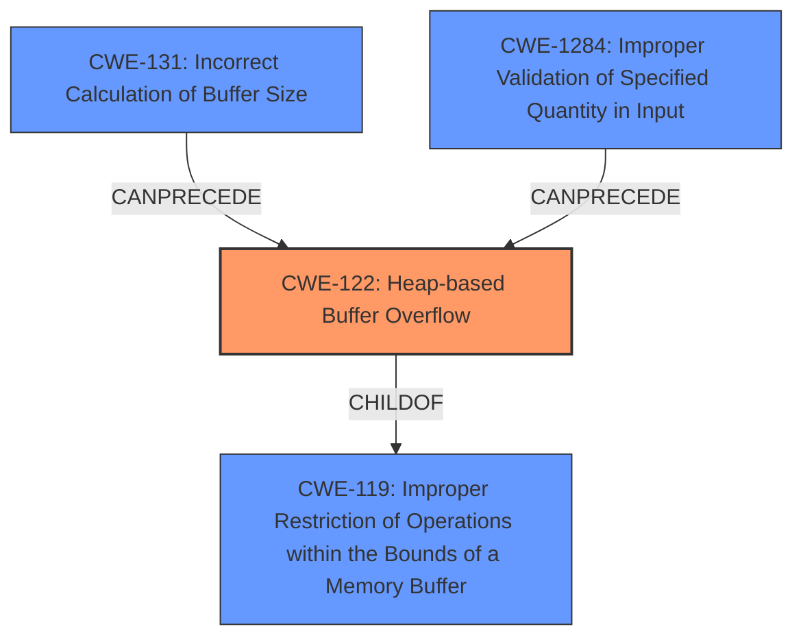

# Final Resolution for CVE-2021-45417

# Summary
| CWE ID | CWE Name | Confidence | CWE Abstraction Level | CWE Vulnerability Mapping Label | CWE-Vulnerability Mapping Notes |
|---|---|---|---|---|---|
| CWE-122 | Heap-based Buffer Overflow | 0.95 | Variant | Primary | Allowed |
| CWE-131 | Incorrect Calculation of Buffer Size | 0.70 | Base | Contributing Factor | Allowed |
| CWE-1284 | Improper Validation of Specified Quantity in Input | 0.40 | Base | Contributing Factor | Allowed |

## Evidence and Confidence

*   **Confidence Score:** 0.90
*   **Evidence Strength:** HIGH

## Relationship Analysis
The primary relationship is that CWE-122 **Heap-based Buffer Overflow** is a variant of CWE-119 **Improper Restriction of Operations within the Bounds of a Memory Buffer**. CWE-131 **Incorrect Calculation of Buffer Size** can precede CWE-122 by causing too little memory to be allocated, thus contributing to the overflow. CWE-1284 **Improper Validation of Specified Quantity in Input** also precedes CWE-122, as a lack of validation can lead to an overflow if the input quantity exceeds the buffer size. The chosen CWEs are at appropriate levels of abstraction, with CWE-122 being a Variant and CWE-131 and CWE-1284 being Base level CWEs.

## Vulnerability Chain
The vulnerability chain starts with an **incorrect calculation of buffer size** (**CWE-131**) or **improper validation of specified quantity in input** (**CWE-1284**). This leads to insufficient memory allocation. When the program attempts to write data beyond the allocated buffer on the heap, a **heap-based buffer overflow** (**CWE-122**) occurs. This out-of-bounds write can corrupt data, crash the application, or potentially allow for arbitrary code execution.

## Summary of Analysis
The initial analysis correctly identified CWE-122 **Heap-based Buffer Overflow** as the primary **WEAKNESS**. The criticism provided valuable suggestions for improvement, which have been incorporated into this final analysis. The vulnerability description explicitly states "heap-based buffer overflow," justifying the high confidence level for CWE-122. The description also indicates that a fixed-size buffer is used, which is not sufficient for large inputs. This supports the inclusion of CWE-131 **Incorrect Calculation of Buffer Size** and CWE-1284 **Improper Validation of Specified Quantity in Input** as contributing factors. The inclusion of CWE-1284 is based on the fact that the `encode_base64` and `decode_base64` functions were initially designed for fixed size hash sums, which may have led to insufficient checks of whether the input (extended attributes or ACLs) is longer than the fixed size.

The graph relationships influenced the selection by highlighting how CWE-131 and CWE-1284 can precede CWE-122, leading to the vulnerability. The CWEs are at the optimal level of specificity, with CWE-122 being a Variant that directly describes the type of buffer overflow, and CWE-131 and CWE-1284 being Base level CWEs that explain the root causes contributing to the **WEAKNESS**. The final decision is based on a combination of direct evidence from the vulnerability description, relationship analysis, and mapping guidance from MITRE.