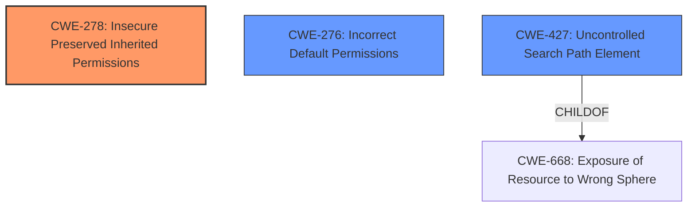

# Final Resolution for CVE-2021-45492

# Summary
| CWE ID | CWE Name | Confidence | CWE Abstraction Level | CWE Vulnerability Mapping Label | CWE-Vulnerability Mapping Notes |
|---|---|---|---|---|---|
| CWE-278 | Insecure Preserved Inherited Permissions | 0.9 | Variant | Primary | Allowed |
| CWE-276 | Incorrect Default Permissions | 0.8 | Base | Secondary | Allowed |
| CWE-427 | Uncontrolled Search Path Element | 0.7 | Base | Secondary | Allowed |

## Evidence and Confidence

*   **Confidence Score:** 0.85
*   **Evidence Strength:** HIGH

## Relationship Analysis
The primary **WEAKNESS** is that the installer does not explicitly set permissions on the installation directory, resulting in the directory inheriting weak permissions from its parent. This aligns with **CWE-278** [CWE-278: Insecure Preserved Inherited Permissions]. The secondary **WEAKNESSES** are **CWE-276** [CWE-276: Incorrect Default Permissions] because the installation defaults to incorrect permissions and **CWE-427** [CWE-427: Uncontrolled Search Path Element] because the installer adds the weakly-permissioned directory to the system's PATH, enabling DLL search-order hijacking.

## Vulnerability Chain
The chain of **ROOT CAUSE** and **WEAKNESSES** is as follows:
1.  The Sage 300 ERP installer fails to set explicit permissions on the installation directory ("C:\Sage\Sage300\Runtime"). (**CWE-278** [CWE-278: Insecure Preserved Inherited Permissions] and **CWE-276** [CWE-276: Incorrect Default Permissions]).
2.  This results in the directory inheriting weak permissions from its parent, making it writable by unprivileged users.
3.  The installer adds the weakly-permissioned directory to the system's PATH. (**CWE-427** [CWE-427: Uncontrolled Search Path Element]).
4.  An attacker can perform DLL search-order hijacking to escalate their privileges to SYSTEM.

## Summary of Analysis
The initial analysis correctly identified **CWE-278** [CWE-278: Insecure Preserved Inherited Permissions] as the primary **ROOT CAUSE**. The criticism suggested adding **CWE-276** [CWE-276: Incorrect Default Permissions] as a secondary CWE, which is a good fit because the installation defaults to incorrect permissions.

The vulnerability description states, "the installer configures the C:\Sage\Sage300\Runtime directory to be the first entry in the system-wide PATH environment variable. However, this directory is writable by unprivileged users because the Sage installer fails to set explicit permissions and therefore inherits weak permissions from the C:\ folder." This clearly indicates that the installer is not setting explicit permissions, leading to inherited, insecure permissions.

The choice of **CWE-427** [CWE-427: Uncontrolled Search Path Element] over **CWE-426** [CWE-426: Untrusted Search Path] is accurate because the installer controls the PATH, but an element within that PATH is vulnerable. The suggested mitigations for all assigned CWEs are applicable and relevant to the specific vulnerability context.
The selected CWEs are at the optimal level of specificity.