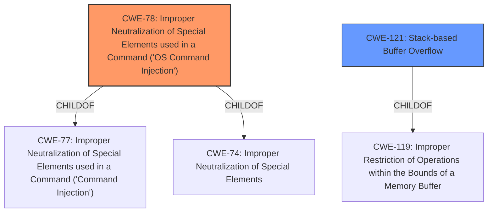

# Final Resolution for CVE-2021-45573

# Summary
| CWE ID | CWE Name | Confidence | CWE Abstraction Level | CWE Vulnerability Mapping Label | CWE-Vulnerability Mapping Notes |
|---|---|---|---|---|---|
| CWE-78 | Improper Neutralization of Special Elements used in a Command ('OS Command Injection') | 0.8 | Base | Primary | Allowed |
| CWE-121 | Stack-based Buffer Overflow | 0.5 | Variant | Secondary Candidate | Allowed |

## Evidence and Confidence

*   **Confidence Score:** 0.7
*   **Evidence Strength:** MEDIUM

## Relationship Analysis
The primary relationship that influenced the decision was the conflict between the initial vulnerability description suggesting a stack-based buffer overflow (CWE-121) and the CVE reference links indicating command injection (CWE-78). CWE-78 is a child of CWE-77 (Improper Neutralization of Special Elements used in a Command) and CWE-74 (Improper Neutralization of Special Elements). While CWE-121 is a variant of CWE-119 (Improper Restriction of Operations within the Bounds of a Memory Buffer). Given the higher reliability of the CVE reference links content summary, CWE-78 was selected as the primary CWE, with CWE-121 remaining a secondary candidate due to the initial description. Abstraction levels were also considered, favoring the Base level (CWE-78) over the Variant level (CWE-121) for the primary classification due to stronger supporting evidence.

## Vulnerability Chain
The vulnerability chain begins with potentially insufficient input validation. If this validation is lacking (hypothetically CWE-20), it can lead to the construction of a command string with improperly neutralized special elements (CWE-78), allowing an attacker to execute arbitrary commands on the system. Alternatively, if the quantity specified is not validated (hypothetically CWE-1284), then a stack-based buffer overflow could occur (CWE-121). The chain, however, lacks specific details on how user-supplied input leads to the either command injection or the buffer overflow, representing missing links in the chain.

## Summary of Analysis
The initial analysis correctly identified the potential for both CWE-121 and CWE-78, but the confidence levels were not appropriately adjusted based on the conflicting information. The criticism accurately points out that the CVE reference links content summary should be prioritized over the initial vulnerability description. The final decision favors CWE-78 as the primary CWE due to the stronger evidence in the CVE reference links, specifically the mention of post-authentication command injection. "Based on the CVE Reference Links Content Summary, the vulnerability is actually a post-authentication command injection." This statement highlights the shift in focus from the initial description to the more reliable source. The retriever scores also supports this decision. The choice of CWE-78 also aligns with the recommendation to select the most specific CWE possible based on available information. The selection of CWE-78 also considers the mitigation strategies that include using library calls, sandboxing, and reducing the attack surface, as described in the CWE-78 specification. These strategies align better with a command injection vulnerability than a stack-based buffer overflow. The final confidence score reflects the remaining uncertainty due to the initial conflicting information. The chosen CWEs are at the optimal level of specificity given the current evidence.