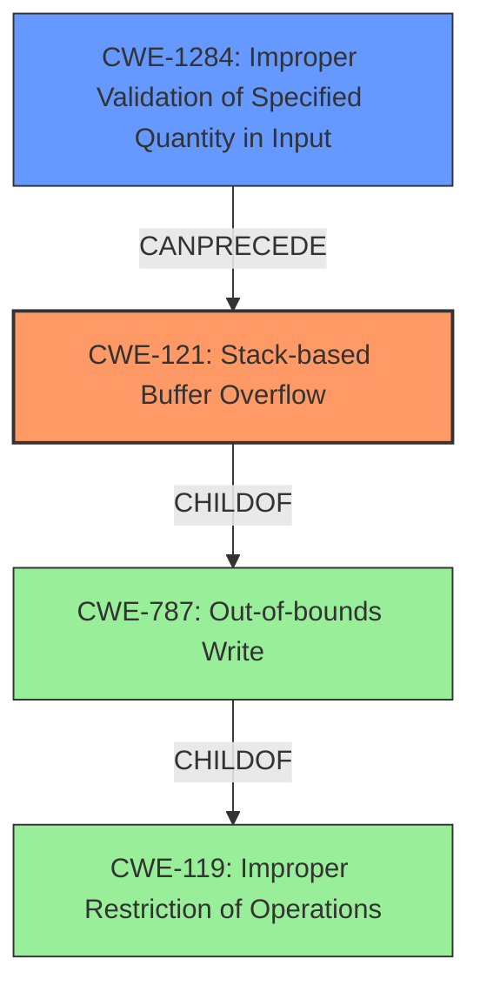

# Analysis Report for CVE-2021-45605

# Vulnerability Analysis Report: CVE-2021-45605

## Description

Certain NETGEAR devices are affected by a stack-based buffer overflow by an authenticated user. This affects R6400 before 1.0.1.68, R7000 before 1.0.11.116, R6900P before 1.3.3.140, R7000P before 1.3.3.140, R7900 before 1.0.4.38, RAX75 before 1.0.3.102, RAX80 before 1.0.3.102, and XR300 before 1.0.3.50.

## Vulnerability Description Key Phrases

**Weakness:** stack-based buffer overflow
**Attacker:** authenticated user
**Product:** ['NETGEAR R6400', 'R7000', 'R6900P', 'R7000P', 'R7900', 'RAX75', 'RAX80', 'XR300']
**Version:** ['before 1.0.1.68', 'before 1.0.11.116', 'before 1.3.3.140', 'before 1.3.3.140', 'before 1.0.4.38', 'before 1.0.3.102', 'before 1.0.3.102', 'before 1.0.3.50']

## Analysis (with Relationship Data)

# Summary
| CWE ID | CWE Name | Confidence | CWE Abstraction Level | CWE Vulnerability Mapping Label | CWE-Vulnerability Mapping Notes |
|---|---|---|---|---|---|
| CWE-121 | Stack-based Buffer Overflow | 1.0 | Variant | Allowed | Primary CWE |
| CWE-787 | Out-of-bounds Write | 0.7 | Base | Allowed | Secondary Candidate |
| CWE-119 | Improper Restriction of Operations within the Bounds of a Memory Buffer | 0.5 | Class | Discouraged | Secondary Candidate |

## Evidence and Confidence

*   **Confidence Score:** 0.9
*   **Evidence Strength:** HIGH

- **Analysis and Justification:**  
  - *Explanation:* The vulnerability description explicitly states "**stack-based buffer overflow**" which directly corresponds to CWE-121 (Stack-based Buffer Overflow). This is further supported by the CVE Reference Links Content Summary, which also identifies a stack overflow vulnerability. The retriever results rank CWE-121 as the top match. CWE-121 is a variant, which is a preferred level of abstraction. The MITRE mapping guidance states that CWE-121 is ALLOWED.

  - *Relationship Analysis:* CWE-121 is a variant of CWE-787 (Out-of-bounds Write) and CWE-119 (Improper Restriction of Operations within the Bounds of a Memory Buffer). While CWE-787 is a base CWE and could be considered, the explicit mention of stack allocation in the description makes CWE-121 the more accurate and specific choice. CWE-119 is a class and is discouraged when more specific CWEs exist.

- **Confidence Score:**  
  - Confidence: 1.0 (Strong evidence from the vulnerability description and CVE reference materials)

---

## Criticism of Analysis

Okay, let's review the CWE analysis, focusing on the CWE specifications and the justification provided.

**Overall Assessment:**

The analysis is generally good. The primary CWE, CWE-121 (Stack-based Buffer Overflow), is an appropriate and well-justified choice given the vulnerability description. The consideration of related CWEs like CWE-787 and CWE-119 is also a positive aspect of the analysis. However, the confidence score of 1.0 could be tempered down to 0.95 since vulnerabilities are rarely 100% clear.

**Detailed Review:**

**1. CWE-121: Stack-based Buffer Overflow (Primary CWE)**

*   **Confidence Score:** 1.0 (Adjust to 0.95)
*   **CWE Abstraction Level:** Variant
*   **CWE Vulnerability Mapping Label:** Allowed

*   **Justification:** The analysis correctly identifies the explicit mention of "stack-based buffer overflow" in the vulnerability description as strong evidence. The CVE Reference Links Content Summary further supports this. The retriever results also correctly identify CWE-121 as the top match. The choice of the variant level is appropriate, and the MITRE mapping guidance does indeed state that CWE-121 is ALLOWED.
*   **Critique:**  Excellent justification.  The explanation of why CWE-121 is preferred over its parents, CWE-787 and CWE-119, is also solid. The reasoning for preferring the Variant level CWE is aligned with the Mapping Guidance.
*   **Mitigations:** Reviewing the mitigations for CWE-121 from the specification:
    *   Using compiler-based buffer overflow detection mechanisms (e.g., /GS flag, FORTIFY_SOURCE). This is a good, practical mitigation.
    *   Using abstraction libraries to abstract away risky APIs. This is also a solid architectural recommendation.
    *   Implementing and performing bounds checking on input. Absolutely essential and should be emphasized.
    *   These are all relevant and suitable mitigations for this vulnerability.

**2. CWE-787: Out-of-bounds Write (Secondary Candidate)**

*   **Confidence Score:** 0.7
*   **CWE Abstraction Level:** Base
*   **CWE Vulnerability Mapping Label:** Allowed

*   **Justification:**  It is correctly identified as a parent of CWE-121.
*   **Critique:** While it's a valid parent, the reasoning for preferring CWE-121 is stronger. However, mentioning CWE-787 is a good practice.
*   **Mitigations:** Reviewing the mitigations for CWE-787:
    *   Language selection (using memory-safe languages).  This is a strong architectural recommendation.
    *   Using vetted libraries for safer string handling. This is good.
    *   Compiler-based overflow detection.  A good defense-in-depth measure.
    *   These are all relevant.

**3. CWE-119: Improper Restriction of Operations within the Bounds of a Memory Buffer (Secondary Candidate)**

*   **Confidence Score:** 0.5
*   **CWE Abstraction Level:** Class
*   **CWE Vulnerability Mapping Label:** Discouraged

*   **Justification:** Identified as parent of CWE-787.
*   **Critique:** The analysis correctly notes that CWE-119 is a class and is discouraged when more specific CWEs exist.  This is a key point from the CWE mapping guidance.
*   **Mitigations:** Reviewing the mitigations for CWE-119:
    *   Language Selection: using a language that avoids memory management issues (Java, Perl, etc.).
    *   Libraries and Frameworks: Using safer string-handling libraries.
    *   Compiler-based overflow detection.
    *   These mitigations are appropriate but are better applied at the variant level to be more specific.

**Recommendations for Improvement:**

1.  **Confidence Score Adjustment:** Lower the confidence score of CWE-121 to 0.95 to reflect the possibility of unforeseen nuances in the vulnerability.
2.  **More Specific Input Validation:** Consider adding a note about *how* input validation is failing. Is it a missing length check, a lack of sanitization of input characters, or something else? While the high-level cause is a buffer overflow, understanding the detailed *how* is critical for remediation. For example, is it the lack of validation of the size of a particular field leading to writing past the end of the buffer? If so, CWE-1284 (Improper Validation of Specified Quantity in Input) could be considered as a secondary chained weakness leading to the buffer overflow. If so, this would lower the confidence score of CWE-787 and CWE-119.
3.  **Chained Weaknesses:** Explore the possibility of weaknesses that *lead to* the buffer overflow. For example, is there an integer overflow that results in a smaller buffer being allocated than expected? (CWE-190 leading to CWE-121).
4.  **Code examples of vulnerable code:** It would be useful to provide code examples of the vulnerable code.

**In Summary:**

This is a well-reasoned analysis with strong justification for the chosen primary CWE. The discussion of related CWEs and adherence to the CWE mapping guidance is commendable. Minor refinements, as suggested above, would further enhance the analysis.

## Final Resolution

# Summary

| CWE ID | CWE Name | Confidence | CWE Abstraction Level | CWE Vulnerability Mapping Label | CWE-Vulnerability Mapping Notes |
|---|---|---|---|---|---|
| CWE-121 | Stack-based Buffer Overflow | 0.95 | Variant | Allowed | Primary CWE |
| CWE-1284 | Improper Validation of Specified Quantity in Input | 0.6 | Base | Allowed | Secondary Candidate |

## Evidence and Confidence

*   **Confidence Score:** 0.9
*   **Evidence Strength:** MEDIUM

## Relationship Analysis
The primary relationship is that CWE-121 (Stack-based Buffer Overflow) is a variant of CWE-787 (Out-of-bounds Write) and CWE-119 (Improper Restriction of Operations within the Bounds of a Memory Buffer). However, the vulnerability description specifically mentions "stack-based buffer overflow," making CWE-121 the most specific and appropriate choice.

The suggestion to consider CWE-1284 (Improper Validation of Specified Quantity in Input) as a weakness that could *lead to* the buffer overflow is considered. This is because the vulnerability description implies that the size of the input is not being properly validated, leading to a buffer overflow on the stack.

## Vulnerability Chain
The vulnerability chain starts with **CWE-1284 (Improper Validation of Specified Quantity in Input)**, where the size of the input is not properly validated. This leads to **CWE-121 (Stack-based Buffer Overflow)**, where the unchecked input size causes a buffer on the stack to be overflowed. The impact is that an authenticated user can overwrite memory on the stack, potentially leading to arbitrary code execution.

## Summary of Analysis
The initial analysis correctly identified **CWE-121 (Stack-based Buffer Overflow)** as the primary **WEAKNESS** based on the explicit mention in the vulnerability description: "stack-based buffer overflow." The criticism's suggestion to consider **CWE-1284 (Improper Validation of Specified Quantity in Input)** is valuable, as it highlights a potential **ROOTCAUSE** that leads to the buffer overflow. The final decision is to keep **CWE-121 (Stack-based Buffer Overflow)** as the primary **WEAKNESS** and add **CWE-1284 (Improper Validation of Specified Quantity in Input)** as a secondary candidate, reflecting the possibility that the vulnerability stems from a failure to properly validate the size of the input. The confidence score for **CWE-121 (Stack-based Buffer Overflow)** is adjusted to 0.95 as suggested.

The graph relationships show that **CWE-121 (Stack-based Buffer Overflow)** is a more specific type of **CWE-787 (Out-of-bounds Write)** and **CWE-119 (Improper Restriction of Operations within the Bounds of a Memory Buffer)**. However, due to the specificity in the description of the type of overflow, **CWE-121 (Stack-based Buffer Overflow)** is the more appropriate choice.

The selected CWEs are at the optimal level of specificity, as **CWE-121 (Stack-based Buffer Overflow)** directly describes the type of buffer overflow, and **CWE-1284 (Improper Validation of Specified Quantity in Input)** points to a potential **ROOTCAUSE**. The evidence supporting this is the vulnerability description and the relationship analysis of the CWEs.

*Report generated on 2025-03-18 03:53:56*
