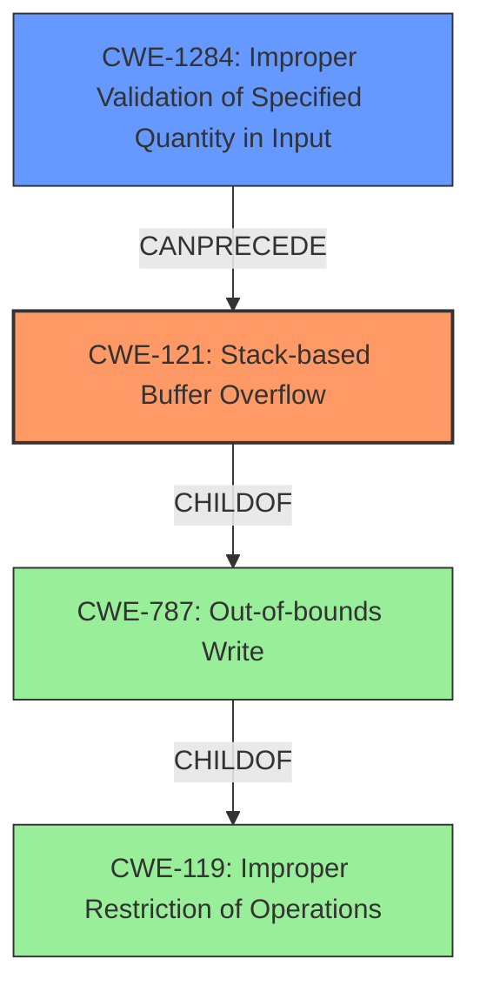

# Final Resolution for CVE-2021-45605

# Summary

| CWE ID | CWE Name | Confidence | CWE Abstraction Level | CWE Vulnerability Mapping Label | CWE-Vulnerability Mapping Notes |
|---|---|---|---|---|---|
| CWE-121 | Stack-based Buffer Overflow | 0.95 | Variant | Allowed | Primary CWE |
| CWE-1284 | Improper Validation of Specified Quantity in Input | 0.6 | Base | Allowed | Secondary Candidate |

## Evidence and Confidence

*   **Confidence Score:** 0.9
*   **Evidence Strength:** MEDIUM

## Relationship Analysis
The primary relationship is that CWE-121 (Stack-based Buffer Overflow) is a variant of CWE-787 (Out-of-bounds Write) and CWE-119 (Improper Restriction of Operations within the Bounds of a Memory Buffer). However, the vulnerability description specifically mentions "stack-based buffer overflow," making CWE-121 the most specific and appropriate choice.

The suggestion to consider CWE-1284 (Improper Validation of Specified Quantity in Input) as a weakness that could *lead to* the buffer overflow is considered. This is because the vulnerability description implies that the size of the input is not being properly validated, leading to a buffer overflow on the stack.

## Vulnerability Chain
The vulnerability chain starts with **CWE-1284 (Improper Validation of Specified Quantity in Input)**, where the size of the input is not properly validated. This leads to **CWE-121 (Stack-based Buffer Overflow)**, where the unchecked input size causes a buffer on the stack to be overflowed. The impact is that an authenticated user can overwrite memory on the stack, potentially leading to arbitrary code execution.

## Summary of Analysis
The initial analysis correctly identified **CWE-121 (Stack-based Buffer Overflow)** as the primary **WEAKNESS** based on the explicit mention in the vulnerability description: "stack-based buffer overflow." The criticism's suggestion to consider **CWE-1284 (Improper Validation of Specified Quantity in Input)** is valuable, as it highlights a potential **ROOTCAUSE** that leads to the buffer overflow. The final decision is to keep **CWE-121 (Stack-based Buffer Overflow)** as the primary **WEAKNESS** and add **CWE-1284 (Improper Validation of Specified Quantity in Input)** as a secondary candidate, reflecting the possibility that the vulnerability stems from a failure to properly validate the size of the input. The confidence score for **CWE-121 (Stack-based Buffer Overflow)** is adjusted to 0.95 as suggested.

The graph relationships show that **CWE-121 (Stack-based Buffer Overflow)** is a more specific type of **CWE-787 (Out-of-bounds Write)** and **CWE-119 (Improper Restriction of Operations within the Bounds of a Memory Buffer)**. However, due to the specificity in the description of the type of overflow, **CWE-121 (Stack-based Buffer Overflow)** is the more appropriate choice.

The selected CWEs are at the optimal level of specificity, as **CWE-121 (Stack-based Buffer Overflow)** directly describes the type of buffer overflow, and **CWE-1284 (Improper Validation of Specified Quantity in Input)** points to a potential **ROOTCAUSE**. The evidence supporting this is the vulnerability description and the relationship analysis of the CWEs.