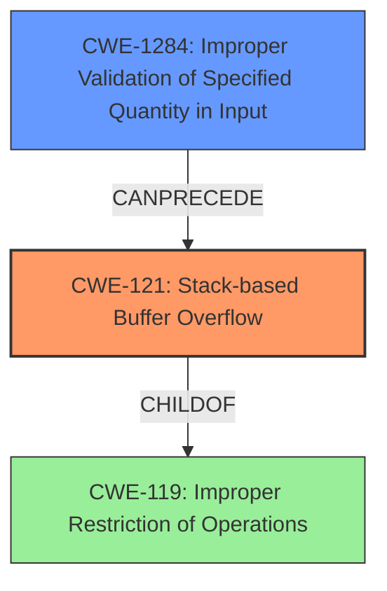

# Final Resolution for CVE-2021-45607

# Summary
| CWE ID | CWE Name | Confidence | CWE Abstraction Level | CWE Vulnerability Mapping Label | CWE-Vulnerability Mapping Notes |
|---|---|---|---|---|---|
| CWE-121 | Stack-based Buffer Overflow | 0.99 | Variant | Allowed | Primary CWE |
| CWE-1284 | Improper Validation of Specified Quantity in Input | 0.7 | Base | Allowed | Secondary Candidate |
  - The Primary CWE should be first and noted as the Primary CWEs
  - The secondary candidate CWEs should be next and noted as secondary candidates.
  - The confidence is a confidence score 0 to 1 to rate your confidence in your assessment for that CWE.
  - The CWE Abstraction Level as one of these values: Base, Variant, Pillar, Class, Compound
  - The Mapping Notes Usage as one of these values: Allowed, Allowed-with-Review, Prohibited, Discouraged

## Evidence and Confidence

*   **Confidence Score:** 0.95
*   **Evidence Strength:** MEDIUM

## Relationship Analysis
The primary relationship impacting the decision is that CWE-121 is a variant of the more general CWE-119. However, the explicit mention of "stack-based buffer overflow" makes CWE-121 the most appropriate choice. Furthermore, the criticism suggests exploring the root cause, which led to the consideration of CWE-1284. While other CWEs like CWE-120, CWE-131, and CWE-20 were considered, CWE-1284 seemed most plausible based on the limited information, because the buffer overflow could be caused by a size parameter being read from input without proper validation.

## Vulnerability Chain
The vulnerability chain starts with a potential **ROOTCAUSE** of improper validation of input (CWE-1284). This leads to an improperly sized buffer being allocated on the stack. Subsequently, a buffer overflow occurs (CWE-121) when data exceeding the buffer's capacity is written to it. The final impact is potentially arbitrary code execution due to the overflow.

## Summary of Analysis
The initial analysis correctly identified CWE-121 as the primary weakness. The criticism highlighted the importance of specificity and suggested a root cause analysis.

The decision to increase the confidence level for CWE-121 to 0.99 is based on the explicit mention of "stack-based buffer overflow" in the vulnerability description. As the criticism stated: "The vulnerability description *explicitly* states 'stack-based buffer overflow'. The fact that the overflow occurs on the stack makes CWE-121 a highly appropriate mapping."

CWE-119 was removed as a secondary candidate, aligning with the CWE's "Usage: Discouraged" guidance. The criticism stated: "The justification states that CWE-119 is a more general case. While true, the CWE specifications explicitly *discourage* using CWE-119 when more specific CWEs (like CWE-121) are available."

CWE-1284 (Improper Validation of Specified Quantity in Input) was added as a secondary candidate because the buffer overflow could be caused by a size parameter being read from input without proper validation. While speculative, it is a plausible root cause based on the limited description. This addresses the criticism's recommendation to consider a deeper dive into the root cause: "Consider a deeper dive into root cause...Identifying the root cause will provide a more valuable and actionable understanding of the vulnerability. However, *only* add these if the available information supports them. Don't add them speculatively."

The selected CWEs are at the optimal level of specificity based on the available evidence. CWE-121 accurately describes the type of buffer overflow, and CWE-1284 provides a plausible root cause, even though it is somewhat speculative.