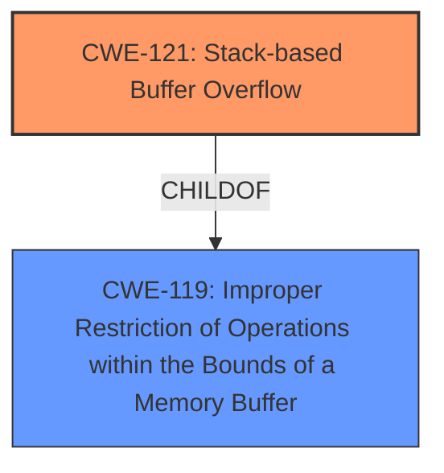

# Final Resolution for CVE-2021-45636

# Summary
| CWE ID | CWE Name | Confidence | CWE Abstraction Level | CWE Vulnerability Mapping Label | CWE-Vulnerability Mapping Notes |
|---|---|---|---|---|---|
| CWE-121 | Stack-based Buffer Overflow | 0.9 | Variant | Allowed | Primary CWE |
| CWE-119 | Improper Restriction of Operations within the Bounds of a Memory Buffer | 0.4 | Class | Discouraged | Secondary Candidate |

## Evidence and Confidence

*   **Confidence Score:** 0.9
*   **Evidence Strength:** HIGH

## Relationship Analysis
The primary CWE is CWE-121 **(Stack-based Buffer Overflow)**, which is a variant of the class CWE-119 **(Improper Restriction of Operations within the Bounds of a Memory Buffer)**. This parent-child relationship confirms that CWE-121 is a more specific and appropriate choice. CWE-119 is a broader category and is often misused when more specific CWEs are available. The relationship analysis supports using the variant CWE-121 over the class CWE-119, when the stack is clearly implicated.

## Vulnerability Chain
The vulnerability chain starts with the **ROOTCAUSE** being a coding error that allows writing data beyond the allocated buffer on the stack. This leads to **WEAKNESS** CWE-121 (Stack-based Buffer Overflow), where an attacker can overwrite adjacent memory locations. The consequence is potential arbitrary code execution or denial of service. The vulnerability occurs pre-authentication, increasing the severity because no prior authorization is needed to trigger the vulnerability.

## Summary of Analysis
The initial analysis and criticism both agree that CWE-121 (Stack-based Buffer Overflow) is the most appropriate primary CWE for this vulnerability. The vulnerability description explicitly states "stack-based buffer overflow," providing strong evidence. The choice of CWE-121, a Variant, over CWE-119, a Class, is justified by the greater specificity. The provided evidence, including the CVE reference summary ("Pre-authentication stack overflow" and "Stack overflow"), supports this classification.

The graph relationships further confirm the choice of CWE-121, as it is a child of CWE-119, representing a more specific case of buffer overflow. The analysis correctly notes that CWE-119 is often misused when more specific CWEs exist. The selection of CWE-121 is at the optimal level of specificity based on the available evidence.

The confidence score of 0.9 is appropriate due to the explicit mention of "stack-based buffer overflow" and corroborating evidence. Overall, the assessment is well-justified and aligns with the provided evidence and relationship analysis.