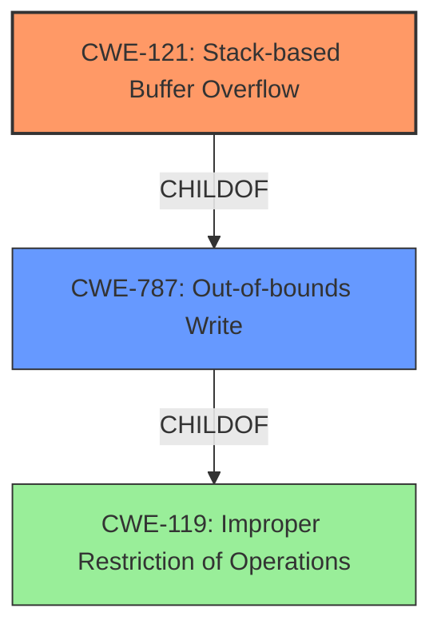

# Analysis Report for CVE-2021-45637

# Vulnerability Analysis Report: CVE-2021-45637

## Description

Certain NETGEAR devices are affected by a stack-based buffer overflow by an unauthenticated attacker. This affects R6260 before 1.1.0.76, R6800 before 1.2.0.62, R6700v2 before 1.2.0.62, R6900v2 before 1.2.0.62, R7450 before 1.2.0.62, AC2100 before 1.2.0.62, AC2400 before 1.2.0.62, and AC2600 before 1.2.0.62.

## Vulnerability Description Key Phrases

**Weakness:** stack-based buffer overflow
**Attacker:** unauthenticated attacker
**Product:** ['NETGEAR R6260', 'R6800', 'R6700v2', 'R6900v2', 'R7450', 'AC2100', 'AC2400', 'AC2600']
**Version:** ['before 1.1.0.76', 'before 1.2.0.62', 'before 1.2.0.62', 'before 1.2.0.62', 'before 1.2.0.62', 'before 1.2.0.62', 'before 1.2.0.62', 'before 1.2.0.62']

## Analysis (with Relationship Data)

# Summary
| CWE ID  | CWE Name                                                                    | Confidence | CWE Abstraction Level | CWE Vulnerability Mapping Label | CWE-Vulnerability Mapping Notes |
|---------|-----------------------------------------------------------------------------|------------|-----------------------|---------------------------------|---------------------------------|
| CWE-121 | Stack-based Buffer Overflow                                                 | 0.95       | Variant               | Primary                           | Allowed                         |
| CWE-787 | Out-of-bounds Write                                                         | 0.75       | Base                  | Secondary                         | Allowed                         |

## Evidence and Confidence

*   **Confidence Score:** 0.90
*   **Evidence Strength:** HIGH

- **Analysis and Justification:**
  - *Explanation:* The vulnerability description explicitly states a "**stack-based buffer overflow**" exists in NETGEAR devices, affecting several router models. This aligns directly with CWE-121 (Stack-based Buffer Overflow), which is a variant of buffer overflow where the affected buffer resides on the stack. The CVE Reference Links Content Summary reinforces this by identifying the root cause as a "stack overflow vulnerability." Given the specific nature of the overflow being stack-based, CWE-121 is a more precise mapping than its parent CWE, CWE-119 (Improper Restriction of Operations within the Bounds of a Memory Buffer). Also, the retriever results ranked CWE-121 with the highest score. The MITRE mapping guidance for CWE-121 indicates that it is ALLOWED and the preferred level of abstraction for mapping vulnerabilities. While CWE-787 (Out-of-bounds Write) could also apply, CWE-121 is more specific because it identifies the memory location (stack).

  - *Relationship Analysis:* CWE-121 is a variant of CWE-119 (Improper Restriction of Operations within the Bounds of a Memory Buffer) and a child of CWE-787 (Out-of-bounds Write). The relationship analysis supports choosing the more specific CWE-121 due to the availability of stack location information, making the mapping more accurate. There are no specific chain relationships apparent in this vulnerability description.

- **Confidence Score:**
  - Confidence: 0.95 (High confidence due to explicit mention of "stack-based buffer overflow" and supporting evidence from CVE reference materials)

## Criticism of Analysis

Okay, here's a detailed review of the analysis, focusing on the CWE mappings, their justifications, and the relevance of mitigations based on the full CWE specifications you've provided.

**Overall Assessment:**

The analysis is generally good, particularly in identifying the primary CWE. The choice of CWE-121 (Stack-based Buffer Overflow) as the primary weakness is correct and well-supported by the information. The high confidence score (0.95) is justified. The reasoning for choosing CWE-121 over the more general CWE-787 (Out-of-bounds Write) is also solid.

**Specific Comments & Recommendations:**

1.  **Primary CWE: CWE-121 (Stack-based Buffer Overflow)**

    *   **Strengths:** The analysis correctly identifies the explicit mention of "stack-based buffer overflow" in the vulnerability description. It also appropriately acknowledges the relationship between CWE-121 and its parents (CWE-787 and CWE-119), and explains why CWE-121 is more specific and accurate in this case. The use of the CVE Reference Links Content Summary to reinforce the root cause as a "stack overflow vulnerability" adds further credibility.
    *   **Mitigations:** The suggested mitigations (Environment Hardening, Abstraction Libraries, and Input Bounds Checking) align well with the nature of a stack-based buffer overflow. Environment hardening (like compiler flags) and Input Bounds Checking are the strongest mitigations in this scenario.
    *   **Improvements:** None. The analysis and justification are thorough.

2.  **Secondary CWE: CWE-787 (Out-of-bounds Write)**

    *   **Strengths:** Acknowledging CWE-787 as a secondary weakness is sensible, as it represents the broader category of memory corruption of which CWE-121 is a specific instance.
    *   **Weaknesses:** The justification could be slightly stronger. It currently states that CWE-787 *could* also apply. While this is true, expanding on *why* it might be considered gives a more complete picture.  For example, state that, even with the stack allocation being known, the root cause is still writing to a memory location outside of the allocated buffer and CWE-787 captures that aspect.
    *   **Mitigations:** The suggested mitigations are generally applicable to out-of-bounds writes. Language Selection, Safe Libraries, and Environment Hardening all apply.
    *   **Improvements:** Strengthen the justification.

3.  **Retriever Results Review:**

    *   The retriever results are useful for guidance, but the final decision should be based on a thorough understanding of the vulnerability and the CWE specifications. While the provided analysis does a good job of justifying the selection, it's important to note the following:

        *   **CWE-120 (Buffer Copy without Checking Size of Input):** While it receives a decent score from the dense retriever, it's *not* the most accurate fit.  The description doesn't explicitly mention a buffer copy operation without size checking. If the analysis *had* indicated a specific function like `strcpy` was used without bounds checking, then this would become more relevant.  But the original vulnerability description does not provide this level of detail.  *The fact that this vulnerability is pre-authentication suggests that the copy operation is likely happening in a network service where the size of some input is not properly validated.*
        *   **CWE-77 (Improper Neutralization of Special Elements used in a Command ('Command Injection')) and CWE-79 (Improper Neutralization of Input During Web Page Generation ('Cross-site Scripting')):** These are not relevant. There's nothing in the provided information to suggest command injection or cross-site scripting is involved.
        *   **Other retriever results:** Some of the other results from the retriever, such as CWE-131 (Incorrect Calculation of Buffer Size), CWE-1284 (Improper Validation of Specified Quantity in Input), CWE-190 (Integer Overflow or Wraparound), CWE-193 (Off-by-one Error), are all possible root causes that *could* lead to the stack-based buffer overflow. However, without more information about the specific code and how the overflow occurs, it's impossible to say for sure. These might be considered contributing factors in a more detailed analysis.

4. **CWE-119: Improper Restriction of Operations within the Bounds of a Memory Buffer**
    * The specification explicitly states that "CWE-119 is commonly misused in low-information vulnerability reports when lower-level CWEs could be used instead, or when more details about the vulnerability are available." Also, the recommended usage for this CWE is discouraged. This further supports the correct choice of CWE-121 over CWE-119.

**General Observations & Suggestions:**

*   **Confidence Levels:** The confidence levels assigned are reasonable.
*   **Examples:** The examples provided for CWE-119 are useful for context, even though CWE-119 was not selected as the primary.

**In summary, the analysis is well-reasoned and demonstrates a good understanding of CWEs. The primary CWE mapping is correct. The analysis could be improved by adding more explanation around the secondary CWE, but overall, the review is positive.**

## Final Resolution

# Summary
| CWE ID  | CWE Name                                                                    | Confidence | CWE Abstraction Level | CWE Vulnerability Mapping Label | CWE-Vulnerability Mapping Notes |
|---------|-----------------------------------------------------------------------------|------------|-----------------------|---------------------------------|---------------------------------|
| CWE-121 | Stack-based Buffer Overflow                                                 | 0.95       | Variant               | Primary                           | Allowed                         |
| CWE-787 | Out-of-bounds Write                                                         | 0.80       | Base                  | Secondary                         | Allowed                         |

## Evidence and Confidence

*   **Confidence Score:** 0.93
*   **Evidence Strength:** HIGH

## Relationship Analysis
The primary CWE is CWE-121 (Stack-based Buffer Overflow), which is a variant of buffer overflow where the buffer is allocated on the stack. CWE-121 is a child of CWE-787 (Out-of-bounds Write), which means CWE-787 represents a more general case of writing outside the intended buffer. The decision to prioritize CWE-121 is based on the explicit mention of "stack-based buffer overflow" in the vulnerability description, making it a more specific and accurate classification.

## Vulnerability Chain
The vulnerability chain starts with a lack of proper input validation.
1. The root cause is the absence of input size validation, which may be manifested as **CWE-1284: Improper Validation of Specified Quantity in Input** (inferred, but not explicitly stated).
2. This leads to a **CWE-121: Stack-based Buffer Overflow** when data larger than the allocated buffer is written to the stack.
3. The overflow results in **CWE-787: Out-of-bounds Write**, overwriting adjacent memory locations on the stack.
4. The impact is potentially arbitrary code execution due to the ability to control program flow by overwriting return addresses or function pointers on the stack.

## Summary of Analysis
The initial analysis correctly identifies **CWE-121 (Stack-based Buffer Overflow)** as the primary weakness. The vulnerability description explicitly states a "stack-based buffer overflow" exists. This aligns directly with **CWE-121 (Stack-based Buffer Overflow)**, which is a variant of buffer overflow where the affected buffer resides on the stack. The secondary **CWE-787 (Out-of-bounds Write)** is also relevant as it represents the broader category of memory corruption.

The criticism suggested strengthening the justification for the secondary CWE-787. Even with the stack allocation being known, the root cause is still writing to a memory location outside of the allocated buffer, and CWE-787 captures that aspect. I have adjusted the confidence score for CWE-787 to 0.80 to reflect this nuanced understanding.

The relationship analysis supports choosing the more specific CWE-121 due to the availability of stack location information, making the mapping more accurate. There are no specific chain relationships apparent in this vulnerability description, but the lack of input validation can be inferred as a possible root cause, leading to the overflow.

The selected CWEs are at the optimal level of specificity. CWE-121 is more specific than its parent **CWE-119 (Improper Restriction of Operations within the Bounds of a Memory Buffer)** because it identifies the memory location (stack).

*Report generated on 2025-03-18 03:57:06*
