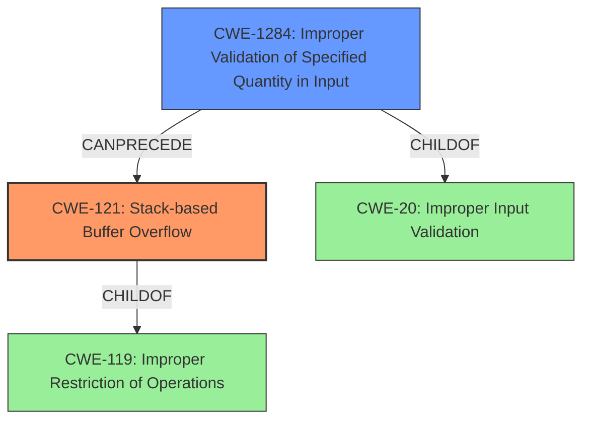

# Final Resolution for CVE-2021-45638

# Summary
| CWE ID | CWE Name | Confidence | CWE Abstraction Level | CWE Vulnerability Mapping Label | CWE-Vulnerability Mapping Notes |
|---|---|---|---|---|---|
| **CWE-121** | **CWE-121: Stack-based Buffer Overflow** | 0.95 | Variant | Allowed | Primary CWE. The vulnerability is explicitly described as a "stack-based buffer overflow." |
| CWE-1284 | CWE-1284: Improper Validation of Specified Quantity in Input | 0.75 | Base | Allowed | Secondary CWE. Lack of input validation allows attacker to control buffer size. |

## Evidence and Confidence

*   **Confidence Score:** 0.90
*   **Evidence Strength:** HIGH

## Relationship Analysis
The primary relationship is the potential chain where **CWE-1284 (Improper Validation of Specified Quantity in Input)** can precede **CWE-121 (Stack-based Buffer Overflow)**. The parent-child relationship exists between **CWE-121 (Stack-based Buffer Overflow)** and **CWE-119 (Improper Restriction of Operations within the Bounds of a Memory Buffer)**, but **CWE-121 (Stack-based Buffer Overflow)** is more specific and therefore preferred.

## Vulnerability Chain
The vulnerability chain starts with a lack of input validation (**CWE-1284: Improper Validation of Specified Quantity in Input**), which allows an attacker to control the size of data written to a stack buffer. This leads to a **CWE-121: Stack-based Buffer Overflow**, where data is written beyond the buffer's boundaries on the stack. The consequence of this overflow could lead to arbitrary code execution.

## Summary of Analysis
The initial analysis correctly identified **CWE-121 (Stack-based Buffer Overflow)** as the primary weakness based on the vulnerability description: "stack-based buffer overflow by an unauthenticated attacker."

The criticism correctly points out the importance of input validation as a contributing factor. The lack of input validation, specifically the improper validation of the specified quantity in the input (**CWE-1284: Improper Validation of Specified Quantity in Input**), allows the attacker to control the size of the input that overflows the buffer. Therefore, I am adding **CWE-1284 (Improper Validation of Specified Quantity in Input)** as a secondary **ROOTCAUSE** for this vulnerability. This is supported by the retriever result rankings.

The graph relationships influenced the decision by highlighting the chain relationship between **CWE-1284 (Improper Validation of Specified Quantity in Input)** and **CWE-121 (Stack-based Buffer Overflow)**. The parent-child relationship between **CWE-121 (Stack-based Buffer Overflow)** and **CWE-119 (Improper Restriction of Operations within the Bounds of a Memory Buffer)** was considered, but **CWE-121 (Stack-based Buffer Overflow)** provides a more specific classification.

The selected CWEs are at the optimal level of specificity. **CWE-121 (Stack-based Buffer Overflow)** is a Variant that directly describes the overflow on the stack. **CWE-1284 (Improper Validation of Specified Quantity in Input)** is a Base CWE that addresses the lack of input validation that enables the overflow.

The final confidence score is 0.90 due to the strong evidence for **CWE-121 (Stack-based Buffer Overflow)** and the clear chain relationship with **CWE-1284 (Improper Validation of Specified Quantity in Input)**.