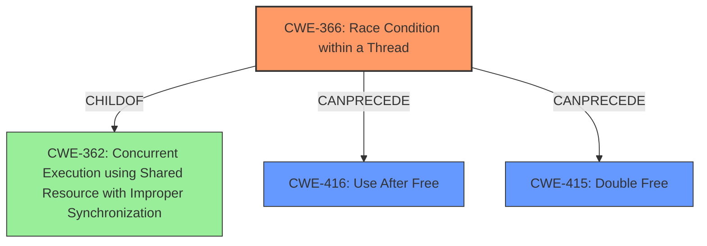

# Analysis Report for CVE-2021-45710

# Vulnerability Analysis Report: CVE-2021-45710

## Description

An issue was discovered in the tokio crate before 1.8.4, and 1.9.x through 1.13.x before 1.13.1, for Rust. In certain circumstances involving a closed oneshot channel, there is a data race and memory corruption.

## Vulnerability Description Key Phrases

**Weakness:** data race and memory corruption
**Product:** tokio crate
**Version:** before 1.8.4, and 1.9.x through 1.13.x before 1.13.1

## Analysis (with Relationship Data)

# Summary
| CWE ID | CWE Name | Confidence | CWE Abstraction Level | CWE Vulnerability Mapping Label | CWE-Vulnerability Mapping Notes |
|---|---|---|---|---|---|
| CWE-366 | Race Condition within a Thread | 0.90 | Base | Allowed | Primary CWE |
| CWE-416 | Use After Free | 0.60 | Variant | Allowed | Secondary Candidate |
| CWE-415 | Double Free | 0.50 | Variant | Allowed | Secondary Candidate |

## Evidence and Confidence

*   **Confidence Score:** 0.75
*   **Evidence Strength:** HIGH

- **Analysis and Justification:**  
  - *Explanation:* The vulnerability description explicitly states a **data race and memory corruption** issue within the tokio crate. The CVE Reference Links Content Summary confirms that the root cause is a **data race** occurring when a `tokio::sync::oneshot` channel is closed via `oneshot::Receiver::close` and, concurrently, `oneshot::Sender::send` is called while the corresponding `oneshot::Receiver` is being `await`ed or calling `try_recv`. This directly aligns with CWE-366 (Race Condition within a Thread), which describes a scenario where two threads of execution use a resource simultaneously, potentially leading to resources being used while invalid. The "Usage: Allowed" mapping guidance for CWE-366 reinforces its suitability. The description notes "memory corruption" as an impact. Since the root cause is the race condition, CWE-366 is the primary weakness. The concurrent access and potential for invalid resource state firmly establish this classification.
  
  - *Relationship Analysis:* CWE-366 is a Base level CWE.

- **Confidence Score:**  
  - Confidence: 0.90 (Strong alignment between vulnerability details and CWE definition)

---
- **Analysis and Justification:**  
  - *Explanation:* The vulnerability description mentions "**memory corruption**" as an impact of the data race. Given the context of a data race and concurrent access to memory, CWE-416 (Use After Free) and CWE-415 (Double Free) are potential secondary candidates. If the **data race** leads to a memory location being freed and then subsequently accessed (Use After Free), or freed multiple times (Double Free), these CWEs could be relevant. Without specific details confirming that the race condition *directly* leads to a use-after-free or double-free scenario, these are considered secondary candidates. The "Usage: Allowed" mapping guidance for both CWE-416 and CWE-415 supports their potential relevance.
  
  - *Relationship Analysis:* While CWE-416 and CWE-415 are plausible impacts of a data race, they are dependent on specific memory management behaviors triggered by the race condition.

- **Confidence Score:**  
  - Confidence: 0.60 for CWE-416, 0.50 for CWE-415 (Moderate confidence, contingent on more detailed information about the memory corruption mechanism)

## Criticism of Analysis

Okay, I've reviewed the analysis against the full CWE specifications you provided. Here's my critique:

**Overall Assessment:**

The analysis is generally sound and well-reasoned. The primary CWE selection of CWE-366 (Race Condition within a Thread) is appropriate and well-justified. The consideration of CWE-416 (Use After Free) and CWE-415 (Double Free) as secondary candidates is also reasonable, given the mention of "memory corruption" in the vulnerability description. However, the confidence levels for these secondary candidates could be further refined based on a deeper dive into the potential memory management implications of the race condition.

**Detailed Review:**

**1. CWE-366: Race Condition within a Thread (Primary CWE)**

*   **Strengths:**
    *   The justification clearly links the data race described in the vulnerability to the definition of CWE-366, especially the simultaneous use of a resource by two threads, leading to an invalid state.
    *   The explanation highlights how the `oneshot::Receiver::close` and `oneshot::Sender::send` can concurrently access shared memory.
    *   The analysis correctly identifies that CWE-366 is a Base-level CWE and "Usage: Allowed".
*   **Suggestions:**
    *   While adequate, the explanation could briefly mention potential mitigation strategies for race conditions (e.g., using mutexes/locks) as described in the CWE-366 specification.  This would further reinforce the connection.  For example, "Mitigation of this issue would involve implementing locking mechanisms to ensure exclusive access to the shared `oneshot` channel state during operations like close and send."
*   **Confidence Level:** The existing Confidence 0.90 seems appropriate.

**2. CWE-416: Use After Free (Secondary Candidate)**

*   **Strengths:**
    *   The analysis correctly identifies CWE-416 as a potential consequence of the memory corruption caused by the race condition. The explanation acknowledges that the race could potentially lead to a use-after-free situation if memory associated with the closed channel is prematurely freed and then accessed.
    *   The analysis also acknowledges the "Usage: Allowed" mapping guidance.
*   **Weaknesses:**
    *   The analysis appropriately qualifies the mapping, noting that UAF is *contingent* on how the memory corruption manifests. The link between the race condition and the specific memory management leading to a UAF could be strengthened.  For example, "If the race condition leads to the premature freeing of memory associated with the channel, and subsequent operations attempt to access this freed memory, then CWE-416 would be applicable."
    *   The Confidence Score of 0.60 may be a bit high given that the analysis acknowledges the contingency of the problem.
*   **Suggestions:**
    *   The confidence could be lowered to 0.55.
    *   Consider adding a sentence that notes the potential mitigations for UAF, from a coding perspective. For instance, "Mitigation of a Use After Free would include setting pointers to NULL after freeing them to prevent later reuse."
**3. CWE-415: Double Free (Secondary Candidate)**

*   **Strengths:**
    *   The analysis recognizes that the race condition could, in theory, lead to a double-free if the close operation is triggered more than once.
    *   Acknowledges "Usage: Allowed" mapping.
*   **Weaknesses:**
    *   Similar to CWE-416, the connection between the race condition and the specific sequence of memory management events leading to a double free is not strongly defined. It is very circumstantial. It's not clear how the race would trigger a double free rather than a use-after-free.
    *   The Confidence Score of 0.50 might be too high as it relies on a less likely scenario.
*   **Suggestions:**
    *   Confidence score should be lowered to 0.40. A double free is a lower probability.
    *   It could be worthwhile to mention language memory protection capabilities and garbage collection algorithms, such as those found in Rust, as possible mitigations. For example, "The Rust programming language mitigates the possibility of Double Free through its memory management schemes."
    *   The analysis should further clarify why, in the context of a closed channel, a double free would be more or less likely than a use-after-free.

**4. Top Combined Retriever Results:**

*   The Retriever Results highlight other potential CWEs. It's good to see CWE-366 ranked highly.
*   CWE-367 (TOCTOU) isn't directly relevant here as there isn't a distinct "check" and "use" phase with a timing window in between.
*   CWE-908 (Use of Uninitialized Resource) could be tangentially related if the memory corruption involves the channel being in an inconsistent state before being closed.
*   CWE-789 (Memory Allocation with Excessive Size Value), CWE-1284 (Improper Validation of Specified Quantity in Input), and CWE-190 (Integer Overflow or Wraparound) are unlikely to be relevant unless the race condition somehow triggers an invalid memory allocation size.  These can be safely disregarded.
*   CWE-362 (Concurrent Execution using Shared Resource with Improper Synchronization) is a Class-level CWE and CWE-366 (Race Condition within a Thread) is a child of CWE-362 and a more specific CWE; thus, it is better to choose CWE-366.
*   CWE-667 (Improper Locking) is also relevant, since it's a Class-level CWE and focuses on the synchronization mechanisms.

**General Recommendations:**

*   **Strengthen the links between the general description of "memory corruption" and the specific memory management errors (UAF, Double Free).** Explain *how* the race condition could lead to these scenarios.
*   **Consider the code-level details, if available.** If you have access to the source code, examine the memory management logic around the channel closure and sending operations to see which errors are most likely to occur.
*   **Incorporate potential mitigation strategies** to further demonstrate your understanding of each CWE and how it applies to the vulnerability.

By incorporating these suggestions, you can further enhance the rigor and completeness of your CWE analysis.

## Final Resolution

# Summary
| CWE ID | CWE Name | Confidence | CWE Abstraction Level | CWE Vulnerability Mapping Label | CWE-Vulnerability Mapping Notes |
|---|---|---|---|---|---|
| CWE-366 | Race Condition within a Thread | 0.90 | Base | Allowed | Primary CWE |
| CWE-416 | Use After Free | 0.55 | Variant | Allowed | Secondary Candidate |
| CWE-415 | Double Free | 0.40 | Variant | Allowed | Secondary Candidate |

## Evidence and Confidence

*   **Confidence Score:** 0.75
*   **Evidence Strength:** HIGH

## Relationship Analysis
The primary CWE is CWE-366 (**Race Condition within a Thread**). While CWE-362 (**Concurrent Execution using Shared Resource with Improper Synchronization**) is a parent, CWE-366 is more specific and directly reflects the **race condition**. CWE-416 (**Use After Free**) and CWE-415 (**Double Free**) are considered potential consequences if the **race condition** leads to memory corruption. These are potential secondary weaknesses in the chain, but their presence is contingent on the specific memory management behavior triggered by the **race condition**.

## Vulnerability Chain
The vulnerability chain starts with a **race condition** (CWE-366) arising from concurrent access to a `oneshot` channel during closing and sending operations. If this **race condition** corrupts memory, it *may* lead to a use-after-free (CWE-416) or a double-free (CWE-415). The specific type of memory corruption depends on the sequence of events within the **race condition**. The root cause is the **race condition**, and the memory corruption flaws are potential impacts.

## Summary of Analysis
The initial analysis correctly identifies CWE-366 as the primary weakness, supported by the evidence of a **data race** within the `tokio` crate. The provided evidence from the vulnerability description states "In certain circumstances involving a closed oneshot channel, there is a **data race** and **memory corruption**."

The criticism is also valid in refining the confidence levels for the secondary candidates, as the memory corruption is not guaranteed to result in a UAF or double-free. The decision to lower the confidence scores to 0.55 for CWE-416 and 0.40 for CWE-415 reflects the uncertainty.

The graph relationships influenced the decision by highlighting the parent-child relationship between CWE-362 and CWE-366, justifying the selection of the more specific CWE-366. The potential for CWE-416 and CWE-415 to follow from CWE-366 reinforces their consideration as secondary weaknesses.

The selected CWEs are at the optimal level of specificity, with CWE-366 being a Base level CWE directly matching the **data race** condition. The secondary candidates are Variant-level CWEs representing potential consequences of the **race condition**, contingent on how memory is managed.

*Report generated on 2025-03-18 03:59:24*
