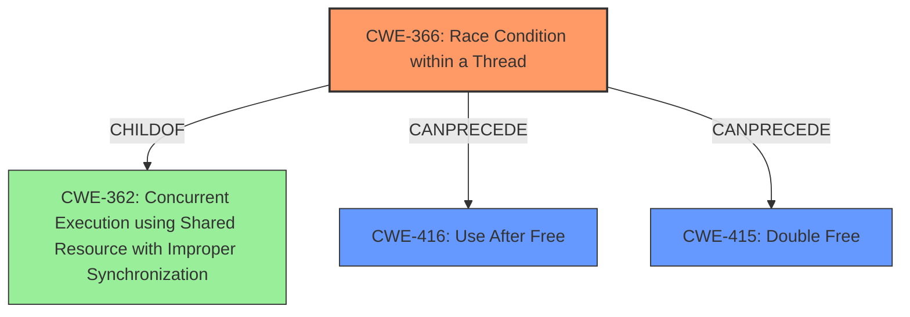

# Final Resolution for CVE-2021-45710

# Summary
| CWE ID | CWE Name | Confidence | CWE Abstraction Level | CWE Vulnerability Mapping Label | CWE-Vulnerability Mapping Notes |
|---|---|---|---|---|---|
| CWE-366 | Race Condition within a Thread | 0.90 | Base | Allowed | Primary CWE |
| CWE-416 | Use After Free | 0.55 | Variant | Allowed | Secondary Candidate |
| CWE-415 | Double Free | 0.40 | Variant | Allowed | Secondary Candidate |

## Evidence and Confidence

*   **Confidence Score:** 0.75
*   **Evidence Strength:** HIGH

## Relationship Analysis
The primary CWE is CWE-366 (**Race Condition within a Thread**). While CWE-362 (**Concurrent Execution using Shared Resource with Improper Synchronization**) is a parent, CWE-366 is more specific and directly reflects the **race condition**. CWE-416 (**Use After Free**) and CWE-415 (**Double Free**) are considered potential consequences if the **race condition** leads to memory corruption. These are potential secondary weaknesses in the chain, but their presence is contingent on the specific memory management behavior triggered by the **race condition**.

## Vulnerability Chain
The vulnerability chain starts with a **race condition** (CWE-366) arising from concurrent access to a `oneshot` channel during closing and sending operations. If this **race condition** corrupts memory, it *may* lead to a use-after-free (CWE-416) or a double-free (CWE-415). The specific type of memory corruption depends on the sequence of events within the **race condition**. The root cause is the **race condition**, and the memory corruption flaws are potential impacts.

## Summary of Analysis
The initial analysis correctly identifies CWE-366 as the primary weakness, supported by the evidence of a **data race** within the `tokio` crate. The provided evidence from the vulnerability description states "In certain circumstances involving a closed oneshot channel, there is a **data race** and **memory corruption**."

The criticism is also valid in refining the confidence levels for the secondary candidates, as the memory corruption is not guaranteed to result in a UAF or double-free. The decision to lower the confidence scores to 0.55 for CWE-416 and 0.40 for CWE-415 reflects the uncertainty.

The graph relationships influenced the decision by highlighting the parent-child relationship between CWE-362 and CWE-366, justifying the selection of the more specific CWE-366. The potential for CWE-416 and CWE-415 to follow from CWE-366 reinforces their consideration as secondary weaknesses.

The selected CWEs are at the optimal level of specificity, with CWE-366 being a Base level CWE directly matching the **data race** condition. The secondary candidates are Variant-level CWEs representing potential consequences of the **race condition**, contingent on how memory is managed.