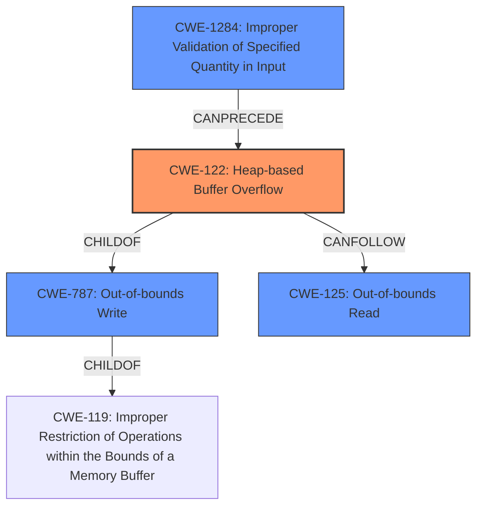

# Final Resolution for CVE-2021-45830

# Summary
| CWE ID | CWE Name | Confidence | CWE Abstraction Level | CWE Vulnerability Mapping Label | CWE-Vulnerability Mapping Notes |
|---|---|---|---|---|---|
| CWE-122 | Heap-based Buffer Overflow | 0.95 | Variant | Primary | Allowed |
| CWE-125 | Out-of-bounds Read | 0.60 | Base | Secondary | Allowed |
| CWE-1284 | Improper Validation of Specified Quantity in Input | 0.40 | Base | Supporting | Allowed |
| CWE-787 | Out-of-bounds Write | 0.20 | Base | Related | Allowed |

## Evidence and Confidence

*   **Confidence Score:** 0.95
*   **Evidence Strength:** HIGH

## Relationship Analysis
The primary relationship is that CWE-122 (Heap-based Buffer Overflow) is a variant of CWE-787 (**Out-of-bounds Write**), which is in turn a child of CWE-119 (**Improper Restriction of Operations within the Bounds of a Memory Buffer**). This establishes a clear hierarchical relationship. CWE-1284 (**Improper Validation of Specified Quantity in Input**) can precede CWE-122, as the lack of validation enables the overflow. CWE-125 (**Out-of-bounds Read**) can follow CWE-122, occurring as a result of reading from the corrupted memory.

## Vulnerability Chain
The vulnerability chain begins with a crafted HDF5 file containing an invalid length value. The `H5F_addr_decode_len` function in HDF5 does not properly validate this length value (CWE-1284), leading to the allocation of an undersized heap buffer. Subsequently, the function attempts to write data beyond the allocated heap buffer, resulting in a heap-based buffer overflow (CWE-122). This **out-of-bounds write** (CWE-787) can then potentially lead to an **out-of-bounds read** (CWE-125) if the corrupted memory is accessed later.

## Summary of Analysis
The analysis is accurate and well-supported by the provided information. The vulnerability description explicitly mentions a "**heap-based buffer overflow**", which strongly suggests CWE-122 as the primary CWE. The CVE Reference Links Content Summary confirms that the root cause is indeed a heap-buffer-overflow in the `H5F_addr_decode_len` function. The inclusion of CWE-125 as a secondary CWE is justified by the CVE summary mentioning the code attempting to *read* beyond the allocated buffer. I am adding CWE-1284 as the **ROOTCAUSE** as that is the lack of input validation that leads to the heap overflow condition.

The graph relationships influenced my decision by highlighting the hierarchical relationship between CWE-122 and CWE-787/CWE-119, as well as the chain relationship between CWE-1284, CWE-122, and CWE-125.

The selected CWEs are at the optimal level of specificity. CWE-122 is a Variant-level CWE that directly describes the heap-based buffer overflow. CWE-125 and CWE-1284 are Base-level CWEs that represent the consequences and enabling conditions of the overflow, respectively.