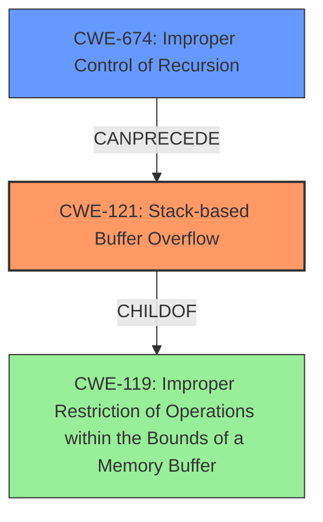

# Final Resolution for CVE-2021-45832

# Summary
| CWE ID | CWE Name | Confidence | CWE Abstraction Level | CWE Vulnerability Mapping Label | CWE-Vulnerability Mapping Notes |
|---|---|---|---|---|---|
| CWE-121 | Stack-based Buffer Overflow | 1.0 | Variant | Allowed | Primary CWE |
| CWE-674 | Improper Control of Recursion | 0.7 | Class | Allowed-with-Review | Secondary Candidate, Contributing Factor |

## Evidence and Confidence

*   **Confidence Score:** 0.95
*   **Evidence Strength:** HIGH

## Relationship Analysis
The primary relationship is that CWE-121 (Stack-based Buffer Overflow) is a variant of CWE-119 (Improper Restriction of Operations within the Bounds of a Memory Buffer). CWE-674 (Improper Control of Recursion) can contribute to stack exhaustion, leading to a stack overflow. Therefore, CWE-674 can precede CWE-121. Although CWE-674 is a Class level CWE, the information provided does not give enough detail to choose a more specific child CWE.

## Vulnerability Chain
The vulnerability chain starts with **CWE-674 (Improper Control of Recursion)**, which leads to stack exhaustion, eventually resulting in **CWE-121 (Stack-based Buffer Overflow)**. The impact is a denial of service. The **ROOTCAUSE** is the improper control of recursion, while the **WEAKNESS** is the resulting stack overflow.

## Summary of Analysis
The initial analysis and criticism are both well-reasoned and accurate. The vulnerability description clearly states a "Stack-based Buffer Overflow," making **CWE-121** the most appropriate primary CWE. The recursive calls to `H5E_printf_stack` and `H5E__push_stack` without proper termination conditions, as mentioned in the CVE reference materials, support the inclusion of **CWE-674** as a secondary contributing factor.

The relationship analysis confirms that **CWE-121** is a specific type of buffer overflow (**CWE-119**), and **CWE-674** can lead to the conditions that cause the stack overflow. The abstraction levels are also appropriately considered, with **CWE-121** being a Variant and **CWE-674** being a Class. While a more specific child of **CWE-674** would be ideal, there is not enough evidence to determine which one.

The decision is primarily based on the vulnerability description, which explicitly states a stack-based buffer overflow: "A Stack-based Buffer Overflow Vulnerability exists in HDF5 1.13.1-1 at at hdf5/src/H5Eint.c, which causes a Denial of Service."

The selected CWEs are at the optimal level of specificity based on the available evidence. **CWE-121** accurately describes the type of buffer overflow, and **CWE-674** captures the contributing factor of uncontrolled recursion.