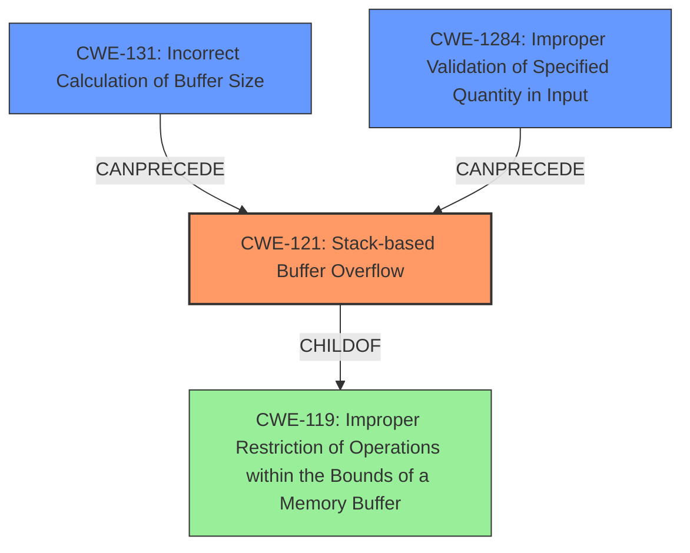

# Final Resolution for CVE-2021-45833

# Summary
| CWE ID | CWE Name | Confidence | CWE Abstraction Level | CWE Vulnerability Mapping Label | CWE-Vulnerability Mapping Notes |
|---|---|---|---|---|---|
| CWE-121 | Stack-based Buffer Overflow | 1.0 | Variant | Primary | Allowed. Most specific match based on explicit description. Consider compiler-based mitigations (ASan/Fortify). |
| CWE-131 | Incorrect Calculation of Buffer Size | 0.5 | Base | Contributing Factor | Possible root cause due to calculation errors within memory allocation. |
| CWE-1284 | Improper Validation of Specified Quantity in Input | 0.4 | Base | Potential Root Cause | Could be present if size information is read from the input file. |

## Evidence and Confidence

*   **Confidence Score:** 0.9
*   **Evidence Strength:** MEDIUM

## Relationship Analysis
The primary CWE is CWE-121 (**CWE-121: Stack-based Buffer Overflow**), a variant of CWE-119 (**CWE-119: Improper Restriction of Operations within the Bounds of a Memory Buffer**). CWE-131 (**CWE-131: Incorrect Calculation of Buffer Size**) and CWE-1284 (**CWE-1284: Improper Validation of Specified Quantity in Input**) are considered as contributing factors/potential root causes. CWE-131 and CWE-1284 can precede CWE-121. This shows a possible vulnerability chain. The abstraction levels influenced the selection, prioritizing the most specific match (CWE-121) while considering other potential root causes at the base level.

## Vulnerability Chain
The vulnerability chain starts with potential root causes like CWE-131 (**CWE-131: Incorrect Calculation of Buffer Size**) or CWE-1284 (**CWE-1284: Improper Validation of Specified Quantity in Input**), leading to CWE-121 (**CWE-121: Stack-based Buffer Overflow**). The overflow results in a Denial of Service. A missing link is the exact operation that caused the overflow (e.g., buffer copy). The chain maps the sequence from initial size calculation/validation flaws to the final impact.

## Summary of Analysis
The initial analysis correctly identified CWE-121 (**CWE-121: Stack-based Buffer Overflow**) as the primary **weakness**, based on the explicit mention in the vulnerability description: "A Stack-based Buffer Overflow Vulnerability exists in HDF5 1.13.1-1 via the H5D__create_chunk_file_map_hyper function in /hdf5/src/H5Dchunk.c". The criticism suggested exploring alternative root causes, which led to the inclusion of CWE-131 (**CWE-131: Incorrect Calculation of Buffer Size**) and CWE-1284 (**CWE-1284: Improper Validation of Specified Quantity in Input**) as contributing factors. The graph relationships influenced the decision by highlighting the hierarchical relationship between CWE-121 and CWE-119 (**CWE-119: Improper Restriction of Operations within the Bounds of a Memory Buffer**), and the potential for CWE-131 and CWE-1284 to precede CWE-121. These selected CWEs are at the optimal level of specificity, with CWE-121 being the most descriptive variant and CWE-131/CWE-1284 representing potential underlying causes.