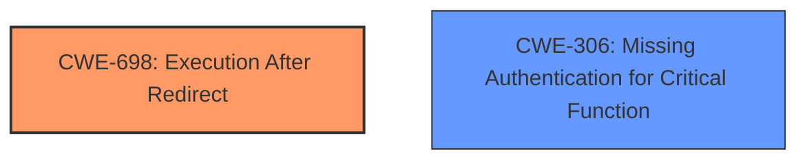

# Final Resolution for CVE-2021-45852

# Summary
| CWE ID | CWE Name | Confidence | CWE Abstraction Level | CWE Vulnerability Mapping Label | CWE-Vulnerability Mapping Notes |
|---|---|---|---|---|---|
| CWE-698 | Execution After Redirect (EAR) | 0.85 | Base | Primary | The primary weakness is that the code continues to execute even after a redirect is issued, allowing unauthorized access. |
| CWE-306 | Missing Authentication for Critical Function | 0.70 | Base | Secondary | The code does not properly authenticate the user before allowing them to add a patient. Contributes to the bypass, but the immediate cause is the execution after redirection. |

## Evidence and Confidence

*   **Confidence Score:** 0.83
*   **Evidence Strength:** HIGH

## Relationship Analysis
The primary relationship that impacts the decision is the chain relationship between **CWE-306 (Missing Authentication for Critical Function)** and **CWE-698 (Execution After Redirect (EAR))**. While **CWE-306 (Missing Authentication for Critical Function)** sets the stage by not requiring a login, **CWE-698 (Execution After Redirect (EAR))** is the direct mechanism that allows the attack to succeed. Without the missing 'exit()' call, the missing authentication wouldn't necessarily lead to unauthorized access. The abstraction levels are both Base, providing good specificity.

## Vulnerability Chain
The vulnerability chain starts with the **ROOTCAUSE** of **CWE-306 (Missing Authentication for Critical Function)**, where the application fails to authenticate users before granting access to sensitive functions. This is followed by the **WEAKNESS** of **CWE-698 (Execution After Redirect (EAR))**, where the application does not terminate execution after a failed authentication attempt and redirection. The final impact is unauthorized patient data being added.
  - The chain starts with the lack of authentication.
  - The chain progresses to execution of code after redirect.
  - The chain results in unauthorized patient data creation.

## Summary of Analysis
The analysis presented is well-reasoned and supported by the evidence.
  - The assessment relies heavily on the provided vulnerability description, where it states: "An issue was discovered in Projectworlds Hospital Management System v1.0. Unauthorized malicious attackers can add patients without restriction via add_patient.php." This is combined with the criticism assessment which mentioned the root cause as: "missing `exit()` call after `header("Location: login.php");`."
  - The graph relationships helped clarify the importance of each CWE in the vulnerability's exploitability.
  - The final decision to classify as **CWE-698 (Execution After Redirect (EAR))** and **CWE-306 (Missing Authentication for Critical Function)** is based on the direct evidence of missing authentication and the missing exit call after the redirection, which are at optimal specificity for the given data.
  - **CWE-698 (Execution After Redirect (EAR))** is the more direct cause of the vulnerability because the missing exit call allows the code to continue executing even after the redirection attempt.