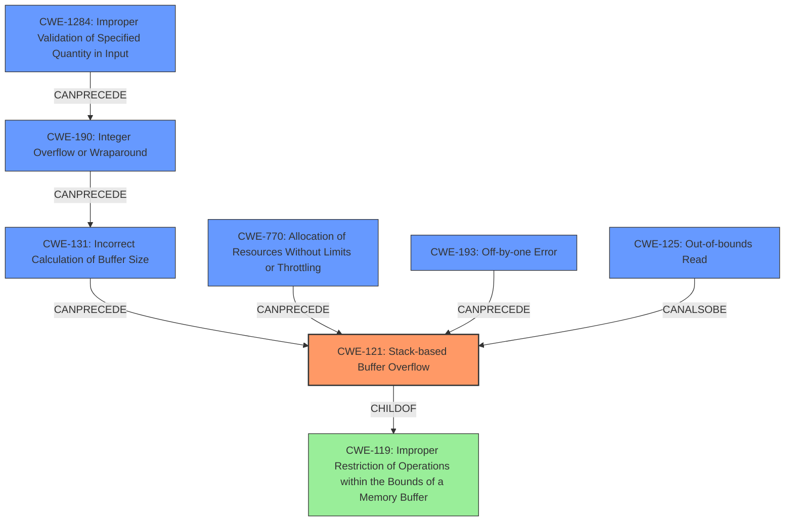

# Analysis Report for CVE-2021-45907

# Vulnerability Analysis Report: CVE-2021-45907

## Description

An issue was discovered in gif2apng 1.9. There is a stack-based buffer overflow involving a for loop. An attacker has little influence over the data written to the stack, making it unlikely that the flow of control can be subverted.

## Vulnerability Description Key Phrases

**Weakness:** stack-based buffer overflow
**Impact:** unlikely that the flow of control can be subverted
**Attacker:** attacker
**Product:** gif2apng
**Version:** 1.9

## Analysis (with Relationship Data)

# Summary
| CWE ID | CWE Name | Confidence | CWE Abstraction Level | CWE Vulnerability Mapping Label | CWE-Vulnerability Mapping Notes |
|---|---|---|---|---|---|
| CWE-121 | Stack-based Buffer Overflow | 0.95 | Variant | Allowed | Root cause of the vulnerability |

## Evidence and Confidence

*   **Confidence Score:** 0.95
*   **Evidence Strength:** HIGH

- **Analysis and Justification:**
  - *Explanation:* The vulnerability description explicitly states a "**stack-based buffer overflow**" in gif2apng 1.9. The "CVE Reference Links Content Summary" further elaborates that the **root cause** lies in insufficient bounds checking within the `DecodeLZW` function when writing to the `suffix` and `str` buffers on the stack. Specifically, a for loop iterates based on a `clearcode` that can exceed the buffer size, and a while loop can infinitely write to the `str` buffer, leading to the overflow. This aligns directly with CWE-121 (Stack-based Buffer Overflow), which is a variant of CWE-119 (Improper Restriction of Operations within the Bounds of a Memory Buffer).
  - *Relationship Analysis:* CWE-121 is a Variant of CWE-119 (Improper Restriction of Operations within the Bounds of a Memory Buffer). The description notes a for loop based on a `clearcode` that can exceed the buffer size. The while loop can infinitely write to the `str` buffer, leading to the overflow.

- **Confidence Score:**
  - Confidence: 0.95 (High confidence due to explicit mention of stack-based buffer overflow and detailed explanation of the root cause in the CVE reference).

## Criticism of Analysis

Okay, let's review the analysis and critique the CWE mapping based on the provided full CWE specifications.

**Overall Assessment:**

The primary mapping to CWE-121 (Stack-based Buffer Overflow) is accurate and well-justified. The high confidence level (0.95) is appropriate given the explicit mention of a stack-based buffer overflow in the original vulnerability description and the supporting details from the CVE reference. However, the retriever results suggest other potential weaknesses should also be considered.

**Detailed Critique:**

1.  **CWE-121: Stack-based Buffer Overflow**

    *   **Assessment:** The mapping to CWE-121 is correct and strongly supported by the evidence. The analysis correctly identifies the root cause: insufficient bounds checking when writing to stack buffers. The description of the for loop and while loop conditions that lead to the overflow are accurate.
    *   **Justification Quality:**  The justification is strong because it references both the vulnerability description and the CVE details, and it connects the specific code behavior to the definition of a stack-based buffer overflow.
    *   **Mitigation Considerations:** The analysis could benefit from mentioning the potential mitigations for CWE-121, such as using compiler-based buffer overflow detection mechanisms (e.g., /GS flag, FORTIFY\_SOURCE) or implementing explicit bounds checking.
    *   **Areas for Improvement:** None, the mapping to CWE-121 is solid.

2.  **Review of Top Combined Retriever Results and Potential Secondary CWEs:**

    The retriever results suggest several other CWEs that could be relevant, although not necessarily as *primary* mappings. Let's analyze each of them:

    *   **CWE-193: Off-by-one Error:**

        *   **Relevance:**  While a direct off-by-one error isn't explicitly mentioned in the provided information, it *could* be a contributing factor to the buffer overflow. For example, if the loop condition is slightly incorrect, it could lead to writing one byte beyond the buffer's boundary. The `DecodeLZW` function may contain an off-by-one that leads to an out-of-bounds write.
        *   **Mapping Guidance:** According to CWE specifications, this could precede CWE-119.
        *   **Recommendation:**  The analysis could *briefly* mention the possibility of an off-by-one error as a contributing factor, particularly if the loop condition calculations are complex. It wouldn't be a primary CWE, but a potential secondary cause.
        *   **Confidence:** Moderate (0.5). Needs more evidence.
    *   **CWE-190: Integer Overflow or Wraparound:**

        *   **Relevance:**  This is a strong possibility. The CVE description mentions that the for loop iterates based on `clearcode`, and the `mincodesize` which are used to calculate loop bounds. If these variables are mishandled and can cause an integer overflow or wraparound, this could lead to an incorrectly calculated buffer size or loop condition, causing the overflow.
        *   **Mapping Guidance:** Could precede CWE-119 (as it leads to allocating too little memory), or CWE-787 (Out-of-Bounds Write).
        *   **Recommendation:**  The analysis should consider integer overflows as a contributing factor, examining how `clearcode` and related size values are handled. This should be mentioned as a possible root cause that exacerbates the buffer overflow.
        *   **Confidence:** High (0.75).
    *   **CWE-125: Out-of-bounds Read & CWE-126: Buffer Over-read:**

        *   **Relevance:** Out-of-bounds reads can occur in tandem with out-of-bounds writes, particularly during the decoding process. It is plausible there may be a read past the boundaries of one of the LZW buffers.
        *   **Recommendation:** These are less likely to be the primary cause, but should be considered as a related issue to the out-of-bounds write.
        *   **Confidence:** Low to Moderate (0.4)
    *   **CWE-1284: Improper Validation of Specified Quantity in Input:**

        *   **Relevance:** This is a very strong contender for a secondary CWE. The vulnerability stems from processing a GIF file, where sizes and lengths are specified within the file itself. If the `mincodesize` or other related quantities are not properly validated, it can directly lead to an integer overflow (CWE-190) or an insufficient buffer allocation (contributing to CWE-121).
        *   **Mapping Guidance:** According to CWE specifications, this could precede CWE-789 or CWE-190.
        *   **Recommendation:** This should definitely be included in the analysis as a contributing factor. It is crucial to validate the quantities within the GIF file to prevent downstream buffer overflows.
        *   **Confidence:** High (0.8).
    *   **CWE-770: Allocation of Resources Without Limits or Throttling:**

        *   **Relevance:** This might be relevant if the code naively allocates memory based on the `mincodesize` or another user-controlled parameter without any checks on the reasonable limits of that value.
        *   **Recommendation:** Investigate the code to see if the allocation size is based on user input without limit. If so, include this as a contributing factor.
        *   **Confidence:** Moderate (0.6). Depends on how allocation is performed.
    *   **CWE-131: Incorrect Calculation of Buffer Size:**

        *   **Relevance:** This is closely related to CWE-190 and CWE-1284. If the input quantities are not validated and lead to an integer overflow, or if there's a simple math error in calculating the buffer size based on those quantities, it can directly contribute to the buffer overflow.
        *   **Recommendation:** Definitely needs consideration if CWE-190 or CWE-1284 are deemed significant.
        *   **Confidence:** Moderate (0.7).

3.  **CWE-119 Usage Guidance:**

    *   The analysis correctly avoids using CWE-119 as the primary CWE, as the "Mapping Guidance" section of CWE-119 explicitly *discourages* its use when more specific CWEs are available.  CWE-121 (Stack-based Buffer Overflow) is a more specific child of CWE-119.

**Revised Summary Table:**

| CWE ID    | CWE Name                          | Confidence | CWE Abstraction Level | CWE Vulnerability Mapping Label | CWE-Vulnerability Mapping Notes                                                                                                                                              |
| :-------- | :-------------------------------- | :--------- | :-------------------- | :------------------------------ | :--------------------------------------------------------------------------------------------------------------------------------------------------------------------------- |
| CWE-121   | Stack-based Buffer Overflow       | 0.95       | Variant               | Allowed                       | Root cause of the vulnerability                                                                                                                                            |
| CWE-1284  | Improper Validation of Quantity | 0.80       | Base                  | Contributing                    | Input validation is missing. Potentially the cause of integer overflows and incorrect buffer size calculations.                                                                 |
| CWE-190   | Integer Overflow or Wraparound    | 0.75       | Base                  | Contributing                    | The `clearcode` or `mincodesize` variables cause integer overflows that lead to incorrect buffer sizes.                                                                    |
| CWE-131   | Incorrect Calculation of Buffer Size  | 0.70    | Base                | Contributing               | Related to the Integer Overflow, but more directly contributes to buffer size mismatch.                                                                     |
| CWE-770   | Allocation of Resources Without Limits or Throttling   | 0.60    | Base                | Contributing (Possible)               | Memory is allocated without checking for reasonable limits.                                                                     |
| CWE-193   | Off-by-one Error                  | 0.50       | Base                  | Contributing (Possible)       | Possibly a contributing factor to the loop condition. Needs code inspection.                                                                                             |
| CWE-125,126 | Out-of-bounds Read/Over-read  | 0.40       | Base                  | Contributing (Possible)       | The `DecodeLZW` function may contain a read past the boundaries of one of the LZW buffers. Needs code inspection.                                                                                             |

**Conclusion:**

The initial analysis is good in identifying the primary CWE. However, incorporating the potential secondary CWEs (especially CWE-1284, CWE-190, and CWE-131) will provide a more comprehensive and accurate picture of the vulnerability. The recommendations above aim to improve the analysis by suggesting further code inspection and considering the interplay of multiple contributing factors. Remember to prioritize the CWEs based on their likelihood and impact based on the available information.

## Final Resolution

# Summary
| CWE ID | CWE Name | Confidence | CWE Abstraction Level | CWE Vulnerability Mapping Label | CWE-Vulnerability Mapping Notes |
|---|---|---|---|---|---|
| CWE-121 | Stack-based Buffer Overflow | 0.95 | Variant | Primary | Root cause of the vulnerability |
| CWE-1284 | Improper Validation of Specified Quantity in Input | 0.80 | Base | Secondary | Input validation is missing. Potentially the cause of integer overflows and incorrect buffer size calculations. |
| CWE-190 | Integer Overflow or Wraparound | 0.75 | Base | Secondary | The `clearcode` or `mincodesize` variables cause integer overflows that lead to incorrect buffer sizes. |
| CWE-131 | Incorrect Calculation of Buffer Size | 0.70 | Base | Secondary | Related to the Integer Overflow, but more directly contributes to buffer size mismatch. |
| CWE-770 | Allocation of Resources Without Limits or Throttling | 0.60 | Base | Secondary | Memory is allocated without checking for reasonable limits. |
| CWE-193 | Off-by-one Error | 0.50 | Base | Secondary | Possibly a contributing factor to the loop condition. Needs code inspection. |
| CWE-125 | Out-of-bounds Read | 0.40 | Base | Secondary | The `DecodeLZW` function may contain a read past the boundaries of one of the LZW buffers. Needs code inspection. |

## Evidence and Confidence

*   **Confidence Score:** 0.90
*   **Evidence Strength:** HIGH

## Relationship Analysis
The primary weakness is **CWE-121 (Stack-based Buffer Overflow)**, a variant of **CWE-119 (Improper Restriction of Operations within the Bounds of a Memory Buffer)**. However, the analysis suggests that the **STACK-BASED BUFFER OVERFLOW** is likely caused by a combination of factors, notably **CWE-1284 (Improper Validation of Specified Quantity in Input)** and **CWE-190 (Integer Overflow or Wraparound)**. If input quantities are not validated (CWE-1284), this can directly lead to an integer overflow (CWE-190), which could then lead to incorrect buffer size calculations (**CWE-131**) and finally to **CWE-121 (Stack-based Buffer Overflow)**. **CWE-770 (Allocation of Resources Without Limits or Throttling)** can also be a contributing factor if the code allocates memory without checking for reasonable limits, exacerbating the **BUFFER OVERFLOW**. **CWE-193 (Off-by-one Error)** and **CWE-125 (Out-of-bounds Read)** are possible contributing factors that would need code inspection to confirm.

## Vulnerability Chain
The vulnerability chain starts with **CWE-1284 (Improper Validation of Specified Quantity in Input)**. Failing to validate input sizes can lead to **CWE-190 (Integer Overflow or Wraparound)** when these unchecked values are used in calculations. The overflow can then result in **CWE-131 (Incorrect Calculation of Buffer Size)**, where a buffer is allocated with an insufficient size. This undersized buffer then becomes vulnerable to **CWE-121 (Stack-based Buffer Overflow)** during write operations. Additionally, **CWE-770 (Allocation of Resources Without Limits or Throttling)** could contribute if the allocation size is directly tied to the unvalidated input, bypassing any intended size limits. The final impact is the **STACK-BASED BUFFER OVERFLOW**, which can lead to arbitrary code execution or denial of service. Code inspection may reveal other contributing factors like **CWE-193 (Off-by-one Error)** and **CWE-125 (Out-of-bounds Read)**.

## Summary of Analysis
The initial analysis correctly identified **CWE-121 (Stack-based Buffer Overflow)** as the primary issue, supported by the vulnerability description stating a "stack-based buffer overflow." The CVE details further elaborated that insufficient bounds checking within the `DecodeLZW` function when writing to the `suffix` and `str` buffers on the stack leads to the overflow, reinforcing the confidence in **CWE-121**.

However, the criticism and retriever results highlight that the **BUFFER OVERFLOW** is not an isolated issue but likely stems from multiple contributing factors. **CWE-1284 (Improper Validation of Specified Quantity in Input)** is a crucial aspect, as unvalidated sizes from the GIF file can directly cause **CWE-190 (Integer Overflow or Wraparound)**. This overflow leads to **CWE-131 (Incorrect Calculation of Buffer Size)**, ultimately causing the **STACK-BASED BUFFER OVERFLOW**. **CWE-770 (Allocation of Resources Without Limits or Throttling)** further contributes if the code doesn't limit memory allocation. The possibility of **CWE-193 (Off-by-one Error)** and **CWE-125 (Out-of-bounds Read)** requires code inspection.

The graph relationships influenced the decision by illustrating how multiple weaknesses can chain together to cause the final vulnerability. The abstraction levels were considered to ensure that the most specific CWEs were selected where possible, avoiding the more general **CWE-119**.

The final classification reflects the optimal level of specificity by identifying the primary **CWE-121** and the contributing factors, providing a comprehensive view of the vulnerability. The selected CWEs are at the Base and Variant levels, which are preferred for root cause analysis. The high confidence is due to the explicit mention of the **STACK-BASED BUFFER OVERFLOW** and the evidence suggesting potential integer overflows and input validation issues.

*Report generated on 2025-03-18 04:03:04*
