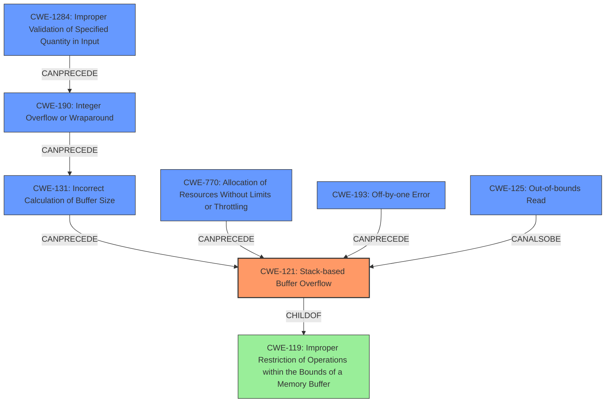

# Final Resolution for CVE-2021-45907

# Summary
| CWE ID | CWE Name | Confidence | CWE Abstraction Level | CWE Vulnerability Mapping Label | CWE-Vulnerability Mapping Notes |
|---|---|---|---|---|---|
| CWE-121 | Stack-based Buffer Overflow | 0.95 | Variant | Primary | Root cause of the vulnerability |
| CWE-1284 | Improper Validation of Specified Quantity in Input | 0.80 | Base | Secondary | Input validation is missing. Potentially the cause of integer overflows and incorrect buffer size calculations. |
| CWE-190 | Integer Overflow or Wraparound | 0.75 | Base | Secondary | The `clearcode` or `mincodesize` variables cause integer overflows that lead to incorrect buffer sizes. |
| CWE-131 | Incorrect Calculation of Buffer Size | 0.70 | Base | Secondary | Related to the Integer Overflow, but more directly contributes to buffer size mismatch. |
| CWE-770 | Allocation of Resources Without Limits or Throttling | 0.60 | Base | Secondary | Memory is allocated without checking for reasonable limits. |
| CWE-193 | Off-by-one Error | 0.50 | Base | Secondary | Possibly a contributing factor to the loop condition. Needs code inspection. |
| CWE-125 | Out-of-bounds Read | 0.40 | Base | Secondary | The `DecodeLZW` function may contain a read past the boundaries of one of the LZW buffers. Needs code inspection. |

## Evidence and Confidence

*   **Confidence Score:** 0.90
*   **Evidence Strength:** HIGH

## Relationship Analysis
The primary weakness is **CWE-121 (Stack-based Buffer Overflow)**, a variant of **CWE-119 (Improper Restriction of Operations within the Bounds of a Memory Buffer)**. However, the analysis suggests that the **STACK-BASED BUFFER OVERFLOW** is likely caused by a combination of factors, notably **CWE-1284 (Improper Validation of Specified Quantity in Input)** and **CWE-190 (Integer Overflow or Wraparound)**. If input quantities are not validated (CWE-1284), this can directly lead to an integer overflow (CWE-190), which could then lead to incorrect buffer size calculations (**CWE-131**) and finally to **CWE-121 (Stack-based Buffer Overflow)**. **CWE-770 (Allocation of Resources Without Limits or Throttling)** can also be a contributing factor if the code allocates memory without checking for reasonable limits, exacerbating the **BUFFER OVERFLOW**. **CWE-193 (Off-by-one Error)** and **CWE-125 (Out-of-bounds Read)** are possible contributing factors that would need code inspection to confirm.

## Vulnerability Chain
The vulnerability chain starts with **CWE-1284 (Improper Validation of Specified Quantity in Input)**. Failing to validate input sizes can lead to **CWE-190 (Integer Overflow or Wraparound)** when these unchecked values are used in calculations. The overflow can then result in **CWE-131 (Incorrect Calculation of Buffer Size)**, where a buffer is allocated with an insufficient size. This undersized buffer then becomes vulnerable to **CWE-121 (Stack-based Buffer Overflow)** during write operations. Additionally, **CWE-770 (Allocation of Resources Without Limits or Throttling)** could contribute if the allocation size is directly tied to the unvalidated input, bypassing any intended size limits. The final impact is the **STACK-BASED BUFFER OVERFLOW**, which can lead to arbitrary code execution or denial of service. Code inspection may reveal other contributing factors like **CWE-193 (Off-by-one Error)** and **CWE-125 (Out-of-bounds Read)**.

## Summary of Analysis
The initial analysis correctly identified **CWE-121 (Stack-based Buffer Overflow)** as the primary issue, supported by the vulnerability description stating a "stack-based buffer overflow." The CVE details further elaborated that insufficient bounds checking within the `DecodeLZW` function when writing to the `suffix` and `str` buffers on the stack leads to the overflow, reinforcing the confidence in **CWE-121**.

However, the criticism and retriever results highlight that the **BUFFER OVERFLOW** is not an isolated issue but likely stems from multiple contributing factors. **CWE-1284 (Improper Validation of Specified Quantity in Input)** is a crucial aspect, as unvalidated sizes from the GIF file can directly cause **CWE-190 (Integer Overflow or Wraparound)**. This overflow leads to **CWE-131 (Incorrect Calculation of Buffer Size)**, ultimately causing the **STACK-BASED BUFFER OVERFLOW**. **CWE-770 (Allocation of Resources Without Limits or Throttling)** further contributes if the code doesn't limit memory allocation. The possibility of **CWE-193 (Off-by-one Error)** and **CWE-125 (Out-of-bounds Read)** requires code inspection.

The graph relationships influenced the decision by illustrating how multiple weaknesses can chain together to cause the final vulnerability. The abstraction levels were considered to ensure that the most specific CWEs were selected where possible, avoiding the more general **CWE-119**.

The final classification reflects the optimal level of specificity by identifying the primary **CWE-121** and the contributing factors, providing a comprehensive view of the vulnerability. The selected CWEs are at the Base and Variant levels, which are preferred for root cause analysis. The high confidence is due to the explicit mention of the **STACK-BASED BUFFER OVERFLOW** and the evidence suggesting potential integer overflows and input validation issues.