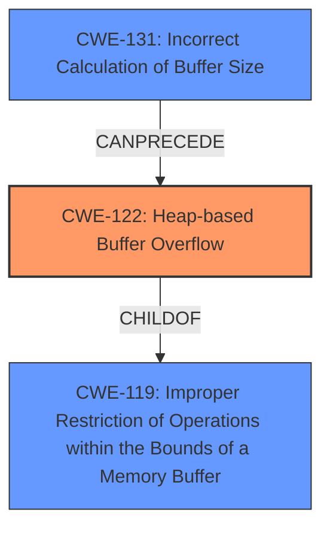

# Final Resolution for CVE-2021-45910

# Summary
| CWE ID | CWE Name | Confidence | CWE Abstraction Level | CWE Vulnerability Mapping Label | CWE-Vulnerability Mapping Notes |
|---|---|---|---|---|---|
| CWE-122 | Heap-based Buffer Overflow | 0.95 | Variant | Allowed | Primary CWE |
| CWE-131 | Incorrect Calculation of Buffer Size | 0.60 | Base | Allowed | Secondary Candidate |

## Evidence and Confidence

*   **Confidence Score:** 0.90
*   **Evidence Strength:** HIGH

## Relationship Analysis
The primary CWE is CWE-122 (**Heap-based Buffer Overflow**), which is a variant of CWE-119 (**Improper Restriction of Operations within the Bounds of a Memory Buffer**). This hierarchical relationship guided the selection towards the more specific CWE-122. CWE-131 (**Incorrect Calculation of Buffer Size**) can precede CWE-122, indicating a potential vulnerability chain where an incorrect size calculation leads to a heap overflow.

## Vulnerability Chain
The vulnerability chain starts with a potential **ROOTCAUSE** of CWE-131 (**Incorrect Calculation of Buffer Size**), which leads to the WEAKNESS of CWE-122 (**Heap-based Buffer Overflow**). This overflow allows an attacker to write data outside the allocated buffer, leading to potential code execution or denial of service.

## Summary of Analysis
The initial analysis correctly identified CWE-122 as the primary CWE due to the explicit mention of "heap-based buffer overflow" in the vulnerability description. The criticism pointed out that while CWE-131 is plausible, the evidence is indirect. The analysis has been updated to acknowledge this uncertainty and slightly reduce the confidence score for CWE-131.

The vulnerability description states "There is a **heap-based buffer overflow** within the main function. It allows an attacker to write data outside of the allocated buffer. The attacker has control over a part of the address that data is written to, control over the written data, and (to some extent) control over the amount of data that is written." This directly supports the selection of CWE-122.

The graph relationships influenced the selection by confirming that CWE-122, being a variant of CWE-119, provides a more specific classification. The potential chain relationship between CWE-131 and CWE-122 highlights how an incorrect buffer size calculation could lead to the overflow.

The selected CWEs are at the optimal level of specificity, with CWE-122 being a Variant and CWE-131 being a Base. This provides a balance between specificity and broad applicability. The confidence score for CWE-131 was reduced to 0.60 to reflect the indirect evidence supporting its inclusion.