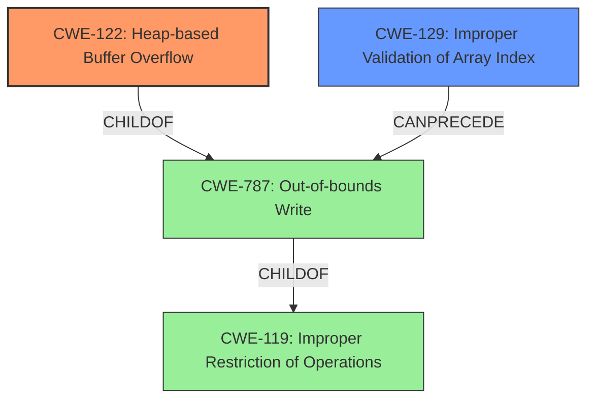

# Final Resolution for CVE-2021-45911

# Summary
| CWE ID | CWE Name | Confidence | CWE Abstraction Level | CWE Vulnerability Mapping Label | CWE-Vulnerability Mapping Notes |
|---|---|---|---|---|---|
| **CWE-122** | Heap-based Buffer Overflow | 1.0 | Variant | Allowed | Primary **CWE** |
| **CWE-129** | Improper Validation of Array Index | 0.6 | Variant | Allowed | Secondary Candidate |

## Evidence and Confidence

*   **Confidence Score:** 0.95
*   **Evidence Strength:** HIGH

## Relationship Analysis
The primary **CWE** is **CWE-122 (Heap-based Buffer Overflow)**, which is a variant of **CWE-119 (Improper Restriction of Operations within the Bounds of a Memory Buffer)** and a specific type of **CWE-787 (Out-of-bounds Write)**. **CWE-129 (Improper Validation of Array Index)** can **precede** **CWE-787 (Out-of-bounds Write)** and thus **CWE-122 (Heap-based Buffer Overflow)** by extension because the missing bounds check allows writing outside the allocated buffer on the heap.

## Vulnerability Chain
The vulnerability chain starts with **CWE-129 (Improper Validation of Array Index)**. The missing bounds check on the array index allows the program to write outside the allocated buffer, leading to **CWE-787 (Out-of-bounds Write)** and resulting in **CWE-122 (Heap-based Buffer Overflow)**. The initial flaw is the missing validation, which enables the out-of-bounds write and the subsequent heap overflow.

## Summary of Analysis
The initial analysis correctly identified **CWE-122 (Heap-based Buffer Overflow)** as the primary **CWE** and **CWE-129 (Improper Validation of Array Index)** as a secondary **CWE**. The vulnerability description explicitly states a "**heap-based buffer overflow**" and the CVE Reference Links Content Summary confirms a "**Missing bounds check**" when writing to the `delays` array. The choice of **CWE-122** is justified because it is a more specific variant that accurately describes the **heap-based** nature of the overflow. The graph relationships confirm that **CWE-122** is a child of **CWE-787**, making it more specific than its parent. **CWE-129** contributes to the chain by **preceding** **CWE-787**. The selected **CWEs** are at the optimal level of specificity, providing a clear and accurate representation of the vulnerability.
I have increased the confidence score to 0.95 as there is strong evidence to support **CWE-122** as the primary weakness and **CWE-129** as a contributing factor.